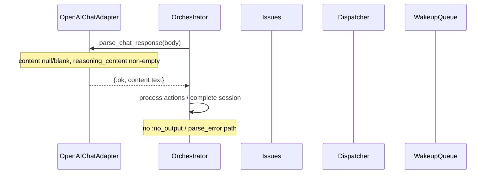
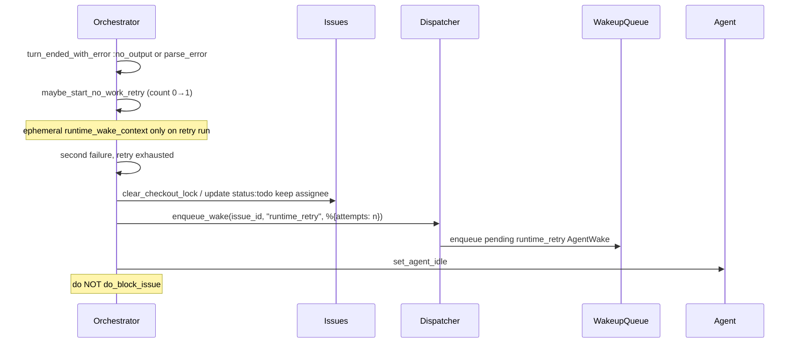
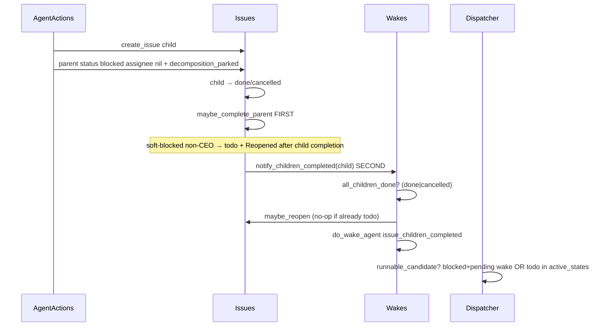
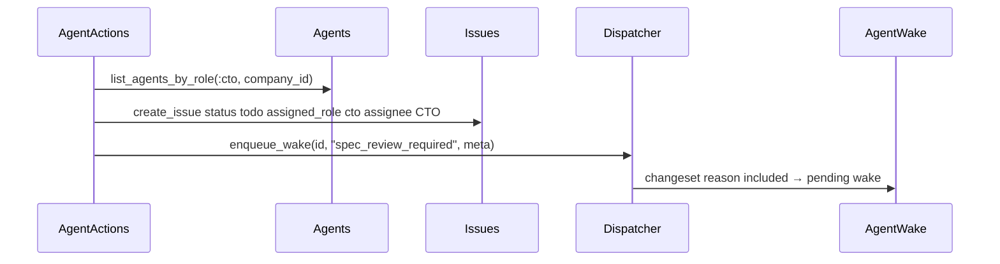

# Requirements

## Introduction

Cympho’s core product promise is that a multi-agent company can run a CEO→CTO→Eng delivery loop without operators reopening every stranded ticket. Today a confirmed P0 cluster permanently parks that loop: OpenAI-compatible chat adapters never read `reasoning_content` / `reasoning` / `thinking`, so GLM-style reasoning-only turns fail **before** orchestrator action parsing as either `{:error, :no_output}` (blank binary content) or `{:error, {:parse_error, _}}` (missing/`null` content or non-text shapes)—both already retriable no_work under Requirement 2; the orchestrator bare-blocks after one no-work retry with a nil assignee and no durable resume wake; auto-decomposition soft-blocks parents that the dispatcher never re-admits; soft-blocked non-CEO parents can be silently auto-closed because private `do_transition/2` bypasses StateMachine; mission seeding enqueues an invalid `spec_review_required` wake (latent until assignee is set); and cancelled children starve parent completion wakes via two independent bugs (gate + call-site). This feature unblocks that spine so chat-based CEO/CTO agents and successful child delivery can progress without manual reopen.

## Requirements

### Requirement 1: OpenAI-chat extracts reasoning text before no_output
**User Story:** As a CEO/CTO agent on an OpenAI-compatible provider (including GLM-style models), I want reasoning-only chat turns treated as usable output, so that my first manager turn does not fail as `:no_output` / parse_error and strand the issue.

#### Acceptance Criteria
1.1 WHEN `Cympho.Adapters.OpenAIChatAdapter.parse_chat_response/1` receives a chat-completions body whose first choice message has `content` that is `null`, missing, or blank after trim, AND the same message (or delta) carries a non-empty string in `reasoning_content` (or alias `reasoning` or `thinking`), THEN the system SHALL return `{:ok, %{"content" => [%{"type" => "text", "text" => trimmed_reasoning}]}}` (usage fields optional as today).
1.2 WHEN both `content` and all reasoning aliases on the first choice message/delta are absent, null, or blank after trim, THEN `parse_chat_response/1` SHALL return `{:error, :no_output}`.
1.3 WHEN non-empty `content` is present, THEN the system SHALL prefer `content` over reasoning fields (existing content-array join behaviour unchanged).
1.4 WHEN the first choice has no usable text fields and does not match a message/delta map shape, THEN the system SHALL still return `{:error, {:parse_error, "missing choices[0].message.content"}}` or `{:error, {:parse_error, "message content is not text"}}` as appropriate for non-text content types (do not invent new parse error atoms). Non-text non-nil `content` SHALL never fall back to reasoning aliases.

### Requirement 2: Retriable no_work failures stay dispatchable
**User Story:** As an operator of an autonomous company, I want retriable no-work adapter failures to leave the issue retriable by the dispatcher, so that one bad chat turn does not permanently bare-block the board with a cleared assignee.

#### Acceptance Criteria
2.1 WHEN a session fails with a retriable no-work reason (`:no_output`, `{:parse_error, _}`, or zero-progress `:stall_timeout` / `:max_run_timeout` with empty `tool_traces`) AND `no_work_retry_count < @max_no_work_retries` (still `1`), THEN the system SHALL keep the existing same-runtime retry path (`maybe_start_no_work_retry/2`) including the comment that contains `retrying once with the same runtime`.
2.2 WHEN that same-runtime retry is exhausted for a retriable no-work reason AND the session still owns the failure path (`session_still_owns_failure_path?/2` true), THEN the system SHALL NOT call `do_block_issue/2` (status `:blocked` with `assignee_id: nil` and no durable resume wake).
2.3 WHEN no-work retries are exhausted under 2.2, THEN the system SHALL release the issue to status `:todo`, keep the pre-failure `assignee_id` when it was set, clear checkout (`checkout_run_id` nil, `checked_out_at` nil), set the agent idle (unless the existing provider-limit pause path applies), and create a durable pending `runtime_retry` wake for that assignee+issue with metadata including `"attempts"` as an integer ≥ 1.
2.4 WHEN a non-no_work failure exhausts provider fallback and is not a retriable no_work reason, THEN `finish_failed_session/2` SHALL continue to park via `block_issue` as today (including `assignee_id: nil` where `do_block_issue/2` does so).
2.5 WHEN an issue is left in `:todo` with a pending `runtime_retry` wake under 2.3, THEN poll eligibility is ordinary SQL (`status in @active_states`) then `runnable_candidate?/1` post-filter — no special blocked exception and no dispatcher edit for `runtime_retry` is required. Task 6 only expands blocked resume reasons; it must not touch the `:todo` path.

### Requirement 3: Auto-decomposition parents resume when children finish
**User Story:** As a CTO or CEO who decomposed work into children, I want the soft-parked parent reopened and dispatchable when every child is terminal, so that I can review/approve without a human unblocking me.

#### Acceptance Criteria
3.1 WHEN `maybe_auto_block_after_decomposition/3` parks a parent after successful `create_issue` while the parent is still checked out `:in_progress` to the acting agent, THEN the parent SHALL remain status `:blocked` with `assignee_id: nil` for capacity release, SHALL keep `assigned_role` unchanged, and SHALL record in `monitor_state`: `"decomposition_parked" => true` and `"decomposition_owner_id" => <acting agent id>` (string UUID).
3.2 WHEN `Cympho.Wakes.notify_children_completed/1` determines all children are terminal (see 6.x) AND the parent status is `:blocked` AND `Issues.is_blocked?/1` is false (no open `issue_blockers` relations), THEN the system SHALL reopen the parent to `:todo` before or as part of the wake path, restore `assignee_id` preferentially to `monitor_state["decomposition_owner_id"]` when that agent still exists and is not governance-terminated, otherwise to the first eligible agent from `parent_wake_target/1` / assigned_role pool, and clear `"decomposition_parked"` from `monitor_state` (may leave `decomposition_owner_id` or clear it; prefer clear both park keys).
3.3 WHEN a parent is status `:blocked` with a pending AgentWake of reason `issue_children_completed` and status `"pending"`, AND the parent is not runtime-paused, AND `Issues.is_blocked?/1` is false, THEN `Dispatcher.runnable_candidate?/1` SHALL return true (same eligibility class as `escalation_from_subordinate`).
3.4 WHEN a parent is status `:blocked` with no pending `escalation_from_subordinate` and no pending `issue_children_completed` wake, AND bare soft-park without those wakes, THEN `runnable_candidate?/1` SHALL remain false (true human/ops blocks must not thrash).
3.5 WHEN `fetch_candidate_issues/2` loads candidates, THEN the SQL `exists` predicate for blocked issues SHALL admit pending wakes whose reason is either `"escalation_from_subordinate"` or `"issue_children_completed"` (not only escalation). Poll eligibility is SQL (`@active_states` ∪ blocked-resume-exists) then `runnable_candidate?/1` post-filter — do not claim `runnable_candidate?` alone checks `@active_states`.

### Requirement 4: Soft-blocked parents never take invalid blocked→done
**User Story:** As a non-CEO manager issue (e.g. CTO parent) soft-blocked after decomposition, I want parent completion logic to reopen me for review instead of silently failing `blocked→done`, so that subtree completion advances the delivery spine.

#### Acceptance Criteria
4.1 WHEN `maybe_complete_parent/1` observes a parent with no open children (`parent_has_open_child?/1` false) AND parent status is `:blocked` AND `root_with_ceo_review?/1` is false, THEN the system SHALL transition the parent to `:todo` (not `:done`), restore supervising owner/role when possible (same restore rules as 3.2 when decomposition park keys present; otherwise keep existing assignee/role or resolve via assigned_role), add a system comment containing exactly the substring `Reopened after child completion`, and SHALL NOT call `do_transition(parent, :done)`.
4.2 WHEN `maybe_complete_parent/1` observes a parent with no open children AND `root_with_ceo_review?/1` is true (CEO root), THEN the system SHALL transition to `:in_review`, call `Wakes.wake_for_final_review/1`, and add the existing system comment `Subtree complete — awaiting CEO sign-off` (even if the parent was previously soft-blocked; use `do_transition`/`update` path that is valid from `:blocked` → `:in_review` per StateMachine).
4.3 WHEN a non-blocked parent (status in `[:in_progress, :todo, :in_review]`) has no open children and is not a CEO root, THEN existing auto-complete to `:done` with comment `Auto-completed: all sub-issues are done` SHALL remain.
4.4 WHEN `Cympho.Issues.StateMachine.valid_transition?(:blocked, :done)` is evaluated, THEN it SHALL remain false (do not add `blocked→done` to the state machine).

**Dual-path order contract (normative — see Design › Coordination):** on every child terminal transition via `do_transition_update/2`, the system SHALL call `maybe_complete_parent/1` **before** `Wakes.notify_children_completed/1`. Soft-blocked non-CEO parents are reopened by 4.1 to `:todo` (with `Reopened after child completion`) while still `:blocked` inside `maybe_complete_parent`; notify’s reopen then no-ops when status is already `:todo` and only enqueues `issue_children_completed`. Ordinary `:in_progress` parents may become `:done` first so notify returns `{:error, :parent_not_active}` (acceptable — no double-wake). Leaving today’s notify-then-complete order while claiming both 3.2 and 4.3 is **forbidden**.

### Requirement 5: Mission seed creates dispatchable CTO spec-review work
**User Story:** As a CEO who seeds mission initiatives, I want each initiative assigned and woken for the CTO with a valid wake reason and dispatchable status, so that CTO spec review starts without operator intervention.

#### Acceptance Criteria
5.1 WHEN `Cympho.Wakes.AgentWake.changeset/2` validates reason `"spec_review_required"`, THEN inclusion validation SHALL accept it (`"spec_review_required"` is a member of `AgentWake.reasons/0` / `@reasons`). Inclusion is enforced solely by `AgentWake.changeset/2` — `Dispatcher.enqueue_wake/3` has **no** separate allowlist.
5.2 WHEN `seed_one_initiative/5` successfully creates a new initiative issue, THEN the issue SHALL have `assigned_role` exactly `"cto"`, `monitor_state["spec_review_required"] == true`, and status `:todo` (not `:backlog`).
5.3 WHEN at least one non-governance-terminated CTO agent exists in the company, THEN `seed_one_initiative/5` SHALL set `assignee_id` to one such CTO (prefer idle CTOs using the same idle-first sort as `Wakes.parent_wake_target/1` role pool: idle first, then `inserted_at`, then `id`) before calling `Dispatcher.enqueue_wake/3`.
5.4 WHEN no CTO agent exists, THEN the initiative SHALL still be status `:todo` with `assigned_role` `"cto"` and `assignee_id` nil; `enqueue_wake` may return `{:ok, :queued_for_dispatch}` via poll path without raising.
5.5 WHEN a CTO assignee was set (5.3), THEN `Dispatcher.enqueue_wake(created.id, "spec_review_required", metadata)` SHALL persist a pending AgentWake with `reason == "spec_review_required"` and `agent_id == created.assignee_id` (not a silent changeset rejection).
5.6 WHEN existing tests assert seeded initiatives land in `:backlog`, those expectations SHALL be updated to `:todo` to match 5.2 (approve_issue still clears `spec_review_required` and may re-assign proposed role as today).

### Requirement 6: Cancelled children count as terminal for completion wakes
**User Story:** As a manager waiting on children, I want cancelled siblings treated as finished work for completion purposes, so that one cancelled child does not permanently starve `issue_children_completed`.

#### Acceptance Criteria
6.1 WHEN `all_children_done?/1` evaluates children, THEN a child with status `:cancelled` SHALL count as terminal (same as `:done`).
6.2 WHEN every child is `:done` or `:cancelled` (mix allowed) AND parent is active for notify (`status in [:in_progress, :blocked, :todo]`), THEN `notify_children_completed/1` SHALL NOT return `{:error, :children_not_all_done}` solely because of cancelled siblings.
6.3 WHEN any child remains outside `[:done, :cancelled]`, THEN `notify_children_completed/1` SHALL still return `{:error, :children_not_all_done}`.
6.4 WHEN the `issue_children_completed` wake preamble is rendered, THEN the text SHALL state that every child is terminal (`:done` or `:cancelled`), not only `:done`.
6.5 WHEN a child transitions to `:cancelled` via `Issues.do_transition_update/2`, THEN the system SHALL invoke `Wakes.notify_children_completed/1` and `maybe_complete_parent/1` for that child (same hooks as `:done`); SHALL NOT skip those hooks solely because status is `:cancelled`. Criteria 6.1–6.3 alone are **insufficient** without this call-site (today `do_transition_update` only notifies when `updated.status == :done` at `lib/cympho/issues.ex` ~2043–2046).

### Requirement 7: Synthetic CEO→CTO→Eng resume path without manual reopen
**User Story:** As a Cympho contributor, I want a focused regression path that seeds a manager parent, auto-parks after decomposition, completes/cancels children, and proves parent resume/wake without manual reopen, so the cluster cannot regress silently.

#### Acceptance Criteria
7.1 WHEN an integration-style DataCase test (or extended existing tests listed in Tasks) runs the synthetic path: parent checked out → `create_issue` child → parent auto soft-blocked → child reaches `:done` or `:cancelled` → notify/completion path runs, THEN the parent SHALL end in `:todo` or `:in_review` (CEO root), with a non-nil supervising assignee when a pool agent exists, and a pending or just-created wake of reason `issue_children_completed` or `final_review_required` as appropriate — without any test calling `Issues.update_issue` solely to manually unstick status from bare `:blocked`.
7.2 WHEN the OpenAI-chat GLM-shaped fixtures from Requirement 1 and the no_work exhaust path from Requirement 2 are covered by unit/orchestrator tests, THEN those tests SHALL pass under `mix test` with 0 failures for the files named in Tasks.
7.3 WHEN the synthetic soft-park resume path from 7.1 runs through the dual-path hooks of `do_transition_update` (complete-parent **then** notify), THEN the parent SHALL **not** land in `:done` as a non-CEO soft-parked manager (assert status is `:todo` plus comment substring `Reopened after child completion`, or CEO root `:in_review` plus `Subtree complete — awaiting CEO sign-off`) — locking the order contract so notify-reopen-then-auto-done thrash cannot regress past wake-only assertions.

## Non-Functional Requirements
- Performance: No new N+1 query patterns beyond one optional agent lookup on seed and one optional parent reopen update on children-complete; keep dispatcher SQL as a single exists subquery with an `IN` list of reasons.
- Security: No change to auth, MCP, or principal permissions. Wakes remain company-scoped via existing issue/agent FKs.
- Reliability: Bare `:blocked` without `escalation_from_subordinate` or `issue_children_completed` (and without reopen to `:todo`) must remain non-runnable. Fail closed on wake reason inclusion. Dual-path parent resume must never thrash soft-parked managers into auto-`:done`.
- Usability: System/agent comments must remain operator-readable; reuse existing `[blocked]` tagging for auto-decomp park comments.

## Out of Scope
- Bug 4 execution-policy `decided_by` spoofing
- Bugs 6–13, 15–23 (dispatcher SQL limit starvation, busy→no_agent, openai_chat engineer repo preflight, terminate without rehome, escalate with no supervisor, `is_blocked?` NotLoaded, depends_on heartbeat checkout, force_fix_pr rework owner, process/http adapter gaps, channel topic mismatches, MCP create_issue permission, plugin schedule_job tenancy, orphan reclaim TOCTOU, stage gate fail-open, start_runtime_session cleanup)
- UI redesign, new adapter types, governance voting changes
- Schema migrations / AgentWake DB enum changes (reason is free string with changeset inclusion only)
- Changing `@max_no_work_retries` away from `1`
- Adding `blocked→done` to `StateMachine`
- Adding `:blocked` to `@active_states` or admitting `runtime_retry` wakes on bare blocked issues
- Backfill of historical invalid wake rows (optional out-of-band ops only)

---

# Design

## Overview

Fix the manager delivery spine in seven surgical seams that already exist: (1) `OpenAIChatAdapter.extract_content/1` falls back to reasoning text via private `text_from_chat_message/1`; (2) orchestrator exhausted no_work releases to `:todo` + durable `runtime_retry` instead of bare `do_block_issue`; (3) dispatcher admits blocked issues that have pending `issue_children_completed` wakes (mirror escalation); (4) decomposition park stamps `monitor_state` and children-complete reopen restores owner; (5) `maybe_complete_parent` reopens soft-blocked non-CEO parents to `:todo` / CEO root to `:in_review` instead of auto-closing, and is ordered **before** notify on terminal child transitions; (6) allow `spec_review_required` in `AgentWake.@reasons`, assign CTO and promote seed initiatives to `:todo`; (7) treat `:cancelled` as terminal in `all_children_done?/1` and invoke notify/complete-parent on cancel as well as done. Prefer reopen + durable wakes over inventing new schemas or active_states that would thrash true blocks.

## Code Reuse Analysis
- **OpenAIChatAdapter** (`lib/cympho/adapters/openai_chat_adapter.ex`): reuse private `normalize_content/1` **unchanged** (binary / list / else already correct); only change `extract_content/1` matching to bind full message/delta maps and add private `text_from_chat_message/1`. Do **not** invent `extract_reasoning_text/1`. Keep public `parse_chat_response/1` contract.
- **Orchestrator** (`lib/cympho/orchestrator.ex`): keep `maybe_start_no_work_retry/2`, `no_work_failure?/2`, `@max_no_work_retries 1`, `runtime_wake_context/1` (ephemeral `{"runtime_retry", %{"attempts" => count}}` injected into same-session retry adapter opts — **not** a durable AgentWake). Replace exhausted no_work branch that currently always hits `finish_failed_session` → `block_issue` with a release path reusing `Issues.clear_checkout_lock/2` or explicit `Issues.update_issue` that preserves assignee, plus durable `Dispatcher.enqueue_wake/3`. Today’s exhaust path never calls `Dispatcher.enqueue_wake/3` (`rg enqueue_wake` empty in orchestrator.ex).
- **Issues.clear_checkout_lock/2** (`lib/cympho/issues.ex` ~2469): clears checkout and sets target status while **keeping assignee** — preferred over `force_release_issue/2` when assignee must remain.
- **Dispatcher** (`lib/cympho/orchestrator/dispatcher.ex`): mirror `pending_escalation_wake?/1` into a shared pending-resume check for reasons `~w(escalation_from_subordinate issue_children_completed)`; update `runnable_candidate?/1` and `fetch_candidate_issues/2` exists-join. Poll: SQL prefilter then `Enum.filter(&runnable_candidate?/1)`. No special change for `runtime_retry` once issue is `:todo`.
- **AgentWake** (`lib/cympho/wakes/agent_wake.ex`): add-only exact token `spec_review_required` after `final_review_required`; `runtime_retry` and `issue_children_completed` already present in `@reasons` — **do not re-add them**. Inclusion is solely `AgentWake.changeset/2` `validate_inclusion(:reason, @reasons)`; `Dispatcher.enqueue_wake/3` has no separate allowlist.
- **Wakes** (`lib/cympho/wakes.ex`): `notify_children_completed/1`, `parent_wake_target/1`, `do_wake_agent/6`; align `all_children_done?/1` with `parent_has_open_child?/1` terminal set `[:done, :cancelled]` and `all_blockers_done?/1` pattern.
- **AgentActions** (`lib/cympho/agent_actions.ex`): `maybe_auto_block_after_decomposition/3`, `seed_one_initiative/5`, `update_workflow_issue/3`; CTO resolve pattern same as `parent_wake_target` role pool via `Agents.list_agents_by_role/2`.
- **AgentPrompt** (`lib/cympho/agent_prompt.ex`): `wake_preamble("spec_review_required", ...)` already exists; update `issue_children_completed` preamble only.
- **WakeupQueue** (`lib/cympho/heartbeat_engine/wakeup_queue.ex`): `runtime_retry` already in `@recent_duplicate_exempt_reasons` — do not re-add.
- **Tests**: `test/cympho/adapters/openai_chat_adapter_test.exs`, `test/cympho/orchestrator_test.exs` (expects `:blocked` after exhausted no_work — update; optional rename “blocks after…” → “releases for redispatch after…”), `test/cympho/orchestrator/dispatcher_test.exs`, `test/cympho/agent_actions/decomposition_deps_test.exs`, `test/cympho/agent_actions/seed_mission_issues_test.exs`, `test/cympho/wakes_test.exs`, `test/cympho/subissue_completion_test.exs` / `test/cympho/issues_test.exs` as needed, `Companies.create_autonomous_company/1` fixtures.

## Architecture

Pieces connect as:

```
OpenAIChatAdapter.parse_chat_response
  → text_from_chat_message(content | reasoning aliases)
  → Orchestrator session turn
      → no_work? → same-runtime retry (max 1; ephemeral runtime_wake_context)
      → exhausted retriable → :todo + assignee + durable runtime_retry AgentWake
      → non-retriable → bare :blocked (existing)

AgentActions.create_issue (decompose)
  → maybe_auto_block_after_decomposition (:blocked + monitor park keys)
  → children work …
  → Issues.do_transition_update child done/cancelled
      → maybe_complete_parent FIRST
           · soft-blocked non-CEO → :todo + "Reopened after child completion"
           · CEO root → :in_review + final_review_required
           · ordinary :in_progress → :done (auto-complete)
      → THEN Wakes.notify_children_completed
           · all_children_done? (done|cancelled)
           · maybe_reopen soft-blocked parent (no-op if already :todo)
           · issue_children_completed wake (or :parent_not_active if already done/in_review)
      → Dispatcher admits blocked|todo parent via wake or active_states

AgentActions.seed_one_initiative
  → assign CTO + status :todo + AgentWake.reasons includes spec_review_required
  → Dispatcher.enqueue_wake (changeset inclusion only; no second allowlist)
```

### Dual-path parent resume coordination (locked contract)

Two independent hooks advance parents when a child becomes terminal:

| Hook | Soft-blocked non-CEO | Ordinary `:in_progress` non-CEO | CEO root soft-blocked |
|------|----------------------|----------------------------------|------------------------|
| `maybe_complete_parent/1` | reopen → `:todo` + `Reopened after child completion` | auto → `:done` | → `:in_review` + `final_review_required` |
| `notify_children_completed/1` | reopen (no-op if already `:todo`) + enqueue `issue_children_completed` | status gate may return `:parent_not_active` if parent already `:done` | status gate returns `:parent_not_active` if already `:in_review` (avoids double-wake with final_review) |

**Mandatory call order in `do_transition_update/2` terminal branch:**

```elixir
updated.status in [:done, :cancelled] ->
  unblock_dependents(issue.id)
  maybe_complete_parent(updated)              # FIRST — 4.1 reopen while still :blocked
  _ = Wakes.notify_children_completed(updated) # SECOND — enqueue wake; reopen is idempotent
```

**Why this order is non-negotiable:** today’s code is notify-then-complete (`lib/cympho/issues.ex` ~2043–2046). If Task 4 reopens blocked→`:todo` and Task 5 still auto-dones any non-blocked parent under 4.3, soft-parked managers reopen then immediately auto-`:done` — silent product regression past tests that only check wake creation. Complete-first lets 4.1 observe `:blocked` and reopen without auto-done; notify then no-ops reopen and only enqueues. **Do not ship notify-then-complete while claiming both AC 3.2 and AC 4.3.**

Notify-only callers (e.g. tests or future paths that call `notify_children_completed` alone) still get Task 4 reopen — keep that helper; it is not redundant.

### Assignee restore decision table

| Priority | Condition | `assignee_id` after reopen |
|----------|-----------|----------------------------|
| 1 | `monitor_state["decomposition_owner_id"]` is a binary UUID, `Agents.get_agent/1` returns ok, `governance_status != "terminated"` | that owner id |
| 2a (notify path) | Priority 1 miss; `parent_wake_target(parent)` → `{:ok, id}` | that id (role-pool / existing assignee) |
| 2b (`maybe_complete_parent` path) | Priority 1 miss | keep `parent.assignee_id` (often nil after soft-park) |
| 3 | No valid owner | `nil`; status still `:todo`; `assigned_role` preserved |

Preferred owner restore via `decomposition_owner_id` only works after Task 8 stamps park keys in `maybe_auto_block_after_decomposition`. Until then, reopen still lands `:todo` with role-pool / `parent_wake_target` fallback (Task 4). Reopen when `blocked + not is_blocked?` even without park keys (legacy soft-parks).

### Main Flows

#### Happy path — GLM reasoning-only CEO turn then continue



#### Error path — no_work exhaust becomes retriable (not bare block)



#### Happy path — decompose soft-park, children done, parent resume



#### Happy path — seed mission CTO dispatch



## File Structure Plan
- lib/cympho/adapters/openai_chat_adapter.ex (edit)
- lib/cympho/wakes/agent_wake.ex (edit)
- lib/cympho/wakes.ex (edit)
- lib/cympho/orchestrator.ex (edit)
- lib/cympho/orchestrator/dispatcher.ex (edit)
- lib/cympho/issues.ex (edit)
- lib/cympho/agent_actions.ex (edit)
- lib/cympho/agent_prompt.ex (edit)
- test/cympho/adapters/openai_chat_adapter_test.exs (edit)
- test/cympho/orchestrator_test.exs (edit)
- test/cympho/orchestrator/dispatcher_test.exs (edit)
- test/cympho/wakes_test.exs (edit)
- test/cympho/agent_actions/decomposition_deps_test.exs (edit)
- test/cympho/agent_actions/seed_mission_issues_test.exs (edit)
- test/cympho/subissue_completion_test.exs (edit) and/or test/cympho/issues_test.exs (edit if soft-blocked parent tests live there)

## Components and Interfaces

### Cympho.Adapters.OpenAIChatAdapter
- **Purpose:** Parse OpenAI-compatible chat completion bodies into orchestrator content maps, including GLM-style reasoning-only payloads.
- **File:** `lib/cympho/adapters/openai_chat_adapter.ex`
- **Interfaces:**
  - `parse_chat_response(body :: String.t()) :: {:ok, map()} | {:error, :no_output | {:parse_error, String.t()}}`
  - private `extract_content(decoded :: map()) :: {:ok, String.t()} | {:error, term()}`
  - private `normalize_content(content :: term()) :: {:ok, String.t()} | {:error, :no_output | {:parse_error, String.t()}}` — **reuse unchanged**
  - private `text_from_chat_message(msg :: map()) :: {:ok, String.t()} | {:error, term()}` (new; sole helper name — do **not** add `extract_reasoning_text/1`)
- **Dependencies:** Jason
- **Reuses:** existing content-array join in `normalize_content/1` (do not mutate it)
- **Satisfies:** 1.1, 1.2, 1.3, 1.4, 7.2

**Implementation note (verified today):**
```elixir
# lib/cympho/adapters/openai_chat_adapter.ex ~190-198
defp extract_content(%{"choices" => [%{"message" => %{"content" => content}} | _]}) do
  normalize_content(content)
end
defp extract_content(%{"choices" => [%{"delta" => %{"content" => content}} | _]}) do
  normalize_content(content)
end
defp extract_content(_), do: {:error, {:parse_error, "missing choices[0].message.content"}}
```

**Three distinct failure modes today (repo `lib/` has zero readers of `reasoning_content` / `reasoning` / `thinking` as chat fields):**

| Payload shape | Result today |
|---------------|--------------|
| `"content" => ""` (blank binary) | `normalize_content` → `{:error, :no_output}` |
| `"content" => nil` (key present, null) | `normalize_content(nil)` → `{:error, {:parse_error, "message content is not text"}}` |
| message/delta map **missing** `"content"` key | no clause matches → catch-all `{:error, {:parse_error, "missing choices[0].message.content"}}` |

None of these read reasoning aliases. Change extract to bind full `message`/`delta` maps without requiring a `"content"` key (~widen match beyond 190–196 to include the catch-all at ~198). Route through `text_from_chat_message/1`: attempt reasoning aliases when `Map.get(msg, "content")` is **nil** OR `normalize_content` returns `{:error, :no_output}` — do **not** only pattern-match `:no_output`. Non-text non-nil content (`{:parse_error, "message content is not text"}`) never falls back (Req 1.4).

### Cympho.Orchestrator
- **Purpose:** Session failure handling — same-runtime no_work retry then retriable release instead of bare block.
- **File:** `lib/cympho/orchestrator.ex`
- **Interfaces (existing private + new private):**
  - `@max_no_work_retries 1` (unchanged)
  - `maybe_start_no_work_retry(session, reason) :: {:ok, session} | {:error, term()} | :none`
  - `no_work_failure?(reason, session) :: boolean()`
  - `finish_failed_session(session, reason) :: {:stop, :normal, session}`
  - **New** `finish_retriable_no_work_session(session, reason) :: {:stop, :normal, session}` — used when `no_work_failure?(reason, session)` is true and retry is exhausted
  - `do_block_issue(issue, attempts_left)` — unchanged; only non-retriable path
  - `runtime_wake_context(session) :: {String.t(), map()}` — **ephemeral only**: injects synthetic `{"runtime_retry", attempts}` into the same-session retry run’s adapter opts. **No AgentWake.** Exhaust path today never calls `Dispatcher.enqueue_wake/3`.
- **Dependencies:** `Cympho.Issues`, `Cympho.Orchestrator.Dispatcher`, `Cympho.Adapters.Error`, agent idle helpers
- **Reuses:** `session_still_owns_failure_path?/2`, `create_agent_comment/3`, `set_agent_idle/1`, `Issues.clear_checkout_lock/2` or update attrs that preserve assignee, `Dispatcher.enqueue_wake/3`
- **Satisfies:** 2.1, 2.2, 2.3, 2.4, 2.5, 7.2

**Verified park path today:**
```elixir
# finish_failed_session (~476) → block_issue → do_block_issue (~1996-2001)
Issues.update_issue(issue, %{status: :blocked, assignee_id: nil, checkout_run_id: nil, checked_out_at: nil})
# turn_ended_with_error ~364-365: :none -> finish_failed_session(session, reason)
# No durable enqueue_wake anywhere in orchestrator.ex
```

Note: `fail_engine_run` → `HeartbeatEngine.fail_run` may already clear checkout to `:todo` while keeping assignee. `finish_retriable_no_work_session` must **not** call `do_block_issue` and must still enqueue a durable `runtime_retry` AgentWake so final status stays `:todo` with assignee preserved. Do not conflate ephemeral `runtime_wake_context/1` with that durable wake.

**Required behaviour for exhausted no_work:**
1. If not `session_still_owns_failure_path?`, skip park (same as today skip-block logging).
2. Else write error comment via `Error.comment/2` (same as finish_failed_session). Release comment may keep the Error.comment body **plus** required substring `released for redispatch`.
3. Release: prefer `Issues.clear_checkout_lock(latest, :todo)` when checkout ownership matches; if status already not in_progress, `Issues.update_issue(latest, %{status: :todo, checkout_run_id: nil, checked_out_at: nil})` **without** clearing `assignee_id`.
4. `Dispatcher.enqueue_wake(issue.id, "runtime_retry", %{"attempts" => max(session.no_work_retry_count, 1)})`.
5. Idle agent / provider-limit pause unchanged.
6. Required testable phrase in a release note comment: `released for redispatch`.

Wire-up: in `handle_info` turn_ended_with_error, when `maybe_start_no_work_retry` returns `:none` (~364–365) and `no_work_failure?(reason, session)`, call `finish_retriable_no_work_session` instead of `finish_failed_session`.

### Cympho.Orchestrator.Dispatcher
- **Purpose:** Decide which issues the automatic poll may run; admit blocked parents with resume wakes.
- **File:** `lib/cympho/orchestrator/dispatcher.ex`
- **Interfaces:**
  - `runnable_candidate?(issue :: Issue.t()) :: boolean()`
  - `enqueue_wake(issue_id :: String.t(), reason :: String.t() | atom(), metadata \\ %{}) :: {:ok, term()} | {:error, term()}` — no reason allowlist; forwards `to_string(reason)` into `WakeupQueue.enqueue/1`
  - private `pending_escalation_wake?(issue_id) :: boolean()` — **refactor** to `pending_blocked_resume_wake?(issue_id)` checking reasons in `~w(escalation_from_subordinate issue_children_completed)`, keep `pending_escalation_wake?/1` as a thin wrapper **or** expand its body in place; either is fine if all call sites use the expanded set for blocked eligibility
  - private `fetch_candidate_issues(limit, company_id) :: [Issue.t()]` — SQL: `@active_states` ∪ blocked-with-resume-wake-exists; then `Enum.filter(&runnable_candidate?/1)`
  - `@active_states` remains `[:todo, :in_review]` by default — do **not** add `:blocked`
- **Dependencies:** `AgentWake`, `Issues`, Repo
- **Reuses:** existing exists-join pattern at lines ~965–974
- **Satisfies:** 2.5, 3.3, 3.4, 3.5

**Verified blocked admission today (`dispatcher.ex` ~101–106, ~1013–1020, ~966–974):** only `"escalation_from_subordinate"`. Soft-parked parents with pending `issue_children_completed` are not SQL-fetched and not runnable.

### Cympho.Wakes.AgentWake
- **Purpose:** Validate wake reasons at insert time.
- **File:** `lib/cympho/wakes/agent_wake.ex`
- **Interfaces:**
  - `reasons() :: [String.t()]`
  - `changeset(agent_wake, attrs) :: Ecto.Changeset.t()`
- **Dependencies:** Ecto
- **Reuses:** `@reasons` list — insert exact token `spec_review_required` immediately after `final_review_required` (add-only). `runtime_retry` / `issue_children_completed` already present — do not re-add. Do not add a second allowlist on `Dispatcher.enqueue_wake/3`.
- **Satisfies:** 5.1, 5.5

### Cympho.Wakes
- **Purpose:** Parent completion wakes and children-done detection; reopen soft-parked parents.
- **File:** `lib/cympho/wakes.ex`
- **Interfaces:**
  - `notify_children_completed(child_issue :: Issue.t()) :: {:ok, AgentWake.t()} | {:error, atom() | Ecto.Changeset.t()}`
  - private `all_children_done?(issue :: Issue.t()) :: boolean()` — terminal when `child.status in [:done, :cancelled]` (today `== :done` only at ~1118)
  - private `parent_wake_target(issue) :: {:ok, agent_id} | {:error, :no_assignee}`
  - private (new) `maybe_reopen_decomposition_parked_parent(parent :: Issue.t()) :: Issue.t()` — if parent.status in `[:blocked, "blocked"]` and not `Issues.is_blocked?(parent)` (preload `:blocked_by` if needed), update to `:todo`, restore assignee, clear decomposition park keys; return reloaded parent. Idempotent no-op when status already `:todo`.
- **Dependencies:** Issues, Agents, Repo, AgentWake
- **Reuses:** `parent_wake_target/1`, `do_wake_agent/6`
- **Satisfies:** 3.2, 6.1, 6.2, 6.3, 7.1, 7.3

**Order inside `notify_children_completed` after preload (must not reopen early):**
1. Preload parent with `[:assignee, :children, :blocked_by]`.
2. Gate `all_children_done?(parent)` first — if false, return `{:error, :children_not_all_done}` **without** reopening (reopening a half-finished parent would thrash capacity).
3. Only when all children are terminal: `parent = maybe_reopen_decomposition_parked_parent(parent)` so soft-blocked parents become `:todo` with owner restored before target resolution (no-op if dual-path already reopened via 4.1).
4. Resolve `parent_wake_target(parent)` on the (possibly reopened) parent; if reopen failed or owner missing, role-pool still applies.
5. Gate parent status in `[:in_progress, :blocked, :todo]` (reopened parents are `:todo`; already-`:done` / `:in_review` → `:parent_not_active` — acceptable after complete-first dual path).
6. `do_wake_agent(..., "issue_children_completed", ...)`.

**Verified today (`wakes.ex` ~283–308):** preload `[:assignee, :children]` only; `parent_wake_target` first then `all_children_done?`; no reopen helper. Soft-park still wakes via assigned_role pool while parent stays bare `:blocked` — reopen remains required for 3.2 owner restore and clean `:todo` redispatch.

### Cympho.Issues / StateMachine
- **Purpose:** Parent auto-completion that respects soft-blocked parents; invoke completion hooks for both done and cancelled children in locked dual-path order.
- **Files:** `lib/cympho/issues.ex`, `lib/cympho/issues/state_machine.ex` (state machine **unchanged**)
- **Interfaces:**
  - private `maybe_complete_parent(child_issue) :: :ok`
  - private `do_transition_update(issue, attrs) :: {:ok, Issue.t()} | {:error, term()}` — must call `maybe_complete_parent/1` **then** `Wakes.notify_children_completed/1` when child status is **either** `:done` **or** `:cancelled`
  - private `parent_has_open_child?(parent_id) :: boolean()` — already treats cancelled terminal (~2124–2128)
  - private `root_with_ceo_review?(parent) :: boolean()`
  - `is_blocked?(issue) :: boolean()`
  - `clear_checkout_lock(issue, target_status \\ :todo) :: {:ok, Issue.t()} | {:error, term()}`
  - `force_release_issue(issue, target_status \\ :todo) :: {:ok, Issue.t()} | {:error, term()}`
  - `update_issue(issue, attrs) :: {:ok, Issue.t()} | {:error, term()}`
  - `StateMachine.valid_transition?(from, to) :: boolean()`
- **Dependencies:** Wakes, Repo
- **Reuses:** Prefer `update_issue/2` for blocked→todo reopen so assignee + `monitor_state` can be set in one write; `do_transition/2` for CEO `:in_review` when no extra attrs needed. Do **not** call `do_transition(parent, :done)` when parent is `:blocked`.
- **Satisfies:** 4.1, 4.2, 4.3, 4.4, 6.2, 6.5, 7.1, 7.3

**Verified bugs:**
```elixir
# 1) maybe_complete_parent non-CEO branch always does (~2097):
case do_transition(parent, :done) do ... end
# Private do_transition/2 does NOT consult StateMachine — so a soft-blocked
# parent can auto-close to :done and skip manager review. Product rule still
# forbids soft-blocked non-CEO auto-:done even though SM is not consulted.
# Fix: reopen non-CEO blocked parents to :todo; CEO roots to :in_review.
# Public StateMachine still keeps blocked→done false (4.4) for transition_issue.

# 2) do_transition_update only notifies/completes on :done, not :cancelled:
if updated.status == :done do
  _ = Wakes.notify_children_completed(updated)
  maybe_complete_parent(updated)
end
# Last-child-cancelled starves issue_children_completed and parent reopen.
# Fix: run the same two calls for status in [:done, :cancelled],
# with maybe_complete_parent FIRST then notify (see dual-path contract).
```

### Cympho.AgentActions
- **Purpose:** Decomposition soft-park stamp; mission seed CTO assign + todo + valid wake.
- **File:** `lib/cympho/agent_actions.ex`
- **Interfaces:**
  - `execute(issue, agent, actions) :: {:ok, map()} | {:error, term()}`
  - private `maybe_auto_block_after_decomposition(issue, agent, results) :: Issue.t()` (~1943; parks blocked+assignee nil without park keys today)
  - private `seed_one_initiative(issue, agent, goal, item, base_depth) :: {:ok, map()} | {:error, term()}` (~2406; status `:backlog`, no assignee, `_ = enqueue_wake(..., "spec_review_required", ...)` today)
  - private `do_seed_mission_issues(issue, agent, action)`
  - private `update_workflow_issue(issue, agent, attrs)`
  - private (new optional) `pick_cto_agent(company_id) :: Agent.t() | nil` — idle-first sort matching Wakes
- **Dependencies:** Issues, Agents, Dispatcher, Goals
- **Reuses:** `Agents.list_agents_by_role(:cto, company_id)`, existing monitor_state merge for seed
- **Satisfies:** 3.1, 5.2, 5.3, 5.4, 5.5, 5.6, 7.1

### Cympho.AgentPrompt
- **Purpose:** Wake preamble copy for children completed.
- **File:** `lib/cympho/agent_prompt.ex`
- **Interfaces:** private `wake_preamble("issue_children_completed", metadata, role) :: String.t()` (~492; currently says every child is `:done`)
- **Dependencies:** none new
- **Reuses:** existing `wake_preamble("spec_review_required", ...)` (already correct)
- **Satisfies:** 6.4

## Data Models

### AgentWake (existing schema `agent_wakes`)
- `id` binary_id
- `agent_id` binary_id (required)
- `issue_id` binary_id
- `reason` string — inclusion in `@reasons` (add `"spec_review_required"`; `runtime_retry` and `issue_children_completed` already present)
- `status` string default `"pending"` — `pending|running|consumed|failed|cancelled`
- `metadata` map default `%{}`
- Example pending CTO seed wake:
```elixir
%AgentWake{
  agent_id: cto_id,
  issue_id: initiative_id,
  reason: "spec_review_required",
  status: "pending",
  metadata: %{"goal_id" => goal_id, "seeded_by_agent" => ceo_id, "proposed_role" => "engineer"}
}
```

### Issue.monitor_state keys (map, no migration)
- Seed (existing): `"spec_review_required" => true`, `"proposed_role"`, `"seeded_by_agent_id"`, `"seeded_via" => "seed_mission_issues"`
- Decomposition park (new):
  - `"decomposition_parked" => true`
  - `"decomposition_owner_id" => "<uuid>"`
- Cleared on reopen: delete both keys from monitor_state map

### Issue status semantics (no schema change)
| Status | Role in this feature |
|--------|----------------------|
| `:todo` | Retriable after no_work; seed initiatives; reopened soft parents |
| `:blocked` | Soft park after decomp; true escalation/block; dispatcher only if resume wake |
| `:in_review` | CEO root final review |
| `:done` / `:cancelled` | Terminal children |

## Error Handling
1. **Scenario:** Chat response has empty content and empty reasoning fields  
   - **Handling:** `{:error, :no_output}` from adapter (blank content path); orchestrator no_work retry then release path  
   - **User impact:** Agent comment from Error: title path uses `No adapter output` / message `The adapter finished without producing usable output.`; after exhaust, issue stays `:todo` with assignee + `released for redispatch` note, not bare blocked.

2. **Scenario:** Chat response has `content: null` or missing content key, and empty reasoning fields  
   - **Handling:** Pre-fix: `{:parse_error, "message content is not text"}` or `{:parse_error, "missing choices[0].message.content"}`. Post-fix with no reasoning: `{:error, :no_output}` (1.2). Both are retriable no_work under 2.1.  
   - **User impact:** Same retriable no_work path as parse_error / no_output.

3. **Scenario:** Chat response missing choices entirely / non-message shape  
   - **Handling:** `{:error, {:parse_error, "missing choices[0].message.content"}}`  
   - **User impact:** Same retriable no_work path as parse_error.

4. **Scenario:** Soft-blocked parent, children not all terminal  
   - **Handling:** `notify_children_completed` → `{:error, :children_not_all_done}`; parent stays blocked; no reopen  
   - **User impact:** Parent remains parked until remaining children finish.

5. **Scenario:** Soft-blocked parent, children terminal, but no assignee and no role agents  
   - **Handling:** reopen to `:todo` with `assigned_role` preserved if possible; wake may return `{:error, :no_assignee}`  
   - **User impact:** Issue is at least `:todo` for operator/dispatcher role-claim; no crash.

6. **Scenario:** Seed with no CTO in company  
   - **Handling:** create `:todo` role-assigned issue; enqueue_wake → poll_now path `{:ok, :queued_for_dispatch}`  
   - **User impact:** Initiative visible in backlog/todo for hire/staffing; no invalid wake changeset error in logs.

7. **Scenario:** Bare blocked without resume wake (true ops block)  
   - **Handling:** `runnable_candidate?` false; not in fetch exists  
   - **User impact:** Operator must reopen via UI (existing) — unchanged.

8. **Scenario:** Dual-path thrash if implementer ships notify-then-complete  
   - **Handling:** Spec forbids this order; complete-first reopens while still `:blocked` so 4.1 branch fires  
   - **User impact:** Soft-parked managers stay reviewable at `:todo` instead of silent auto-`:done`.

## Testing Strategy
- Unit: `openai_chat_adapter_test.exs` — GLM null/empty content + reasoning_content; empty all → `:no_output`; non-empty content preferred; optional content:null without reasoning asserts parse_error or post-fix `:no_output` per 1.2. (Satisfies coverage 1.x, 7.2)
- Unit: `wakes_test.exs` — cancelled sibling fires `issue_children_completed`; mix done+cancelled; open child still errors; soft-blocked parent reopens only when all children terminal. (3.2, 6.x, 7.1)
- Unit: `dispatcher_test.exs` — blocked + pending `issue_children_completed` runnable; blocked without wake still not; escalation still runnable. (3.3–3.5)
- Unit/integration: `orchestrator_test.exs` — exhausted parse_error and zero-progress max_run_timeout → status `:todo`, assignee preserved, `released for redispatch` comment + pending `runtime_retry` wake (update tests that assert `:blocked`; optional rename “blocks after…” → “releases for redispatch after…”). (2.x, 7.2)
- Unit: `decomposition_deps_test.exs` — assert `decomposition_parked` monitor keys; children-complete reopen path (may live in wakes or agent_actions test). (3.1, 7.1)
- Unit: `seed_mission_issues_test.exs` — `:todo`, assignee CTO when present, AgentWake row with `spec_review_required`. (5.x)
- Unit: `subissue_completion_test.exs` — soft-blocked non-CEO parent reopens to `:todo` not `:done`; CEO root soft-blocked → `:in_review`; last child `:cancelled` still advances parent; dual-path does not thrash to `:done` (7.3). (4.x, 6.2, 6.5, 7.1, 7.3)
- Command: `mix test` — expect `0 failures`.

## Assumptions
- CEO/CTO commonly use `openai_chat` / OpenAI-compatible providers that put text in `reasoning_content` with empty/`null`/missing `content` — reason: confirmed GLM-shaped production failure mode with three distinct adapter failures (blank → `:no_output`; null → not-text parse_error; missing key → missing-content parse_error).
- Reasoning-only turns fail before orchestrator action parsing as `:no_output` **or** retriable `{:parse_error, _}` depending on payload shape — not always `:no_output`. Both are retriable no_work under 2.1.
- Decomposition auto-block is intentional capacity release without `issue_blockers` — resume reopens status + restores supervisor; do not invent hard blockers.
- Bare `:blocked` without `escalation_from_subordinate` or `issue_children_completed` must stay non-runnable — reason: avoid thrashing true human/ops blocks.
- Seed initiatives remaining role-assigned to CTO until `approve_issue` is intentional; only status/assignee/wake fix, not engineer pre-assignment.
- Cancelled children are terminal for completion, matching `parent_has_open_child?/1`.
- `do_transition_update/2` must invoke complete-parent **then** notify for both `:done` and `:cancelled` — reason: last-child-cancelled currently never calls either; order prevents soft-park auto-done thrash.
- Reopen of soft-blocked parents inside `notify_children_completed` runs only after `all_children_done?` — reason: never reopen while siblings still open.
- Private `do_transition/2` bypasses StateMachine today; soft-blocked non-CEO parents must still not auto-`:done` (product reopen rule), and public SM keeps `blocked→done` false.
- No schema migrations; wake reason is string inclusion only (`AgentWake.changeset` is the sole allowlist).
- `@max_no_work_retries` stays `1`.
- Prefer `Issues.clear_checkout_lock/2` over `force_release_issue/2` when preserving assignee.
- For reopen assignee restore, prefer `decomposition_owner_id` then `parent_wake_target` / keep assignee — reason: original decomposer is the correct reviewer when still valid. Owner keys only exist after Task 8 stamps them.
- Existing escalate-only blocked behaviour remains for true escalations (assignee set to supervisor + escalation wake).
- Implementer updates tests that currently assert bare `:blocked` after no_work exhaust or seed `:backlog` — those expectations are wrong relative to this fix.
- Optional historical wake backfill is out of band; not a task in this spec.
- Do not allow `issue_children_completed` wakes when parent is already `:in_review`/`:done` (status gate) — avoids double-wake noise with `final_review_required`.

---

# Tasks

- [x] 1. Accept `spec_review_required` as a valid AgentWake reason
  - Files: lib/cympho/wakes/agent_wake.ex (edit)
  - Purpose: Mission seed already enqueues this reason; without inclusion validation, no CTO wake row can persist once an assignee is set (5.3). This is the data-layer gate for Requirement 5.
  - Do:
    1. Open `lib/cympho/wakes/agent_wake.ex` and locate `@reasons ~w(...)`.
    2. Add the exact token `spec_review_required` to the list immediately after `final_review_required` (add-only; do not remove any existing reason; do not re-add `runtime_retry` or `issue_children_completed` — already present).
    3. Do not change `changeset/2` beyond what the expanded `@reasons` provides via `validate_inclusion(:reason, @reasons)`.
    4. Confirm `def reasons, do: @reasons` still exposes the new value.
    5. Do **not** add a reason allowlist on `Dispatcher.enqueue_wake/3` — inclusion is solely `AgentWake.changeset/2`.
  - Details:
    - Exact string: `"spec_review_required"` (underscore, no spaces).
    - With 5.3 assigning a CTO, 5.5 requires a persisted pending wake; without this token the path returns `{:error, %Ecto.Changeset{}}`.
  - Check: `mix compile --warnings-as-errors` finishes with no errors.
  - _Leverage: lib/cympho/wakes/agent_wake.ex `@reasons`_
  - _Requirements: 5.1_

- [x] 2. Fall back to reasoning_content in OpenAIChatAdapter.extract_content
  - Files: lib/cympho/adapters/openai_chat_adapter.ex (edit)
  - Purpose: Stops GLM-style reasoning-only HTTP 200 responses from becoming `:no_output` or parse_error before the orchestrator even starts action parsing.
  - Do:
    1. Replace the two content-only `extract_content/1` clauses (~190–196) with clauses that match full message/delta maps without requiring a `"content"` key, e.g. `%{"choices" => [%{"message" => msg} | _]}` when `is_map(msg)`, and the same for `"delta"`. Keep the catch-all at ~198.
    2. Implement private helper **`text_from_chat_message/1`** when `is_map(msg)` (this exact name only — do **not** create `extract_reasoning_text/1`):
       - a. Let `raw = Map.get(msg, "content")`. Call `normalize_content(raw)` when raw is not nil; when raw is nil, treat as needing reasoning fallback (skip normalize or call and expect non-text — prefer: if `is_nil(raw)`, go to step c reasoning attempt before returning parse_error).
       - b. If `normalize_content` returns `{:ok, text}`, return it (content wins).
       - c. If `raw` is `nil` **OR** result is `{:error, :no_output}`, iterate aliases `["reasoning_content", "reasoning", "thinking"]`; for the first key present whose value is a binary with non-empty `String.trim/1`, return `{:ok, that binary}` (trim only at `parse_chat_response` boundary as today — returning untrimmed is ok if parse_chat_response trims).
       - d. If content is present but non-text (`normalize_content` → `{:error, {:parse_error, "message content is not text"}}`) AND no non-empty reasoning alias was found under the nil/`no_output` path, return that parse_error (do **not** hide non-text content behind reasoning — Req 1.4).
       - e. If all empty after reasoning attempt, return `{:error, :no_output}`.
    3. Keep the catch-all `extract_content(_)` → `{:error, {:parse_error, "missing choices[0].message.content"}}` for non-message shapes.
    4. Leave `normalize_content/1` body unchanged (reuse as-is).
    5. Leave `parse_chat_response/1` public API unchanged.
  - Details:
    - Prefer content over reasoning when content is non-empty after trim.
    - `content: null` with `reasoning_content: "hello"` → ok with text `"hello"` (must attempt reasoning when content is nil — not only on `:no_output`).
    - `content: ""` with `reasoning_content: "  x  "` → ok (parse_chat_response trims to `"x"`).
    - Missing content key with reasoning → ok (message map matches without requiring content key).
    - Both empty / all blank → `:no_output`.
    - Non-text list/map content without usable reasoning → `{:parse_error, "message content is not text"}` (no fallback).
  - Check: `mix compile --warnings-as-errors` finishes with no errors.
  - _Leverage: lib/cympho/adapters/openai_chat_adapter.ex normalize_content/1 (unchanged)_
  - _Requirements: 1.1, 1.2, 1.3, 1.4_

- [x] 3. Treat cancelled children as terminal in all_children_done?
  - Files: lib/cympho/wakes.ex (edit)
  - Purpose: Aligns children-complete detection with `parent_has_open_child?/1` so cancelled siblings no longer fail the notify gate forever.
  - Do:
    1. Locate `defp all_children_done?(%Issue{} = issue)` (~1111).
    2. Change the terminal check from `child.status == :done` to `child.status in [:done, :cancelled]`.
    3. Keep the empty-children warning log as-is.
  - Details:
    - Do not change `all_blockers_done?/1` (already includes cancelled).
    - Status may be atom from schema; if string statuses appear in tests use also `"done"`/`"cancelled"` only if existing code already normalizes — Issue status is Ecto enum atom in this codebase; match atoms only.
    - Full cancel-starvation also needs Task 5 (`do_transition_update` currently only calls `notify_children_completed` when `status == :done` at issues.ex ~2043–2046); Task 3 alone is still required so mixed done+cancelled siblings pass the gate once notify is invoked. Criteria 6.1–6.3 without 6.5/Task 5 are insufficient.
  - Check: `mix compile --warnings-as-errors` finishes with no errors.
  - _Leverage: lib/cympho/issues.ex parent_has_open_child?/1 terminal set_
  - _Requirements: 6.1, 6.2, 6.3_

- [x] 4. Reopen soft-blocked decomposition parents inside notify_children_completed
  - Files: lib/cympho/wakes.ex (edit)
  - Purpose: When children finish, auto-parked parents must leave `:blocked` and regain an owner so wakes and dispatcher can run them — including notify-only callers that never hit `maybe_complete_parent`.
  - Do:
    1. Add private `maybe_reopen_decomposition_parked_parent(%Issue{} = parent)`:
       - Preload `:blocked_by` if needed for `Issues.is_blocked?/1`.
       - If `parent.status` not in `[:blocked, "blocked"]`, return parent unchanged (idempotent no-op when dual-path already reopened to `:todo`).
       - If `Issues.is_blocked?(parent)` is true (active issue_blockers), return parent unchanged.
       - Else compute `owner_id`:
         - From `get_in(parent.monitor_state, ["decomposition_owner_id"])` if binary; verify agent exists via `Agents.get_agent/1` and agent `governance_status != "terminated"`; else nil.
         - If nil, case `parent_wake_target(parent)` → use `{:ok, id}` or nil on error.
       - Build `monitor = Map.drop(parent.monitor_state || %{}, ["decomposition_parked", "decomposition_owner_id"])`.
       - Call `Issues.update_issue(parent, %{status: :todo, assignee_id: owner_id, checkout_run_id: nil, checked_out_at: nil, monitor_state: monitor})`.
       - On `{:ok, updated}`, return updated; on error log warning and return original parent.
    2. Change `notify_children_completed/1` preload to `Repo.preload([:assignee, :children, :blocked_by])`.
    3. **Order is mandatory — never reopen before the all-children gate:**
       - a. If `not all_children_done?(parent)`, return `{:error, :children_not_all_done}` immediately (parent stays blocked).
       - b. Else `parent = maybe_reopen_decomposition_parked_parent(parent)`.
       - c. Then `with {:ok, target_agent_id} <- parent_wake_target(parent)` (uses restored assignee when present).
       - d. Then require `parent.status in [:in_progress, :blocked, :todo]` else `{:error, :parent_not_active}`.
       - e. Then `do_wake_agent(target_agent_id, parent.id, "issue_children_completed", "system", child_issue.id, %{child_id: child_issue.id})`.
  - Details:
    - Reopen applies to soft-blocked parents even if `decomposition_parked` is missing (legacy parks): still reopen when blocked + not is_blocked? + all children terminal — so pre-flag parents recover.
    - Preferred assignee restore via `decomposition_owner_id` only works after Task 8 stamps those keys in `maybe_auto_block_after_decomposition`; until then reopen still lands `:todo` with `parent_wake_target` / role-pool fallback.
    - Clear both park keys whenever reopening (Map.drop both keys always on reopen path).
    - Do not set assignee when owner_id is nil (leave nil, status todo).
    - Reopening a parent that still has open children is forbidden — that is why step 3a comes first.
  - Check: `mix compile --warnings-as-errors` finishes with no errors.
  - _Leverage: lib/cympho/wakes.ex parent_wake_target/1; lib/cympho/issues.ex is_blocked?/1 update_issue/2_
  - _Requirements: 3.2, 7.1_

- [x] 5. Fix maybe_complete_parent and fire completion hooks on cancelled children (complete-first order)
  - Files: lib/cympho/issues.ex (edit)
  - Purpose: Soft-blocked managers reopen for review instead of auto-closing; cancelled last-children must also advance the parent spine; dual-path order prevents reopen-then-auto-done thrash.
  - Do:
    1. Open private `do_transition_update/2` (~2037). Change the terminal branch so **both** `:done` and `:cancelled` run hooks, with **`maybe_complete_parent` FIRST**, then notify:
       ```elixir
       updated.status in [:done, :cancelled] ->
         unblock_dependents(issue.id)
         maybe_complete_parent(updated)
         _ = Wakes.notify_children_completed(updated)
       ```
       (Remove the inner `if updated.status == :done` guard. **Do not** keep today’s notify-then-complete order. Keep the later Approvals cancel for both terminal statuses.)
    2. Open private `maybe_complete_parent/1` (~2062–2111).
    3. Inside the transaction, after `false <- parent_has_open_child?(parent_id)`:
       - If `root_with_ceo_review?(parent)`: call `do_transition(parent, :in_review)` (works from `:blocked` via private do_transition; StateMachine also allows blocked→in_review for public callers). Keep `Wakes.wake_for_final_review/1` and comment exactly `Subtree complete — awaiting CEO sign-off`.
       - Else if `parent.status in [:blocked, "blocked"]`: **do not** `do_transition(parent, :done)`. Instead:
         - Resolve `restored` assignee: if `get_in(parent.monitor_state, ["decomposition_owner_id"])` is a binary and `Agents.get_agent/1` returns `{:ok, agent}` with `governance_status != "terminated"`, use that id; else keep `parent.assignee_id`; else nil.
         - Prefer **one** `Issues.update_issue(parent, %{status: :todo, assignee_id: restored, checkout_run_id: nil, checked_out_at: nil, monitor_state: Map.drop(parent.monitor_state || %{}, ["decomposition_parked", "decomposition_owner_id"])})` so status, owner, and park keys update together.
         - On `{:ok, _}`, `add_system_comment(parent, "Reopened after child completion")` — body must contain exact substring `Reopened after child completion`.
         - On `{:error, reason}`, `Repo.rollback(reason)`.
       - Else: existing non-CEO `do_transition(parent, :done)` + comment `Auto-completed: all sub-issues are done` (AC 4.3 — ordinary `:in_progress`/`:todo`/`:in_review` parents).
    4. Do not change `StateMachine` module (blocked→done stays false for `transition_issue`).
    5. Keep outer always-return-`:ok` behaviour of `maybe_complete_parent/1`.
  - Details:
    - Never call `do_transition(parent, :done)` when `parent.status == :blocked`.
    - Complete-first is mandatory: soft-blocked non-CEO is reopened by 4.1 to `:todo` before notify; notify’s maybe_reopen is then a no-op and only enqueues `issue_children_completed`. Ordinary `:in_progress` parents may become `:done` first so notify returns `:parent_not_active` (acceptable). Leaving notify-then-complete while claiming both 3.2 and 4.3 is forbidden.
    - CEO root path must work from soft-blocked parents.
    - Cancelled children must trigger the same parent complete+notify path as done children (AC 6.5) — otherwise last-child-cancelled starves 6.x/7.1. Task 3’s gate fix alone is insufficient without this call-site.
  - Check: `mix compile --warnings-as-errors` finishes with no errors.
  - _Leverage: lib/cympho/issues.ex do_transition/2 do_transition_update/2, root_with_ceo_review?/1, Wakes.wake_for_final_review/1 notify_children_completed/1_
  - _Requirements: 4.1, 4.2, 4.3, 4.4, 6.2, 6.5, 7.1, 7.3_

- [x] 6. Admit issue_children_completed wakes for blocked dispatcher candidates
  - Files: lib/cympho/orchestrator/dispatcher.ex (edit)
  - Purpose: Even if reopen races, a pending children-completed wake on a blocked parent must be dispatcher-eligible like escalation.
  - Do:
    1. Replace the reason filter in `pending_escalation_wake?/1` (~1013–1020) so it matches `w.reason in ^["escalation_from_subordinate", "issue_children_completed"]` (or two OR clauses). Rename to `pending_blocked_resume_wake?/1` if cleaner; update `runnable_candidate?/1` blocked clause (~101–106) to call the expanded function.
    2. Update `fetch_candidate_issues/2` exists subquery (~965–974) to the same reason set (`w.reason in ^[...]`).
    3. Leave true bare blocked (no pending resume wake) as non-runnable.
  - Details:
    - Expand blocked resume reasons only to `~w(escalation_from_subordinate issue_children_completed)`.
    - Do **not** add `runtime_retry` to blocked eligibility (runtime_retry issues are `:todo` after this feature — ordinary `@active_states` SQL + `runnable_candidate?` post-filter).
    - Do **not** add `:blocked` to `@active_states`.
    - Poll eligibility remains SQL prefilter then `runnable_candidate?/1` — no other dispatcher change for no_work release.
  - Check: `mix compile --warnings-as-errors` finishes with no errors.
  - _Leverage: lib/cympho/orchestrator/dispatcher.ex runnable_candidate?/1 pending_escalation_wake?/1_
  - _Requirements: 3.3, 3.4, 3.5_

- [x] 7. Exhausted no_work releases to todo + durable runtime_retry wake
  - Files: lib/cympho/orchestrator.ex (edit)
  - Purpose: Stops retriable empty/malformed turns from bare-blocking issues with nil assignee after a single retry.
  - Do:
    1. Add private `finish_retriable_no_work_session(%__MODULE__{} = session, reason)`:
       - `create_agent_comment` with `Error.comment(reason, adapter: session_adapter_name(session))` (same as finish_failed_session). Release comment may keep Error.comment body plus required substring.
       - Reload issue; if `session_still_owns_failure_path?(latest, session)`:
         - Release without clearing assignee: try `Issues.clear_checkout_lock(latest, :todo)`; if that errors, `Issues.update_issue(latest, %{status: :todo, checkout_run_id: nil, checked_out_at: nil})` without assignee_id key.
         - `create_agent_comment` with body containing exact substring `released for redispatch` and the formatted no_work reason (reuse `format_no_work_reason/1`).
         - Call `Cympho.Orchestrator.Dispatcher.enqueue_wake(latest.id, "runtime_retry", %{"attempts" => max(session.no_work_retry_count, 1)})` — this is the **durable** AgentWake; do not rely on `runtime_wake_context/1` (ephemeral same-session opts only).
       - Else: existing skip log path for ownership moved; still try clear session-owned checkout if helpers require.
       - Provider limit pause vs `set_agent_idle` same as `finish_failed_session`.
       - Return `{:stop, :normal, session}`.
    2. In the turn_ended_with_error handler where `maybe_start_no_work_retry` returns `:none` (~364–365), branch:
       - if `no_work_failure?(reason, session)` → `finish_retriable_no_work_session(session, reason)`
       - else → `finish_failed_session(session, reason)`
    3. Keep `maybe_start_no_work_retry` and `@max_no_work_retries 1` unchanged, including the comment containing `retrying once with the same runtime` (wording may still say "before blocking"; optional follow-up string change is not required).
    4. Do not alter `do_block_issue/2` for non-no_work failures. Do **not** call `do_block_issue` from the retriable exhaust path.
  - Details:
    - After exhaust, assertable state: status `:todo`, assignee_id equal to session.agent_id when session still owns path, pending wake reason `runtime_retry`.
    - Same-runtime first retry path untouched (2.1); `runtime_wake_context/1` remains ephemeral for that retry only.
    - Today’s exhaust path never calls `Dispatcher.enqueue_wake/3` — this task adds it.
  - Check: `mix compile --warnings-as-errors` finishes with no errors.
  - _Leverage: lib/cympho/orchestrator.ex maybe_start_no_work_retry/2 finish_failed_session/2; lib/cympho/issues.ex clear_checkout_lock/2; lib/cympho/orchestrator/dispatcher.ex enqueue_wake/3_
  - _Requirements: 2.1, 2.2, 2.3, 2.4, 2.5_

- [x] 8. Stamp decomposition_parked monitor keys on auto-block
  - Files: lib/cympho/agent_actions.ex (edit)
  - Purpose: Makes parent resume able to restore the decomposing manager explicitly after capacity release (enables preferred owner path used by Tasks 4 and 5).
  - Do:
    1. In `maybe_auto_block_after_decomposition/3` (~1943), expand `update_workflow_issue` attrs:
       - Keep `status: :blocked`, `assignee_id: nil`, clear checkout fields.
       - Set `monitor_state` to `(issue.monitor_state || %{})` merged with `%{"decomposition_parked" => true, "decomposition_owner_id" => agent.id}`.
    2. Keep the existing tagged blocked note text starting with `Waiting for delegated work:`.
  - Details:
    - Do not add issue_blockers rows.
    - Preserve other monitor_state keys.
    - Cross-link: Task 4 reopen works without these keys (legacy), but preferred owner restore via `decomposition_owner_id` only works after this task.
  - Check: `mix compile --warnings-as-errors` finishes with no errors.
  - _Leverage: lib/cympho/agent_actions.ex maybe_auto_block_after_decomposition/3 update_workflow_issue/3_
  - _Requirements: 3.1_

- [x] 9. Seed mission initiatives as :todo with CTO assignee and valid wake
  - Files: lib/cympho/agent_actions.ex (edit)
  - Purpose: Makes CEO `seed_mission_issues` produce work the dispatcher and CTO heartbeat can actually run.
  - Do:
    1. Add private `pick_cto_agent(company_id)` when `is_binary(company_id)`:
       - `Agents.list_agents_by_role(:cto, company_id)`
       - Reject `governance_status == "terminated"`
       - Sort like wakes: `{agent.status != :idle, agent.inserted_at || ~U[1970-01-01 00:00:00Z], agent.id}`
       - Return first agent or nil.
    2. In `seed_one_initiative/5` create attrs (~2425):
       - Change `status: :backlog` to `status: :todo`.
       - Keep `assigned_role: "cto"` and monitor_state flags including `"spec_review_required" => true`.
       - Set `assignee_id` to `pick_cto_agent(issue.company_id).id` when non-nil.
    3. After create, call `Dispatcher.enqueue_wake(created.id, "spec_review_required", metadata map)`. With assignee set this persists a real wake (Task 1 reason inclusion). **When assignee is set, do not discard errors with bare `_ =`**: pattern-match or at least log `{:error, changeset}` so Task 1 regressions are visible (tests in Task 15 still assert the pending AgentWake row). Unassigned path may keep poll-only success.
    4. Leave `approve_issue` / `execute_spec_review_approval` behaviour unchanged.
  - Details:
    - Duplicate-title path unchanged.
    - When no CTO, assignee_id nil and status still `:todo`.
    - Latent today: unassigned seed takes poll-only branch and never hits inclusion; after 5.3, silent `_ = enqueue_wake` would hide changeset rejection.
  - Check: `mix compile --warnings-as-errors` finishes with no errors.
  - _Leverage: lib/cympho/agents.ex list_agents_by_role/2; lib/cympho/wakes.ex parent_wake_target sort; lib/cympho/orchestrator/dispatcher.ex enqueue_wake/3_
  - _Requirements: 5.2, 5.3, 5.4, 5.5, 5.6_

- [x] 10. Update issue_children_completed wake preamble copy
  - Files: lib/cympho/agent_prompt.ex (edit)
  - Purpose: Prompt text must not claim every child is `:done` when cancelled is also terminal.
  - Do:
    1. Locate `wake_preamble("issue_children_completed", ...)` (~492).
    2. Change the first sentence to state every child is terminal (`:done` or `:cancelled`) — e.g. `Every child issue under this one is terminal (:done or :cancelled).` Keep the rest of the roll-up instructions.
  - Details:
    - Do not edit `spec_review_required` preambles (already correct).
  - Check: `mix compile --warnings-as-errors` finishes with no errors.
  - _Leverage: lib/cympho/agent_prompt.ex wake_preamble/3_
  - _Requirements: 6.4_

- [x] 11. Adapter tests for GLM reasoning_content shapes
  - Files: test/cympho/adapters/openai_chat_adapter_test.exs (edit)
  - Purpose: Lock Requirement 1 so empty/`null`/missing content + reasoning text cannot regress to hard failure without fallback.
  - Do:
    1. In `describe "parse_chat_response/1"`, add tests:
       - `content` null + `reasoning_content` non-empty → `{:ok, ...}` with trimmed text.
       - `content` `""` + `reasoning_content` non-empty → ok.
       - message **without** content key + `reasoning_content` non-empty → ok.
       - `content` non-empty + different `reasoning_content` → prefers content text.
       - `content` `""` and no reasoning keys → `{:error, :no_output}` (existing empty test may stay).
       - optional: `content: null` without reasoning → parse_error or, post-fix, `:no_output` per Req 1.2.
       - optional: alias `"thinking"` only → ok.
    2. Keep existing happy-path and empty-content tests.
  - Details:
    - Use `Jason.encode!` bodies like existing tests.
  - Check: `mix test test/cympho/adapters/openai_chat_adapter_test.exs` prints `0 failures`.
  - _Leverage: existing describe parse_chat_response/1_
  - _Requirements: 1.1, 1.2, 1.3, 1.4, 7.2_

- [x] 12. Wakes tests for cancelled children and soft-block reopen
  - Files: test/cympho/wakes_test.exs (edit)
  - Purpose: Prove cancelled siblings complete the notify path and soft-blocked parents reopen only when every child is terminal.
  - Do:
    1. Add test under `notify_children_completed/1`: parent with child1 `:cancelled` and child2 `:done` → `{:ok, wake}` with reason `"issue_children_completed"`.
    2. Add test: parent status `:blocked`, assignee nil, `assigned_role` matching agent role or monitor `decomposition_owner_id` set to agent.id, children all done → notify returns ok AND parent reloaded status is `:todo` with assignee restored when owner_id set.
    3. Keep existing `children_not_all_done` test for open `:todo` siblings; if adding a soft-blocked variant, assert parent **remains** `:blocked` when a sibling is still open (no early reopen).
    4. Optional: assert `monitor_state` no longer has `"decomposition_parked"` after successful reopen.
  - Details:
    - Use existing setup agent/project/company patterns in the file.
  - Check: `mix test test/cympho/wakes_test.exs` prints `0 failures`.
  - _Leverage: test/cympho/wakes_test.exs notify_children_completed describe_
  - _Requirements: 3.2, 6.1, 6.2, 6.3, 7.1_

- [x] 13. Dispatcher tests for children_completed blocked eligibility
  - Files: test/cympho/orchestrator/dispatcher_test.exs (edit)
  - Purpose: Guard against reintroducing escalation-only blocked admission.
  - Do:
    1. In `runnable_candidate?/1` describe, keep test that bare blocked with no wake is not runnable.
    2. Add DB-backed test (in `DispatcherDbTest` or unit with Repo insert): create company/issue status blocked, insert pending `AgentWake` reason `issue_children_completed`, assert `Dispatcher.runnable_candidate?(preloaded_issue)` is true when not is_blocked? and company_id set.
    3. Add parallel assertion that pending `escalation_from_subordinate` still admits blocked (if not already covered).
  - Details:
    - Issue struct-only tests cannot see wakes — use DataCase insert for wake-backed eligibility.
  - Check: `mix test test/cympho/orchestrator/dispatcher_test.exs` prints `0 failures`.
  - _Leverage: test/cympho/orchestrator/dispatcher_test.exs runnable_candidate?/1; AgentWake changeset_
  - _Requirements: 3.3, 3.4, 3.5_

- [x] 14. Orchestrator tests: no_work exhaust stays retriable
  - Files: test/cympho/orchestrator_test.exs (edit)
  - Purpose: Replace wrong expectation that exhausted no_work ends as permanent `:blocked`.
  - Do:
    1. Update test `"blocks after one malformed-output retry is exhausted"` (~1136) — double `{:parse_error, _}` script. Optionally rename to `"releases for redispatch after one malformed-output retry is exhausted"`.
    2. Update test `"retries zero-progress max_run_timeout once then blocks when retry also fails"` (~1244) — double `:max_run_timeout` with empty tool_traces (also `no_work_failure?/2`). Optionally rename to use “releases for redispatch” instead of “blocks”.
    3. For both (and any other double-failure test whose reason is retriable no_work), change final assertions to:
       - `status == :todo`
       - `assignee_id == agent_id` (session agent preserved)
       - a comment body contains exact substring `released for redispatch`
       - a pending `AgentWake` exists with `reason == "runtime_retry"` for that issue and agent (query via `Cympho.Wakes` / Repo as other tests do).
    4. Keep tests where first no_output/stall then success still completes without park.
    5. Leave non-no_work failure tests that expect `:blocked` intact, including:
       - stall_timeout **after tool progress** (not retriable no_work)
       - `permission_blocked` / runtime_failure
       - no-progress action-contract circuit breaker that parks after N consecutive failures
  - Details:
    - MockAdapter.script double parse_error / no_output / max_run_timeout patterns stay; only end-state assertions change.
  - Check: `mix test test/cympho/orchestrator_test.exs` prints `0 failures`.
  - _Leverage: test/cympho/orchestrator_test.exs MockAdapter.script patterns_
  - _Requirements: 2.1, 2.2, 2.3, 2.4, 7.2_

- [x] 15. Decomposition and seed mission test updates
  - Files: test/cympho/agent_actions/decomposition_deps_test.exs (edit), test/cympho/agent_actions/seed_mission_issues_test.exs (edit)
  - Purpose: Align action-layer expectations with park stamps and dispatchable CTO seed.
  - Do:
    1. In decomposition tests that assert auto-block, also assert `get_in(reloaded.monitor_state, ["decomposition_parked"]) == true` and `decomposition_owner_id` equals the acting agent id.
    2. Optionally extend one test: complete child to done → call `Wakes.notify_children_completed` or transition child through done so notify fires → parent status `:todo` with assignee restored.
    3. In seed_mission_issues_test: change **all** post-seed status assertions from `status == :backlog` to `status == :todo`, including:
       - initial seed success (`Enum.all?(created, &(&1.status == :backlog))` → `:todo`);
       - pre-approve child status before CTO `approve_issue` (`assert child.status == :backlog` → `:todo`);
       - thin-brief rejection path that leaves the issue unreleased (`assert reloaded.status == :backlog` after failed approve → still `:todo`, still `assigned_role == "cto"`, still `spec_review_required`).
    4. Assert when company has CTO (create_autonomous_company does), `assignee_id` equals that CTO on newly seeded initiatives.
    5. Query `AgentWake` for reason `"spec_review_required"` and matching issue_id/agent_id (hard assert — do not only check issue fields, so silent enqueue discard cannot hide Task 1 regressions).
  - Details:
    - approve_issue success path still releases into proposed role with status `:todo` (existing post-approve assertions stay); only seed-hold expectations move from `:backlog` → `:todo`.
  - Check: `mix test test/cympho/agent_actions/decomposition_deps_test.exs test/cympho/agent_actions/seed_mission_issues_test.exs` prints `0 failures`.
  - _Leverage: Companies.create_autonomous_company fixtures in those tests_
  - _Requirements: 3.1, 5.2, 5.3, 5.5, 5.6, 7.1_

- [x] 16. Subissue completion tests for soft-blocked parents (dual-path + cancel)
  - Files: test/cympho/subissue_completion_test.exs (edit)
  - Purpose: Prove maybe_complete_parent reopens soft-blocked intermediate parents, keeps CEO final_review path, cancelled last child still advances parent, and complete-first dual-path does not thrash soft-parked managers to `:done`.
  - Do:
    1. Add test: parent status `:blocked`, non-CEO (no ceo assigned_role), two children; transition both to done (via in_review→done helpers); assert parent status `:todo` (not `:done`) and a system comment contains `Reopened after child completion`. Assert a pending or created `issue_children_completed` wake when an assignee/pool exists (or that notify was attempted after complete).
    2. Add test: root parent `assigned_role: "ceo"` soft-blocked with one child done → parent `:in_review` (not `:done`) with comment `Subtree complete — awaiting CEO sign-off`.
    3. Add test: parent `:blocked` (or `:in_progress`), child1 `:done`, child2 transitions to `:cancelled` → parent reaches `:todo` (non-CEO reopen) or `:done` (non-blocked in_progress auto-complete) — prove cancel invokes completion hooks (AC 6.5). Prefer soft-blocked parent → `:todo` + `Reopened after child completion` so cancel+reopen is locked.
    4. Keep existing auto-complete when parent is `:in_progress` and all children `:done`.
    5. Explicitly assert soft-blocked non-CEO parent does **not** end as `:done` after dual-path hooks (AC 7.3) — guards against notify-then-complete thrash.
  - Details:
    - Pass `company_id: company.id` on every `create_issue` in new tests (setup already creates company).
    - For cancel path use `Issues.transition_issue(child, :cancelled)` (or todo→cancelled if SM requires an intermediate — StateMachine allows in_progress→cancelled and todo→cancelled).
  - Check: `mix test test/cympho/subissue_completion_test.exs` prints `0 failures`.
  - _Leverage: test/cympho/subissue_completion_test.exs transition_to_done/1_
  - _Requirements: 4.1, 4.2, 4.3, 6.2, 6.5, 7.1, 7.3_

- [ ] 17. Run full test suite
  - Files: none (verification only)
  - Purpose: Confirm the cluster fix does not regress unrelated suites after expectation updates.
  - Do:
    1. Run `mix test` from the repo root.
    2. If failures are only from outdated assertions in files this feature intentionally changed, fix those assertions to match this spec (do not weaken unrelated tests).
    3. Do not start implementing out-of-scope bugs to silence failures — stop and record under Blockers if an unrelated pre-existing failure blocks green.
  - Details:
    - Expectation: final output includes `0 failures`.
  - Check: `mix test` prints `0 failures`.
  - _Leverage: mix test alias (ecto.create/migrate + test)_
  - _Requirements: 7.1, 7.2, 7.3_

---

# How to implement

1. Read the Design section once, then work the tasks in order, one at a time.
2. Do exactly what the task says. Use the names, paths, and signatures from the Design section. Do not rename, redesign, or improve.
3. Only touch the files the current task names.
4. After each task, run `mix compile --warnings-as-errors` and the tests named by the task. When they pass, change `- [ ]` to `- [x]` and move to the next task.
5. If something the spec names does not exist, or a check fails twice: stop. Describe the problem under "## Blockers" below. Do not guess and do not work around it.

## Blockers

None
