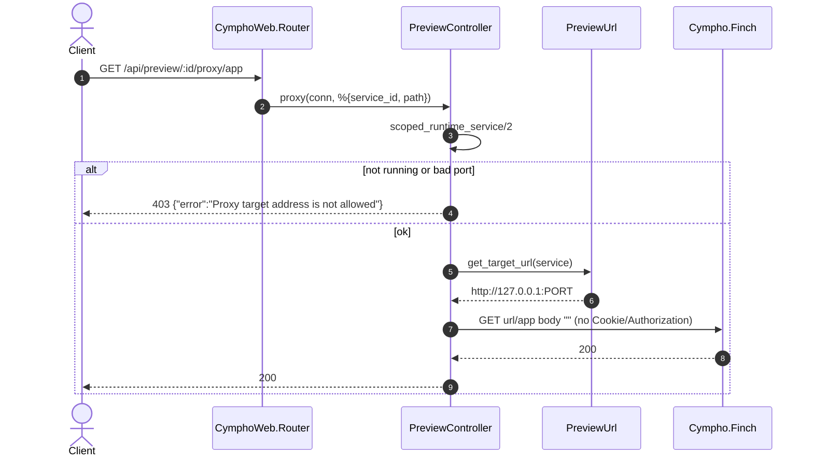
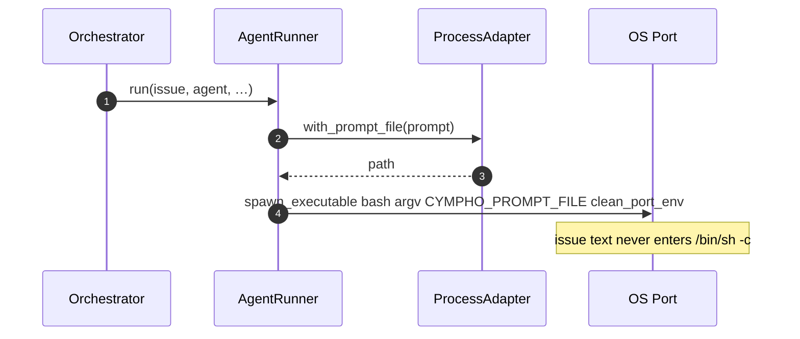
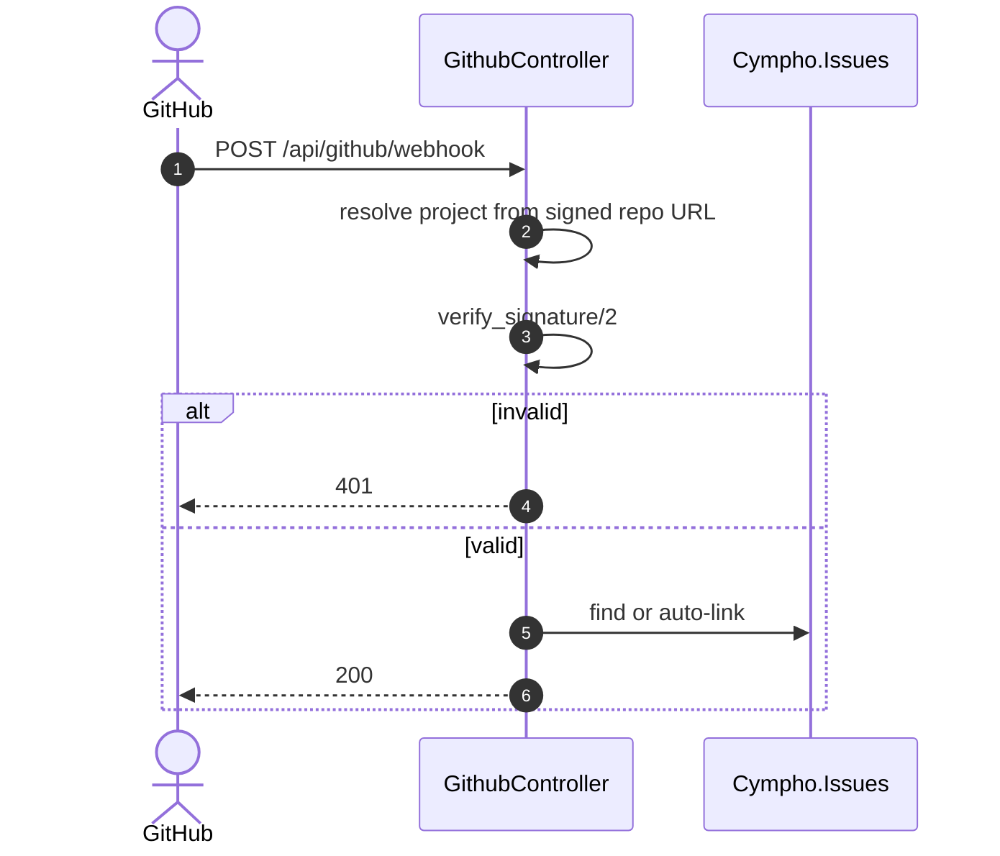
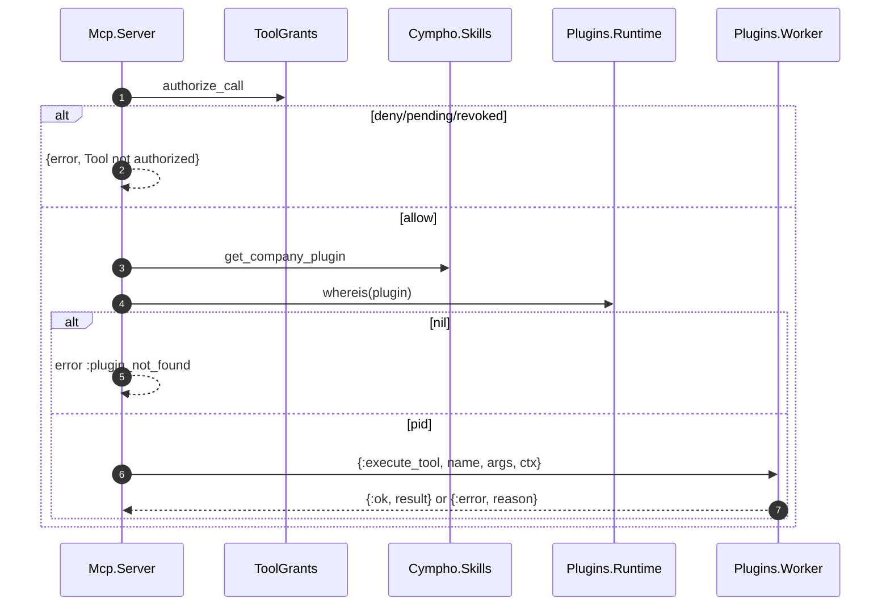

# Requirements

## Introduction

This specification is the in-place replacement for the original eight-requirement audit-remediation program. Independent re-reads of current `lib/` confirmed that Tasks 1–9 of the old spec were never implemented, and that the worst remaining holes were never in that spec: Claude heredoc RCE, BEAM-env inheritance, leftover `/profile/:id` and `?user_id=` IDORs, `CompanyAccess` query/body spoofing, GitHub HMAC-after-write, unscoped labels/policies/secrets, workspace cwd rehome, session/socket company trust, JSONB stage-gate crashes, and pause-rehome leaving live orchestrators. This program closes those residual defects with surgical patches and deletions. It does not invent `Cympho.Plugins.execute_tool/4`, does not 403 default localhost previews, and does not grow new OTP trees or Paperclip screens.

## Requirements

### Requirement 1: Preview proxy is loopback-only and mechanically correct
**User Story:** As an engineer previewing a running workspace service, I want the proxy to hit only the local port and the real API path, so that previews load and cannot be pointed at cloud metadata.

#### Acceptance Criteria
1.1 WHEN `PreviewController.proxy/2` forwards a request THEN the Finch target SHALL be exactly `"http://127.0.0.1:" <> Integer.to_string(service.port)`. `PreviewUrl.get_target_url/1` SHALL ignore `service.url` (url remains a display field).
1.2 IF `service.port` is missing, not an integer, or not in `1..65535` THEN the controller SHALL return HTTP 403 with JSON `{"error": "Proxy target address is not allowed"}`. Default loopback previews SHALL NOT be rejected.
1.3 IF any host is ever resolved before connect THEN the process SHALL connect only to that resolved IP after re-checking IPv4 loopback, IPv6 loopback (`::1`), IPv4-mapped IPv6 (`:ffff:127.0.0.1` and `:ffff:` + RFC1918/link-local), RFC1918, `169.254.0.0/16`, `fd00:ec2::254`, and metadata hostnames (`metadata.google.internal`, `169.254.169.254`). Those SHALL return the same 403 JSON as 1.2.
1.4 WHEN building the upstream path THEN the controller SHALL use `params["path"]` when present, otherwise match `conn.path_info` as `["api", "preview", _id, "proxy" | rest]` and join `rest` with `"/"`. The Finch body on this GET route SHALL be `""`. Request headers `cookie`, `authorization`, `host`, `connection`, `keep-alive`, and `transfer-encoding` SHALL be dropped.
1.5 WHEN `PreviewUrl.generate_preview_url/2` or LiveView `preview_href/1` emit a href for a running service THEN the path SHALL be `"/api/preview/#{id}/proxy"`. They SHALL NOT emit `"/preview/#{id}"` and SHALL NOT use `service.url` as the href.
1.6 WHEN `DELETE /api/exec-workspaces/:id` is received THEN `WorkspaceController.destroy_exec_workspace/2` SHALL exist as a one-line alias of `destroy_execution_workspace/2` and SHALL NOT raise `UndefinedFunctionError`.
1.7 WHEN `GET /api/workspaces/:id/exec-workspaces` or `GET /api/exec-workspaces/:id/operations` finds a company-scoped record THEN the action SHALL return HTTP 200. The controller SHALL read `params["status"]` / `params["limit"]` and MUST NOT call `Keyword.take/2` on the params map.

### Requirement 2: Claude spawn and adapter ports do not inherit the host
**User Story:** As a tenant, I want issue text and my configured CLI command executed without a host shell, so that comments cannot run as the BEAM user and host secrets stay out of the child env.

#### Acceptance Criteria
2.1 WHEN `AgentRunner` starts a Claude turn THEN it SHALL write the prompt with `Cympho.Adapters.ProcessAdapter.with_prompt_file/2` (make that function public) and open `Port.open({:spawn_executable, bash}, args)` with `CYMPHO_PROMPT_FILE`. `bash_command/3` and `Port.open({:spawn, cmd}, …)` SHALL be deleted.
2.2 WHEN quoting a CLI token THEN the token SHALL be wrapped as `"'" <> String.replace(to_string(token), "'", "'\"'\"'") <> "'"`. Replace-only `AgentRunner.shell_quote/1` and `ClaudeCodeAdapter.shell_quote/1` SHALL be deleted.
2.3 IF `ClaudeCodeAdapter.validate_config/1` sees a `command` containing whitespace or any of `;|&$\`<>(){}\n` THEN it SHALL return `{:error, "command must be a single executable name without metacharacters"}`.
2.4 WHEN `ClaudeCodeAdapter.health_check/1` or `available?/1` checks the binary THEN it SHALL use `System.find_executable/1` only. It SHALL NOT interpolate `command` into `bash -lc`.
2.5 WHEN `AgentRunner` or `ProcessAdapter` builds Port env THEN the list SHALL pass through `Cympho.Adapters.CodexAdapter.clean_port_env/1` (make that function public) or an equivalent that unsets every non-replaced host key via `{key, false}`. `AgentRunner.api_key/0`, `ClaudeCodeAdapter.get_api_key/1`, and `RuntimePreflight.credentials_present?/2` SHALL NOT treat `System.get_env("ANTHROPIC_API_KEY")` as a configured tenant credential. The ProcessAdapter test that currently asserts `CYMPHO_PARENT_ENV_TEST` is visible SHALL be flipped so the child does not see that parent var.

### Requirement 3: Leftover identity surfaces are deleted
**User Story:** As a signed-in user, I want profile and notification settings to apply only to me, so that I cannot view, edit, or delete another person.

#### Acceptance Criteria
3.1 WHEN the router is compiled THEN `live "/profile/:id"` and `live "/profile/:id/edit"` SHALL be absent. `ProfileLive.Show`, `ProfileLive.Edit`, and `test/cympho_web/live/profile_live_test.exs` SHALL be deleted. Account profile SHALL remain on `/settings/profile` (`SettingsLive.Profile`).
3.2 WHEN `SettingsLive.Index` mounts THEN it SHALL load only `Users.get_user(socket.assigns.current_user.id)`. The `mount(%{"user_id" => _})` clause, `mount_user_picker/1`, `handle_event("select_user", …)`, and the HEEx picker SHALL be deleted. `?user_id=` SHALL be ignored.
3.3 WHEN user A opens `/settings/notifications?user_id=<B>` THEN the page SHALL render A's email and prefs, never B's. Tests that treated other-user mounts as the happy path SHALL be rewritten as the failure case.
3.4 WHEN `WebhookChannel.deliver/2` is given a URL whose host is loopback, link-local, RFC1918, a metadata hostname, IPv6-mapped private, or has userinfo THEN it SHALL return `{:error, :blocked_webhook_url}` and MUST NOT call Finch.

### Requirement 4: Company mutation and session company are membership-bound
**User Story:** As a company member, I want API and socket tenancy to follow path ids and memberships, so that I cannot mutate another company or join its channel after I leave.

#### Acceptance Criteria
4.1 WHEN `CymphoWeb.Plugs.CompanyAccess.call/2` reads a company id THEN it SHALL use only `conn.path_params["company_id"] || conn.path_params["id"]`.
4.2 WHEN `CompanyController.update/2` or `delete/2` run THEN they SHALL be behind `plug CymphoWeb.Plugs.CompanyAccess, [require_admin: true]`.
4.3 WHEN `Company.changeset/2` is used by generic `Companies.update_company/2` THEN it SHALL NOT cast `:governance_config`, `:status`, `:budget_monthly_cents`, `:spent_monthly_cents`, or `:issue_counter`. Governance writes SHALL go through `CompanyController.update_governance_config/2` only.
4.4 WHEN a member of company A sends `PUT` or `DELETE /api/companies/<B>?company_id=<A>` THEN the response SHALL be HTTP 404 with JSON `{"errors":[{"detail":"Not found"}]}` and company B SHALL be unchanged.
4.5 WHEN `SessionController.default_company_id/1` or `CymphoWeb.Socket.connect/3` (session clause) resolve a company THEN they SHALL accept only a membership (`Companies.has_access?/2`). If session `company_id` is not a membership, `UserAuth` SHALL `delete_session(conn, :company_id)` rather than only falling back in assigns. `User.registration_changeset/2` SHALL NOT cast `:company_id`.
4.6 WHEN `/live` or `/socket` websocket options are set THEN they SHALL be `connect_info: [:peer_data, :x_headers, session: @session_options]`. `Socket.extract_ip/1` SHALL parse the first `x-forwarded-for` or `x-real-ip` via `:inet.parse_address/1`, else `peer_data.address`, else `{127, 0, 0, 1}`.
4.7 WHEN `POST /api/invites/:token/accept` is called by a valid JWT user whose `list_user_companies/1` is `[]` THEN `CymphoWeb.Plugs.UserAuth` SHALL assign `current_user` and skip company resolution. It SHALL NOT halt 401 `"User has no company memberships"`. Other API actions SHALL keep that 401.

### Requirement 5: GitHub webhooks verify HMAC before any write
**User Story:** As an operator, I want unsigned GitHub deliveries rejected before auto-link, so that strangers cannot attach PRs or post comments.

#### Acceptance Criteria
5.1 WHEN `GithubController.webhook/2` handles `pull_request` or `pull_request_review` THEN it SHALL verify HMAC (existing `verify_signature/2`) before `find_issue_and_project/2`, `try_auto_link_by_branch/2`, `Issues.update_issue/2`, or `Comments.create_comment/1`. Resolve the project/secret from the signed payload repo URL with no writes. Invalid signature SHALL return HTTP 401 with empty body.
5.2 WHEN this requirement lands THEN `lib/cympho/github_webhook.ex` and `test/cympho/github_webhook_test.exs` SHALL be deleted. `CymphoWeb.Plugs.GithubWebhookVerification` SHALL NOT be created. `AGENTS.md` and `CLAUDE.md` SHALL stop claiming that plug exists.

### Requirement 6: Labels LiveView is company-scoped
**User Story:** As a tenant admin, I want the Labels page to list and mutate only my company's labels, so that I cannot collide with or delete another tenant's taxonomy.

#### Acceptance Criteria
6.1 WHEN `LabelLive.Index` pages labels THEN it SHALL use a new company-scoped page helper (`Labels.list_company_labels_page/2`) with `where: [company_id: ^current_company.id]`. `Labels.list_labels/0` and `list_labels_page/1` SHALL remain unscoped (do not silently change them).
6.2 WHEN creating a label from LabelLive THEN `company_id` SHALL be `socket.assigns.current_company.id`. `Label.changeset/2` SHALL `validate_required([:name, :company_id])`.
6.3 WHEN editing or deleting THEN LabelLive SHALL call `Labels.get_company_label(current_company.id, id)`. A foreign id SHALL put flash `"Label not found"` and leave other tenants unchanged.
6.4 WHEN `SearchLive.Index` mounts THEN it SHALL assign `Labels.list_labels_by_company(current_company.id)`, not `Labels.list_labels()`.
6.5 WHEN `SettingsLayout` `@groups` is rendered THEN Workspace SHALL include `{:labels, "Labels", "/labels", "hero-tag-mini"}`.

### Requirement 7: Execution policies are company-scoped
**User Story:** As a tenant admin, I want policies created, listed, and assigned only inside my company, so that an empty tenant does not inherit another tenant's Governed posture.

#### Acceptance Criteria
7.1 WHEN `ExecutionPolicy.changeset/2` runs THEN it SHALL cast and `validate_required` `:company_id` and `assoc_constraint(:company)`. The existing nullable column from `20260425181501_enhance_execution_policies.exs` SHALL be backfilled then set NOT NULL. Do not add a second create-table migration.
7.2 WHEN listing, paging, getting, or computing `policy_posture/1` THEN queries SHALL filter `company_id`. `get_company_execution_policy(company_id, id)` SHALL return `{:ok, policy}` or `{:error, :not_found}`. Unscoped `list_execution_policies/0` and `get_execution_policy!/1` SHALL be removed from request paths.
7.3 WHEN ExecutionPolicyLive creates a policy THEN it SHALL stamp `current_company.id` and ignore client `company_id`. Show/Edit/delete of a foreign id SHALL navigate home with flash `"Policy not found"`.
7.4 WHEN `Issues.assign_execution_policy/3` runs THEN it SHALL reject `nil` `issue.company_id` with `{:error, :not_found}`, load the policy with `get_company_execution_policy(issue.company_id, policy_id)`, and load the executor with `Agents.get_company_agent(issue.company_id, executor_id)`.
7.5 WHEN this requirement lands THEN `ExecutionPolicyController` and `ExecutionPolicyJSON` SHALL be deleted and SHALL NOT be added to `router.ex`.

### Requirement 8: Secrets and workspace paths stay in-tenant
**User Story:** As a tenant, I want agent secrets and workspace directories isolated to my company, so that a foreign secret cannot overwrite my API key and a member cannot `cd` to `/etc`.

#### Acceptance Criteria
8.1 WHEN `Secrets.list_secrets_for_agent/1` includes agent or instance rows THEN those clauses SHALL also require `s.company_id == ^company_id`.
8.2 WHEN `Secret.changeset/2` has `scope` in `~w(agent project)` THEN `scope_id` SHALL identify an agent (`Agents.get_company_agent/2`) or project (`Projects.get_company_project/2`) in the same `company_id`, or the changeset SHALL have error `:scope_id` `"is not in this company"`.
8.3 WHEN `resolve_env_for_agent/1` merges keys THEN agent-scoped values SHALL override company-scoped values. `order_by(:key)` last-write-wins SHALL NOT decide precedence.
8.4 WHEN updating a `ProjectWorkspace` or `ExecutionWorkspace` THEN the update changeset SHALL NOT cast `:company_id` or `:project_id`. Create-time scoping remains.
8.5 WHEN casting `cwd` or calling `Runtime.ensure_configured_cwd/4` THEN the path SHALL be expanded. Blank, non-absolute, or `..` paths, and paths whose expanded form is `"/"` or has prefix `/etc`, `/usr`, `/bin`, `/sbin`, `/var`, `/System`, or `/private/etc`, SHALL add changeset error `:cwd` `"is not a safe workspace path"` (or `Runtime` SHALL return `{:error, {:workspace_unavailable, cwd}}`). Add public `Cympho.Workspace.safe_host_cwd?/1` for this check. Existing private `validate_path_is_safe/1` stays for issue-workspace deletion.

### Requirement 9: Principal grants are company-scoped
**User Story:** As a board, I want permission grants to apply only inside the company that issued them, so that a blank scope cannot follow a user into every tenant.

#### Acceptance Criteria
9.1 WHEN the alter-table migration runs THEN `principal_permission_grants.company_id` SHALL be `uuid NOT NULL REFERENCES companies(id) ON DELETE CASCADE` with index `(company_id, principal_type, principal_id)`.
9.2 WHEN creating a grant THEN `company_id` SHALL be required on the schema. Backfill from `board_approval.company_id` or the principal's company; leftover rows SHALL be deleted before NOT NULL.
9.3 WHEN `has_permission?/4` or `has_permission_in_scope?/4` evaluates a grant with blank `scope_type`/`scope_id` THEN it SHALL apply only to resources in that grant's `company_id`. `list`/`has`/`get` SHALL require `company_id`. `create_permission_grant_from_approval/2` SHALL copy `board_approval.company_id`.
9.4 WHEN this lands THEN unused `get_principal_permission_grant!/1` SHALL be deleted. Add `get_company_principal_permission_grant(company_id, id)`.

### Requirement 10: Decide identity and JSONB stage gates
**User Story:** As the designated human approver, I want decide to bind my user id and survive a database reload, so that another member cannot impersonate me and submit_review still advances.

#### Acceptance Criteria
10.1 WHEN `IssueExecutionPolicyController.decide/2` runs THEN `decided_by` SHALL be exactly `conn.assigns.current_user.id`. `params["decided_by"]` SHALL be ignored.
10.2 WHEN a company member who is not `state.current_participant` posts decide THEN the response SHALL be HTTP 401 with message `"Unauthorized"`.
10.3 WHEN this user-JWT route's human/approver/reviewer stage is stored or tested THEN `participant_id` SHALL be a user UUID. Controller tests SHALL stop POSTing agent UUIDs as `decided_by`.
10.4 WHEN `ExecutionState.normalize/1` runs THEN it SHALL coerce `last_decision_outcome`, `current_stage_type`, and history `decision` values with `String.to_existing_atom/1`, rescuing to `nil`.
10.5 WHEN `Runtime.verify_stage_gate/2` or `Issues.do_transition/2` reads `issue.execution_state` THEN they SHALL call `ExecutionState.normalize/1` first and use `Map.get(state, :current_participant)`. At least one test SHALL `Repo.get(Issue, id)` before `transition_issue(issue, :in_review, …)`.

### Requirement 11: Board quorum and owner decision surfaces complete
**User Story:** As a board member, I want a real quorum and a vote button on the page I was sent to, so that one early approve cannot execute the company and Inbox links are not dead-ends.

#### Acceptance Criteria
11.1 WHEN `BoardApproval.approval_threshold_met?/2` runs THEN it SHALL return `false` if `total_votes < min_quorum`. `load_threshold_opts/1` SHALL set `min_quorum` to `min(Keyword.get(explicit) || 3, max(1, length(Companies.list_board_members(company_id))))`. Existing unit tests MAY pass an explicit `:min_quorum`.
11.2 WHEN a company with exactly one board member receives one `"approve"` vote THEN status SHALL become `"approved"`. WHEN a company with three board members receives one `"approve"` under default percentage `0.6` THEN status SHALL stay `"pending"`.
11.3 WHEN `BoardApprovalLive.Show` is pending AND `Companies.is_board_member?(current_user.id, current_company.id)` THEN the template SHALL render Approve, Deny, and Abstain buttons that call `BoardApprovals.cast_vote/4`. Non-members SHALL not see those buttons. Reuse existing `handle_info {:board_vote_cast, _}`.
11.4 WHEN Home `board_approval_action/1` or the Approvals nav counts pending board approvals THEN the destination path SHALL be `"/inbox?status=action"` (or the first pending `"/board-approvals/#{id}"`), never `"/approvals?status=pending"` for that board count. `/approvals` SHALL remain the ordinary `Cympho.Approvals` queue.
11.5 WHEN `BoardApprovalLive.Show` header action is rendered THEN the label SHALL be `"Back to Inbox"` and `navigate` SHALL be `~p"/inbox"`.
11.6 WHEN company autonomy is `:paused` or review-mode THEN Simple Home SHALL expose Pause/Resume (do not leave those items only inside `ui-advanced-only`). Simple `"Turn on"` SHALL NOT use path `"/settings"`.

### Requirement 12: Routine triggers can be added in the UI
**User Story:** As an owner, I want to attach a cron on the routine I just saved, so that “wait for a trigger” is not a dead end.

#### Acceptance Criteria
12.1 WHEN `RoutineLive.Show` has zero schedule triggers THEN it SHALL render a cron field. Submit SHALL call `RoutineTriggers.create_schedule_trigger(%{"routine_id" => routine.id, "cron_expression" => cron})`. Success flash SHALL be `"Trigger created"`. Invalid cron SHALL flash `"Invalid cron expression"`.
12.2 WHEN `routine_next_action_path/1` handles `:add_triggers` THEN it SHALL return `"/routines/" <> routine_id`, not `"/routines"`. Pass the routine id into the helper (change the function head if needed).
12.3 WHEN workspace index empty, exec-workspace “No runtime services”, or routine-show empty runs render THEN they SHALL pass the existing `empty_state` `<:actions>` slot (New workspace / add trigger / start service).

### Requirement 13: Runtime crashes and leftover processes are closed
**User Story:** As an operator, I want pause, classify, health checks, and channels to stay up, so that a deleted agent or a PubSub tuple cannot take down the node.

#### Acceptance Criteria
13.1 WHEN `RehomePaused.rehome_issue/3` runs THEN it SHALL call `Orchestrator.stop(issue.id, {:runtime_stop, :agent_paused_rehome})` before `Issues.force_release_issue/2`. It SHALL NOT call `Dispatcher.stop_issue/2`. After pause, `Orchestrator.whereis(issue.id)` SHALL be `nil`.
13.2 WHEN `Issues.create_issue/1` classifies and ignites THEN it SHALL NOT start two `Task.Supervisor` children against the same `lock_version`. Either skip async classify (keyword-only ignite) or run `Routing.classify_and_persist/1` and pass the returned issue into `AutoAssignment.assign_and_promote_for_dispatch/1`.
13.3 WHEN `HealthChecker` sweeps THEN it SHALL `Repo.all` non-offline agent ids with no surrounding transaction, then check outside Ecto. Persist each health update in its own `Repo.update`. On `{:error, :not_found}` it SHALL return the unchanged state and drop that id from `consecutive_failures` and `last_health_status`.
13.4 WHEN `CompanyChannel` receives an unmatched message THEN `handle_info(_msg, socket)` SHALL return `{:noreply, socket}`. `CymphoWeb.Socket` SHALL keep only `channel "company:*", CymphoWeb.CompanyChannel`. `HeartbeatsChannel` and `RunsChannel` SHALL be deleted. Do not add `channel "company:*:issue:*"` macros.
13.5 WHEN `RateLimiting.dedup_broadcast/3` decides to broadcast THEN it SHALL call `EventStore.append(topic, %{event: event, payload: payload})` and put `event_id` on the Endpoint payload. Deduped events SHALL NOT append.
13.6 WHEN `Cympho.Application` starts THEN `Cympho.Skills.Loader` and `Cympho.Skills.Resolver` SHALL appear in `children` before `Skills.HotReloader`. `Skills.Sandbox.@role_hierarchy` SHALL be `%{cto: 5, ceo: 4, engineer: 3, product_manager: 2, designer: 1}`. Do not invent `architect` or `junior`.

### Requirement 14: HTTP and OpenAI adapters do not forward company keys to private URLs
**User Story:** As a tenant admin, I want member-configured endpoints to be public and keyless unless I set a per-agent key, so that company secrets cannot be sent to `169.254.169.254`.

#### Acceptance Criteria
14.1 WHEN `HttpAdapter.validate_url/1`, `validate_callback_url/1`, health_endpoint, or `OpenAIChatAdapter.validate_endpoint/1` run, and again immediately before `Finch.build`, THEN a shared helper SHALL require a host and reject userinfo, loopback, link-local, RFC1918, metadata hostnames, and IPv6-mapped private forms. Failure message SHALL be `"url host is not allowed"`.
14.2 WHEN Runtime injects a company `OPENAI_API_KEY` / `DASHSCOPE_API_KEY` / `ANTHROPIC_API_KEY` / `LLMOTIONS_API_KEY` for `:openai_chat` THEN the endpoint host SHALL be on the allowlist `["api.openai.com", "api.anthropic.com"]` or end with `".aliyuncs.com"` or match the secret's recorded provider host. Any other host SHALL require an explicit per-agent `api_key` or return `{:error, :missing_api_key}`.
14.3 WHEN HealthChecker probes HTTP or OpenAI THEN `Authorization` and `auth_token` SHALL be omitted from the probe.

### Requirement 15: Concurrent writes, comments, secrets, prompts, and mail
**User Story:** As a collaborator, I want stale writes, comments, secret edits, prompt rollback, and email to do what the UI says, so that I do not lose data or think a toggle worked.

#### Acceptance Criteria
15.1 WHEN `Issues.do_update_issue/2` raises `Ecto.StaleEntryError` THEN it SHALL return `{:error, changeset}` with `add_error(changeset, :lock_version, "is stale (concurrent modification)", stale: true)`. The two identical function heads SHALL be merged into one.
15.2 WHEN Kanban `handle_event("submit_comment", …)` runs THEN the issue SHALL belong to `socket.assigns.current_company.id` via `Issues.get_company_issue/2`, and the comment SHALL set `author_id: socket.assigns.current_user.id` and `author_type: "user"`. A miss SHALL `put_flash(:error, "Issue not found or unauthorized")` and insert nothing.
15.3 WHEN `do_execution_policy_decision/3` or `unblock_dependents/1` receive `{:error, _}` from `update_issue/2` THEN they SHALL NOT `tap` a hard `{:ok, _}` match. `reassign_backlog` lives in `lib/cympho/issues/auto_assignment.ex`, not `issues.ex`.
15.4 WHEN secret form mode is `:edit` THEN the Value password field SHALL not render. `Secrets.update_secret/2` and `rotate_secret/2` SHALL treat blank/whitespace as `nil` (leave `encrypted_value` unchanged on update; rotate SHALL return `{:error, :value_required}`).
15.5 WHEN `apply_prompt_tuning/2` writes the first patched prompt THEN it SHALL insert a baseline `create_config_revision` of the current agent instructions before `update_agent`. Studio Restore SHALL target that prior revision. Tests SHALL NOT treat `"v1 rollback point recorded"` after a first apply on a brand-new agent as success unless a pre-patch snapshot exists.
15.6 WHEN `Notifications.Dispatcher.deliver_via/3` delivers email THEN it SHALL merge `user.email` into the config under both `"email"` and `:email`. `config/test.exs` SHALL set `config :cympho, Cympho.Mailer, adapter: Swoosh.Adapters.Test`.
15.7 WHEN `cache_preference/1` writes ETS THEN it SHALL be `Enum.reject(existing, &(&1.id == pref.id)) ++ [pref]`.
15.8 WHEN `Budgets.record_spend/4` updates `spent_amount` THEN it SHALL run inside `Repo.transaction` with `lock: "FOR UPDATE"` and broadcast after commit. WHEN `WakeupQueue.dequeue/1` selects a pending wake THEN the query SHALL include `lock: "FOR UPDATE SKIP LOCKED"`.

### Requirement 16: Authorized MCP tools call the plugin worker
**User Story:** As an MCP client, I want an allowed dynamic tool to run on the registered plugin process, so that authorization is not a fake success.

#### Acceptance Criteria
16.1 WHEN `Mcp.Server.do_dynamic_call/3` gets `ToolGrants.authorize_call/3` `:allow` and `ToolRegistry.get_active/2` `{:ok, tool}` with a binary `plugin_id` THEN it SHALL `Skills.get_company_plugin(agent.company_id, plugin_id)`, `Plugins.Runtime.whereis(plugin)`, and `GenServer.call(pid, {:execute_tool, tool.name, args || %{}, %{company_id: agent.company_id, agent_id: agent.id}})`.
16.2 IF `plugin_id` is nil or `whereis/1` is nil or `get_company_plugin/2` misses THEN the result SHALL be `%{success: false, dynamic: true, tool: tool.name, error: ":plugin_not_found"}`.
16.3 WHEN the worker replies `{:ok, result}` THEN the map SHALL be `%{success: true, dynamic: true, tool: tool.name, plugin_id: plugin_id, result: result}`. WHEN it replies `{:error, reason}` THEN `%{success: false, dynamic: true, tool: tool.name, error: inspect(reason)}`. `Cympho.Plugins.execute_tool/4` SHALL NOT be added. Worker default `handle_request/3` SHALL reply `{:error, :unsupported_tool}` for `{:execute_tool, _, _, _}`. Grants/controller tests that freeze `"Dynamic tool call authorized"` SHALL be updated.

## Non-Functional Requirements
- Performance: HealthChecker SHALL NOT hold a Repo transaction across HTTP. Sequential out-of-txn checks are enough; do not add `Task.async_stream` as a platform.
- Security: Zero Finch to `169.254.169.254` / RFC1918 / metadata via preview, HTTP adapters, or webhook notifications. Zero host `ANTHROPIC_API_KEY` / `DATABASE_URL` inheritance into tenant Ports.
- Reliability: HealthChecker MUST remain a map state after a deleted agent. CompanyChannel MUST stay alive after an `{:issue_created, _}` tuple.
- Usability: Board Show and Routine Show complete the action they advertise. No visual redesign.

## Out of Scope
- New frameworks, new behaviours, extra OTP trees, or a six-channel socket.
- Copying every Paperclip screen. G6 (real remote EnvironmentDriver) and G13 (skip/replace/rename writers, GitHub/ref sources, directory package format) stay in `paperclip_gap.md`.
- G8 Evaluations LiveView, G11 viewport/safe-area, visual tokens, command-palette restyle.
- Inventing `Cympho.Plugins.execute_tool/4`.
- Forbidding `localhost` / `127.0.0.1` / `0.0.0.0` as preview targets.
- Dedicated `channel "company:*:…"` macros; public-ETS BroadcastDedup rewrite; token-bucket math rewrite.
- Mounting `ExecutionPolicyController`. Adding `CymphoWeb.Plugs.GithubWebhookVerification`.
- Probe HTTP/TCP engine, marketplace fork/provenance, Issue Show assign/decide UI, first-wave seed rewrite beyond Dispatcher prod default.
- Reopening G1–G5 or G7–G12.

---

# Design

## Overview

Fix residual isolation, RCE, and owner-dead-end bugs by deleting leftover surfaces and reusing helpers that already exist: `ProcessAdapter.with_prompt_file/2`, `CodexAdapter.clean_port_env/1`, `RuntimePreflight` wrap-quote, `Labels.get_company_label/2`, `Agents.get_company_agent/2`, `Issues.get_company_issue/2`, `Projects.get_company_project/2`, `BoardApprovals.cast_vote/4`, `RoutineTriggers.create_schedule_trigger/1`, `Plugins.Runtime.whereis/1`, `ExecutionState.normalize/1`, `Orchestrator.stop/2`, `EventStore.append/2`, and `CompanyAccess` `:require_admin`. Do not grow the program into a redesign.

## Code Reuse Analysis
- **`Cympho.Adapters.ProcessAdapter`** (`lib/cympho/adapters/process_adapter.ex`): `with_prompt_file/2` (lines 311–321) already writes a 0600 temp file. Make it public; AgentRunner must call it.
- **`Cympho.Adapters.CodexAdapter`** (`lib/cympho/adapters/codex_adapter.ex`): `clean_port_env/1` (lines 919–931) already unsets every non-replaced host key. Make it public.
- **`Cympho.RuntimePreflight`** (`lib/cympho/runtime_preflight.ex`): `shell_quote/1` at line 1067 already wraps tokens. Copy that form into AgentRunner argv quoting.
- **`Cympho.Workspace`** (`lib/cympho/workspace.ex`): add public `safe_host_cwd?/1`; keep private `validate_path_is_safe/1` for issue workspaces.
- **`Cympho.Labels`** (`lib/cympho/labels.ex`): `get_company_label/2` and `list_labels_by_company/1` already exist. Add only a company-scoped page helper. Do not change `list_labels/0`.
- **`Cympho.Agents`** (`lib/cympho/agents.ex`): `get_company_agent/2` (line 167). `kill_session/1` already stops orchestrators — reuse that stop reason style, not `Dispatcher.stop_issue/2`.
- **`Cympho.Projects`** (`lib/cympho/projects.ex`): `get_company_project/2` (line 171) for secret scope_id checks.
- **`Cympho.Issues`** (`lib/cympho/issues.ex`): `get_company_issue/2` (line 684). `execution_policy_decision/3` already normalizes (line 3037) — extend `normalize/1` and use it in `verify_stage_gate/2` and `do_transition/2`.
- **`Cympho.BoardApprovals`** (`lib/cympho/board_approvals.ex`): `cast_vote/4` (line 157), `get_company_board_approval/2` (line 105), `list_board_members` via `Cympho.Companies.list_board_members/1` (line 2854).
- **`Cympho.RoutineTriggers`** (`lib/cympho/routine_triggers.ex`): `create_schedule_trigger/1` (line 48).
- **`Cympho.Plugins.Runtime`** (`lib/cympho/plugins/runtime.ex`): `whereis/1` (line 99) looks up `Plugins.ProcessRegistry`.
- **`Cympho.Skills`** (`lib/cympho/skills.ex`): `get_company_plugin/2` (line 684).
- **`Cympho.Orchestrator`** (`lib/cympho/orchestrator.ex`): `stop/2` (line 142).
- **`Cympho.EventStore`** (`lib/cympho/event_store.ex`): `append/2` and `fetch_since/3` already implemented; only the producer is missing.
- **`CymphoWeb.FallbackController`** (`lib/cympho_web/controllers/fallback_controller.ex`): `{:error, :unauthorized}` already renders HTTP 401 `"Unauthorized"`.
- **`CymphoWeb.SettingsLive.Profile`** (`lib/cympho_web/live/settings_live/profile.ex`): already loads `current_user.id`.
- **`Cympho.DataCase` / `CymphoWeb.ConnCase` / `CymphoWeb.LiveCase`**: existing test cases. `register_and_log_in_user/1` returns `{conn, user, company}`.

## Architecture

```
Preview:  GET /api/preview/:id/proxy/*  →  Finch http://127.0.0.1:<port>/<path>
Claude:   prompt file → spawn_executable bash argv → clean_port_env
Identity: delete /profile/:id and ?user_id= picker; SettingsLive.Profile only
Company:  path_params + require_admin; Socket.has_access?; clear stale session
GitHub:   HMAC → then auto-link (reuse controller verify_signature/2)
Tenancy:  get_company_* on labels, policies, secrets, grants, workspaces
MCP:      ToolGrants.allow → Runtime.whereis → Worker {:execute_tool, …}
```

### Main Flows

#### Flow 1: Preview proxy (happy and SSRF)


#### Flow 2: Claude spawn (no heredoc)


#### Flow 3: GitHub HMAC-first (error path)


#### Flow 4: MCP dynamic call


## File Structure Plan
- `lib/cympho/agent_runner.ex` (edit)
- `lib/cympho/adapters/claude_code_adapter.ex` (edit)
- `lib/cympho/adapters/process_adapter.ex` (edit)
- `lib/cympho/adapters/codex_adapter.ex` (edit)
- `lib/cympho/runtime_preflight.ex` (edit)
- `lib/cympho/workspaces/preview_url.ex` (edit)
- `lib/cympho_web/controllers/preview_controller.ex` (edit)
- `lib/cympho_web/controllers/workspace_controller.ex` (edit)
- `lib/cympho_web/live/workspace_live/exec_workspace.ex` (edit)
- `lib/cympho_web/live/workspace_live/show_workspace.ex` (edit)
- `lib/cympho_web/live/workspace_live/index.ex` (edit)
- `lib/cympho_web/router.ex` (edit)
- `lib/cympho_web/live/profile_live/show.ex` (delete)
- `lib/cympho_web/live/profile_live/edit.ex` (delete)
- `lib/cympho_web/live/agent_live/edit.ex` (delete)
- `lib/cympho_web/controllers/execution_policy_controller.ex` (delete)
- `lib/cympho_web/controllers/execution_policy_json.ex` (delete)
- `lib/cympho/github_webhook.ex` (delete)
- `lib/cympho_web/heartbeats_channel.ex` (delete)
- `lib/cympho_web/runs_channel.ex` (delete)
- `lib/cympho_web/live/settings_live/index.ex` (edit)
- `lib/cympho_web/live/settings_live/index.html.heex` (edit)
- `lib/cympho/notifications/webhook_channel.ex` (edit)
- `lib/cympho_web/plugs/company_access.ex` (edit)
- `lib/cympho_web/controllers/company_controller.ex` (edit)
- `lib/cympho/companies/company.ex` (edit)
- `lib/cympho/companies.ex` (edit)
- `lib/cympho_web/controllers/session_controller.ex` (edit)
- `lib/cympho_web/socket.ex` (edit)
- `lib/cympho_web/user_auth.ex` (edit)
- `lib/cympho_web/plugs/user_auth.ex` (edit)
- `lib/cympho/users/user.ex` (edit)
- `lib/cympho_web/endpoint.ex` (edit)
- `lib/cympho_web/controllers/github_controller.ex` (edit)
- `lib/cympho_web/live/label_live/index.ex` (edit)
- `lib/cympho/labels.ex` (edit)
- `lib/cympho/labels/label.ex` (edit)
- `lib/cympho_web/live/search_live/index.ex` (edit)
- `lib/cympho_web/components/settings_layout.ex` (edit)
- `lib/cympho/execution_policies/execution_policy.ex` (edit)
- `lib/cympho/execution_policies.ex` (edit)
- `lib/cympho_web/live/execution_policy_live/index.ex` (edit)
- `lib/cympho_web/live/execution_policy_live/new.ex` (edit)
- `lib/cympho_web/live/execution_policy_live/show.ex` (edit)
- `lib/cympho_web/live/execution_policy_live/edit.ex` (edit)
- `lib/cympho/issues.ex` (edit)
- `lib/cympho/secrets.ex` (edit)
- `lib/cympho/secrets/secret.ex` (edit)
- `lib/cympho_web/live/secrets_live/form_component.ex` (edit)
- `lib/cympho/workspaces/project_workspace.ex` (edit)
- `lib/cympho/workspaces/execution_workspace.ex` (edit)
- `lib/cympho/runtime.ex` (edit)
- `lib/cympho/workspace.ex` (edit)
- `lib/cympho/principal_permissions/principal_permission_grant.ex` (edit)
- `lib/cympho/principal_permissions.ex` (edit)
- `priv/repo/migrations/20260814000001_add_company_id_to_principal_permission_grants.exs` (new)
- `priv/repo/migrations/20260814000002_require_execution_policies_company_id.exs` (new)
- `lib/cympho_web/controllers/issue_execution_policy_controller.ex` (edit)
- `lib/cympho/issues/execution_state.ex` (edit)
- `lib/cympho/board_approvals/board_approval.ex` (edit)
- `lib/cympho/board_approvals.ex` (edit)
- `lib/cympho_web/live/board_approval_live/show.ex` (edit)
- `lib/cympho_web/live/board_approval_live/show.html.heex` (edit)
- `lib/cympho_web/live/dashboard_live/index.ex` (edit)
- `lib/cympho_web/live/dashboard_live/index.html.heex` (edit)
- `lib/cympho_web/components/nav_rail.ex` (edit)
- `lib/cympho_web/live/routine_live/show.ex` (edit)
- `lib/cympho_web/live/routine_live/show.html.heex` (edit)
- `lib/cympho_web/live/routine_live/index.ex` (edit)
- `lib/cympho/issues/rehome_paused.ex` (edit)
- `lib/cympho/adapters/health_checker.ex` (edit)
- `lib/cympho_web/company_channel.ex` (edit)
- `lib/cympho/rate_limiting.ex` (edit)
- `lib/cympho/application.ex` (edit)
- `lib/cympho/skills/sandbox.ex` (edit)
- `lib/cympho/adapters/http_adapter.ex` (edit)
- `lib/cympho/adapters/openai_chat_adapter.ex` (edit)
- `lib/cympho_web/live/kanban_live/index.ex` (edit)
- `lib/cympho_web/live/operations_live/index.ex` (edit)
- `lib/cympho/notifications/dispatcher.ex` (edit)
- `lib/cympho/mcp/server.ex` (edit)
- `lib/cympho/plugins/worker.ex` (edit)
- `lib/cympho/budgets.ex` (edit)
- `lib/cympho/heartbeat_engine/wakeup_queue.ex` (edit)
- `config/test.exs` (edit)
- `AGENTS.md` (edit)
- `CLAUDE.md` (edit)
- `test/cympho_web/controllers/preview_controller_test.exs` (new)
- `test/cympho_web/controllers/workspace_controller_test.exs` (new)
- `test/cympho/principal_permissions_test.exs` (new)
- `test/cympho/board_approvals_quorum_test.exs` (new)
- `test/cympho_web/live/profile_live_test.exs` (delete)
- `test/cympho/github_webhook_test.exs` (delete)
- `test/cympho_web/live/agent_edit_live_test.exs` (delete)
- `test/cympho/agent_runner_test.exs` (edit)
- `test/cympho/adapters/process_adapter_test.exs` (edit)
- `test/cympho_web/live/settings_live_test.exs` (edit)
- `test/cympho_web/controllers/company_controller_test.exs` (edit)
- `test/cympho_web/channels/socket_auth_test.exs` (edit)
- `test/cympho_web/controllers/session_controller_test.exs` (edit)
- `test/cympho_web/controllers/api_tenancy_test.exs` (edit)
- `test/cympho_web/controllers/github_controller_test.exs` (edit)
- `test/cympho_web/live/label_live_test.exs` (edit)
- `test/cympho/labels_test.exs` (edit)
- `test/cympho/execution_policies_test.exs` (edit)
- `test/cympho_web/live/execution_policy_live_test.exs` (edit)
- `test/cympho_web/controllers/issue_execution_policy_controller_test.exs` (edit)
- `test/cympho/secrets_test.exs` (edit)
- `test/cympho/workspace_test.exs` (edit)
- `test/cympho/runtime_test.exs` (edit)
- `test/cympho/execution_policy_lifecycle_test.exs` (edit)
- `test/cympho_web/live/board_approval_live_test.exs` (edit)
- `test/cympho_web/live/routine_live_test.exs` (edit)
- `test/cympho/issues/rehome_paused_assignee_test.exs` (edit)
- `test/cympho/adapters/health_checker_test.exs` (edit)
- `test/cympho_web/channels/issues_channel_test.exs` (edit)
- `test/cympho_web/channels/company_channel_test.exs` (edit)
- `test/cympho/event_store_test.exs` (edit)
- `test/cympho/rate_limiting/rate_limiting_test.exs` (edit)
- `test/cympho/skills/sandbox_audit_test.exs` (edit)
- `test/cympho/skills/loader_test.exs` (edit)
- `test/cympho/adapters/http_adapter_test.exs` (edit)
- `test/cympho/adapters/openai_chat_adapter_test.exs` (edit)
- `test/cympho_web/live/kanban_live_test.exs` (edit)
- `test/cympho/issues_test.exs` (edit)
- `test/cympho_web/live/operations_live_test.exs` (edit)
- `test/cympho/notifications/dispatcher_test.exs` (edit)
- `test/cympho/notifications/channels_test.exs` (edit)
- `test/cympho/heartbeat_engine/wakeup_queue_test.exs` (edit)
- `test/cympho/mcp/tool_registry_grants_test.exs` (edit)
- `test/cympho_web/controllers/mcp_controller_test.exs` (edit)

## Components and Interfaces

### `Cympho.Workspaces.PreviewUrl`
- **Purpose:** Build display hrefs and the loopback Finch target.
- **File:** `lib/cympho/workspaces/preview_url.ex`
- **Interfaces:** `generate_preview_url(RuntimeService.t(), String.t()) :: String.t() | nil`, `get_target_url(RuntimeService.t()) :: String.t() | nil`
- **Dependencies:** `RuntimeService`
- **Reuses:** existing `@common_dev_ports` only as documentation; port range is `1..65535`
- **Satisfies:** 1.1, 1.5

### `CymphoWeb.PreviewController`
- **Purpose:** Company-scoped preview JSON and GET proxy.
- **File:** `lib/cympho_web/controllers/preview_controller.ex`
- **Interfaces:** `proxy(Plug.Conn.t(), map()) :: Plug.Conn.t()`, `show/2`, `index/2`
- **Dependencies:** `Workspaces.get_company_runtime_service/2` (already used as `scoped_runtime_service/2`). Do not call `Workspaces.get_service/1` (it does not exist).
- **Reuses:** `PreviewUrl`
- **Satisfies:** 1.1, 1.2, 1.3, 1.4

### `CymphoWeb.WorkspaceController`
- **Purpose:** Workspace HTTP API.
- **File:** `lib/cympho_web/controllers/workspace_controller.ex`
- **Interfaces:** `destroy_exec_workspace(Plug.Conn.t(), map()) :: Plug.Conn.t()`, `list_exec_workspaces/2`, `list_operations/2`
- **Satisfies:** 1.6, 1.7

### `Cympho.AgentRunner`
- **Purpose:** Claude CLI process for the default adapter.
- **File:** `lib/cympho/agent_runner.ex`
- **Interfaces:** existing `run/4`; delete `bash_command/3`; public quoting helper optional
- **Reuses:** `ProcessAdapter.with_prompt_file/2`, `CodexAdapter.clean_port_env/1`
- **Satisfies:** 2.1, 2.2, 2.5

### `Cympho.Adapters.ClaudeCodeAdapter`
- **Purpose:** Validate tenant command and health without a shell.
- **File:** `lib/cympho/adapters/claude_code_adapter.ex`
- **Interfaces:** `validate_config(map()) :: :ok | {:error, String.t()}`, `health_check/1`, `available?/1`
- **Satisfies:** 2.3, 2.4, 2.5

### `CymphoWeb.SettingsLive.Index` / `SettingsLive.Profile`
- **Purpose:** Self-only notifications and profile.
- **Files:** `lib/cympho_web/live/settings_live/index.ex`, `lib/cympho_web/live/settings_live/profile.ex`
- **Interfaces:** `mount/3` loads current_user only
- **Satisfies:** 3.1, 3.2, 3.3

### `Cympho.Notifications.WebhookChannel`
- **Purpose:** Signed outbound webhooks with a host guard.
- **File:** `lib/cympho/notifications/webhook_channel.ex`
- **Interfaces:** `deliver(Message.t(), map()) :: :ok | {:error, term()}`
- **Satisfies:** 3.4

### `CymphoWeb.Plugs.CompanyAccess`
- **Purpose:** Membership (and optional admin) gate from path params.
- **File:** `lib/cympho_web/plugs/company_access.ex`
- **Interfaces:** `call(Plug.Conn.t(), keyword()) :: Plug.Conn.t()`
- **Satisfies:** 4.1, 4.2, 4.4

### `Cympho.Companies.Company`
- **Purpose:** Generic company update must not write governance or counters.
- **File:** `lib/cympho/companies/company.ex`
- **Interfaces:** `changeset(t(), map()) :: Ecto.Changeset.t()` (create), `update_changeset(t(), map()) :: Ecto.Changeset.t()` (used by `Companies.do_update_company/2`)
- **Satisfies:** 4.3

### `CymphoWeb.Socket` / `CymphoWeb.Endpoint` / `CymphoWeb.UserAuth` / `CymphoWeb.SessionController`
- **Purpose:** Membership-bound session company and real client IPs.
- **Files:** `lib/cympho_web/socket.ex`, `lib/cympho_web/endpoint.ex`, `lib/cympho_web/user_auth.ex`, `lib/cympho_web/controllers/session_controller.ex`
- **Interfaces:** `connect/3`, `extract_ip/1`, `default_company_id/1`, `require_authenticated_user/2`, `assign_browser_company_context/2` (private), `resolve_company_for_conn/3` (private), `assign_current_company/2` (private, LiveView assigns only)
- **Satisfies:** 4.5, 4.6

### `CymphoWeb.Plugs.UserAuth`
- **Purpose:** API JWT auth; allow invite accept with zero companies.
- **File:** `lib/cympho_web/plugs/user_auth.ex`
- **Interfaces:** `call/2`
- **Satisfies:** 4.7

### `CymphoWeb.GithubController`
- **Purpose:** HMAC-first webhook.
- **File:** `lib/cympho_web/controllers/github_controller.ex`
- **Interfaces:** `webhook/2`, existing `verify_signature/2`
- **Satisfies:** 5.1, 5.2

### `Cympho.Labels` / `CymphoWeb.LabelLive.Index`
- **Purpose:** Company-scoped label UI.
- **Files:** `lib/cympho/labels.ex`, `lib/cympho/labels/label.ex`, `lib/cympho_web/live/label_live/index.ex`
- **Interfaces:** `list_company_labels_page(String.t(), keyword()) :: Pagination.Page.t()`, `get_company_label/2` (existing)
- **Satisfies:** 6.1, 6.2, 6.3, 6.4, 6.5

### `Cympho.ExecutionPolicies`
- **Purpose:** Company-scoped policies.
- **Files:** `lib/cympho/execution_policies.ex`, `lib/cympho/execution_policies/execution_policy.ex`
- **Interfaces:** `list_execution_policies(String.t()) :: [t()]`, `get_company_execution_policy(String.t(), String.t()) :: {:ok, t()} | {:error, :not_found}`, `list_execution_policies_page(String.t(), keyword())`, `policy_posture([t()])`
- **Satisfies:** 7.1, 7.2, 7.3, 7.5

### `Cympho.Issues` (assign / decide / update / transition)
- **Purpose:** Tenant-safe policy attach, decide identity as second gate, JSONB-safe transitions, stale lock.
- **File:** `lib/cympho/issues.ex`
- **Interfaces:** `assign_execution_policy/3`, `execution_policy_decision/3`, `do_update_issue/2` (private), `do_transition/2` (private)
- **Satisfies:** 7.4, 10.4, 10.5, 15.1, 15.3

### `Cympho.Secrets` / `Cympho.Secrets.Secret`
- **Purpose:** Same-company agent secrets and explicit merge precedence.
- **Files:** `lib/cympho/secrets.ex`, `lib/cympho/secrets/secret.ex`
- **Interfaces:** `list_secrets_for_agent/1`, `resolve_env_for_agent/1`, `update_secret/2`, `rotate_secret/2`, `changeset/2`
- **Satisfies:** 8.1, 8.2, 8.3, 15.4

### `Cympho.Workspace` / workspace schemas / `Cympho.Runtime`
- **Purpose:** Safe cwd and create-time-only tenancy on workspaces; JSONB stage gates; secret-backed keys.
- **Files:** `lib/cympho/workspace.ex`, `lib/cympho/workspaces/project_workspace.ex`, `lib/cympho/workspaces/execution_workspace.ex`, `lib/cympho/runtime.ex`
- **Interfaces:** `safe_host_cwd?(String.t()) :: boolean()`, `ensure_configured_cwd/4` (private), `verify_stage_gate/2` (private), `with_secret_backed_api_key/3` (private)
- **Satisfies:** 8.4, 8.5, 10.5, 14.2

### `Cympho.PrincipalPermissions`
- **Purpose:** Company-scoped grants; blank scope means this company only.
- **Files:** `lib/cympho/principal_permissions.ex`, `lib/cympho/principal_permissions/principal_permission_grant.ex`
- **Interfaces:** `has_permission?(…, opts)`, `has_permission_in_scope?/4`, `get_company_principal_permission_grant/2`, `create_permission_grant_from_approval/2`
- **Satisfies:** 9.1, 9.2, 9.3, 9.4

### `CymphoWeb.IssueExecutionPolicyController`
- **Purpose:** Bind decide to current_user.
- **File:** `lib/cympho_web/controllers/issue_execution_policy_controller.ex`
- **Interfaces:** `decide(Plug.Conn.t(), map()) :: Plug.Conn.t()`, `assign/2`
- **Satisfies:** 10.1, 10.2, 10.3

### `Cympho.Issues.ExecutionState`
- **Purpose:** Normalize JSONB keys and enum atoms.
- **File:** `lib/cympho/issues/execution_state.ex`
- **Interfaces:** `normalize(map() | nil) :: map() | nil`
- **Satisfies:** 10.4, 10.5

### `Cympho.BoardApprovals.BoardApproval` / `Cympho.BoardApprovals`
- **Purpose:** Quorum-aware auto-approve.
- **Files:** `lib/cympho/board_approvals/board_approval.ex`, `lib/cympho/board_approvals.ex`
- **Interfaces:** `approval_threshold_met?(t(), keyword()) :: boolean()`, `cast_vote/4`, `load_threshold_opts/1` (private)
- **Satisfies:** 11.1, 11.2

### `CymphoWeb.BoardApprovalLive.Show` / Dashboard / Nav
- **Purpose:** Vote UI and correct destinations.
- **Files:** `lib/cympho_web/live/board_approval_live/show.ex`, `show.html.heex`, `lib/cympho_web/live/dashboard_live/index.ex`, `index.html.heex`, `lib/cympho_web/components/nav_rail.ex`
- **Interfaces:** `handle_event("cast_vote", …)`, `board_approval_action/1`
- **Satisfies:** 11.3, 11.4, 11.5, 11.6

### `CymphoWeb.RoutineLive.Show` / Index
- **Purpose:** Attach a schedule on the detail page.
- **Files:** `lib/cympho_web/live/routine_live/show.ex`, `show.html.heex`, `index.ex`
- **Interfaces:** `handle_event("create_schedule_trigger", …)`, `routine_next_action_path/1`
- **Satisfies:** 12.1, 12.2, 12.3

### `Cympho.Issues.RehomePaused` / `Cympho.Orchestrator`
- **Purpose:** Stop the live session before release.
- **Files:** `lib/cympho/issues/rehome_paused.ex`, `lib/cympho/orchestrator.ex`
- **Interfaces:** `rehome_issue/3` (private), `Orchestrator.stop/2`
- **Satisfies:** 13.1

### `Cympho.Adapters.HealthChecker`
- **Purpose:** Health sweeps without a held transaction or corrupted state.
- **File:** `lib/cympho/adapters/health_checker.ex`
- **Interfaces:** existing GenServer; `perform_health_checks/1`, `check_agent_health/2` (private)
- **Satisfies:** 13.3

### `CymphoWeb.CompanyChannel` / `Cympho.RateLimiting` / `Cympho.EventStore`
- **Purpose:** Survive LiveView PubSub tuples; populate replay.
- **Files:** `lib/cympho_web/company_channel.ex`, `lib/cympho/rate_limiting.ex`
- **Interfaces:** `handle_info/2`, `dedup_broadcast/3`
- **Reuses:** `EventStore.append/2` (already implemented; do not edit `event_store.ex`)
- **Satisfies:** 13.4, 13.5

### `Cympho.Skills.Loader` / `Resolver` / `Sandbox` / `Cympho.Application`
- **Purpose:** ETS tables exist at boot; role lookup is a map.
- **Files:** `lib/cympho/application.ex`, `lib/cympho/skills/sandbox.ex`
- **Interfaces:** existing `start_link/1`; `get_role_level/1`
- **Satisfies:** 13.6

### `Cympho.Adapters.HttpAdapter` / `OpenAIChatAdapter`
- **Purpose:** Shared public-URL guard and no secret-forward.
- **Files:** `lib/cympho/adapters/http_adapter.ex`, `lib/cympho/adapters/openai_chat_adapter.ex`
- **Interfaces:** add public `HttpAdapter.validate_public_url(String.t()) :: :ok | {:error, String.t()}`
- **Satisfies:** 14.1, 14.2, 14.3

### `CymphoWeb.KanbanLive.Index`
- **Purpose:** Company-scoped comments with author.
- **File:** `lib/cympho_web/live/kanban_live/index.ex`
- **Interfaces:** `handle_event("submit_comment", …)`
- **Satisfies:** 15.2

### `CymphoWeb.OperationsLive.Index`
- **Purpose:** Baseline prompt revision before first apply.
- **File:** `lib/cympho_web/live/operations_live/index.ex`
- **Interfaces:** `apply_prompt_tuning/2` (private)
- **Satisfies:** 15.5

### `Cympho.Notifications.Dispatcher` / `EmailChannel` / `Cympho.Mailer`
- **Purpose:** Cache prefs correctly and deliver to `user.email`.
- **Files:** `lib/cympho/notifications/dispatcher.ex`, `config/test.exs`
- **Interfaces:** `cache_preference/1` (private), `deliver_via/3` (private)
- **Reuses:** `Cympho.Notifications.EmailChannel.deliver/2` already reads `config[:email]` — do not edit that file
- **Satisfies:** 15.6, 15.7

### `Cympho.Budgets` / `Cympho.HeartbeatEngine.WakeupQueue`
- **Purpose:** Row locks under concurrency.
- **Files:** `lib/cympho/budgets.ex`, `lib/cympho/heartbeat_engine/wakeup_queue.ex`
- **Interfaces:** `record_spend/4`, `dequeue/1`
- **Satisfies:** 15.8

### `Cympho.Mcp.Server` / `Cympho.Plugins.Worker` / `Cympho.Plugins.Runtime`
- **Purpose:** Real worker call after grant allow.
- **Files:** `lib/cympho/mcp/server.ex`, `lib/cympho/plugins/worker.ex`
- **Interfaces:** `do_dynamic_call/3` (private), `handle_request/3`
- **Reuses:** `Plugins.Runtime.whereis/1` (line 99), `Skills.get_company_plugin/2` (line 684)
- **Satisfies:** 16.1, 16.2, 16.3

### `Cympho.Issues` (classify/ignite)
- **Purpose:** One writer on lock_version 0.
- **File:** `lib/cympho/issues.ex`
- **Interfaces:** `maybe_classify_role/2` (private), `maybe_auto_ignite/2` (private)
- **Reuses:** `Routing.classify_and_persist/1`, `AutoAssignment.assign_and_promote_for_dispatch/1`
- **Satisfies:** 13.2

## Data Models

### `execution_policies` (existing table, column already present)
- `id`: `:binary_id`
- `name`: `:string`, required
- `stage_configs`: `{:array, :map}`, default `[]`
- `company_id`: `:binary_id`, required after backfill, FK `companies.id`
- Example: `%{name: "Default", company_id: company.id, stage_configs: [%{"type" => "executor", "participant_id" => user_or_agent_id}]}`

### `principal_permission_grants` (alter)
- Existing integer `id` (do not change PK)
- Add `company_id`: `:binary_id`, NOT NULL, `on_delete: :delete_all`
- Blank `scope_type`/`scope_id` means all resources **in that company_id only**
- Example: `%{company_id: company.id, principal_type: "user", principal_id: user.id, permission: "task.assign", scope_type: nil, scope_id: nil}`

### Preview target
- Finch URL: `"http://127.0.0.1:#{port}"`
- Display `service.url` unchanged
- Href: `"/api/preview/#{id}/proxy"`

### Secret env merge
- Start `%{}`
- Put company-scoped keys
- Put agent-scoped keys second (override)

## Error Handling
1. **Scenario:** Preview port missing or target would be metadata
   - **Handling:** 403 `{"error": "Proxy target address is not allowed"}`
   - **User impact:** Preview link shows that JSON, not AWS credentials
2. **Scenario:** Claude `command` is `cz; id`
   - **Handling:** `validate_config/1` returns `{:error, "command must be a single executable name without metacharacters"}`; run never interpolates it into bash
   - **User impact:** Adapter unavailable; no host RCE
3. **Scenario:** Member of A hits `/api/companies/<B>?company_id=<A>`
   - **Handling:** CompanyAccess 404 `{"errors":[{"detail":"Not found"}]}`
   - **User impact:** B unchanged
4. **Scenario:** Forged `decided_by`
   - **Handling:** Ignored; identity is `current_user.id`; non-participant → 401 `"Unauthorized"`
   - **User impact:** Cannot impersonate the stage actor
5. **Scenario:** Authorized MCP tool with nil plugin_id
   - **Handling:** `%{success: false, dynamic: true, tool: name, error: ":plugin_not_found"}`
   - **User impact:** No fake `"Dynamic tool call authorized"`
6. **Scenario:** Deleted agent during health sweep
   - **Handling:** return unchanged state; drop that id
   - **User impact:** HealthChecker stays up
7. **Scenario:** Stale issue lock
   - **Handling:** `{:error, changeset}` on `:lock_version` `"is stale (concurrent modification)"`
   - **User impact:** No process crash
8. **Scenario:** Unsigned GitHub webhook
   - **Handling:** 401 empty body before any write
   - **User impact:** No auto-link comment

## Testing Strategy
- Unit: new `preview_controller_test.exs`, `workspace_controller_test.exs`, `principal_permissions_test.exs`, `board_approvals_quorum_test.exs`; extend the existing files named in each task.
- Integration: controller/LiveCase files already in the tree; flip IDOR happy-paths to failures.
- Command to run tests: `mix test` — expect "0 failures"

## Assumptions
- Original spec 06 requirements 1–8 are all still open in current code. Residual adjustments (do not implement the old text as written): drop AC 1.2 localhost/127.0.0.1/0.0.0.0 reject; drop Req 4.3 dedicated-channel remapping; drop Req 4.4 token-bucket rewrite; drop Req 7 `Plugins.execute_tool/4`; drop Req 8.2 public-ETS BroadcastDedup rewrite; do not mount ExecutionPolicyController; do not add GithubWebhookVerification.
- Already shipped (do not invent busywork): G1–G5, G7 grants/registry, G8 durable evaluations (no LiveView required), G9 import preview, G10 onboarding, G11 viewport, G12 OTLP. G5 stale plan confirmation already returns `:stale_target_revision`. `SettingsLive.Profile`, `UserController.enforce_self/2`, `get_company_issue/2`, `get_company_agent/2`, `get_company_label/2`, `cast_vote/4`, `create_schedule_trigger/1`, `ProcessAdapter.with_prompt_file/2`, `CodexAdapter.clean_port_env/1`, `EventStore.append/2`, `Orchestrator.stop/2`, and `FallbackController` 401 already exist.
- G6 and G13 remain open and stay in `paperclip_gap.md`.
- Project/execution `cwd` may live outside `/tmp/cympho/workspaces`, so `validate_path_is_safe/1` is the wrong check for those rows. Use new `safe_host_cwd?/1`.
- Human decide on the user-JWT route uses user ids as `participant_id`. Agent-auth decide is out of scope.
- `Users.list_users/0` stays for `users_test.exs`; Settings must stop calling it.
- `destroy_execution_workspace/2` already returns JSON 200 on success; the alias must do the same.
- Making `with_prompt_file/2` and `clean_port_env/1` public is the intended reuse, not copying the bodies.
- `Company.changeset/2` is also used by create; create may still need `:status` default. Implement by splitting `update_changeset/2` without `:governance_config`/budgets/`issue_counter`/`status`, and keep create on the broader changeset — or drop those fields from the generic changeset and set status only in `create_company/1`. Prefer an `update_changeset/2` used by `do_update_company/2`.
- Prod Dispatcher default-enabled is a real footgun; it is out of this wave (no seed rewrite).
- Invite-accept without membership is in scope because the route is otherwise unreachable.
- Session-cookie cleanup happens on the conn path only: `require_authenticated_user/2` → `assign_browser_company_context/2` → `resolve_company_for_conn/3` calls `delete_session(conn, :company_id)`. LiveView `assign_current_company/2` cannot mutate cookies; after the plug clears the session, the next mount falls back to a membership.
- `maybe_classify_role/2` must not start a `Task.Supervisor` child. When `auto_ignite_sync` is true, classify synchronously and return that issue into `maybe_auto_ignite/2`. When it is false, skip classify and return the original issue (keyword-only ignite). Do not add a new config flag.

---

# Tasks

- [x] 1. Pin preview target to loopback and fix hrefs
  - Files: `lib/cympho/workspaces/preview_url.ex` (edit), `lib/cympho_web/live/workspace_live/exec_workspace.ex` (edit), `lib/cympho_web/live/workspace_live/show_workspace.ex` (edit)
  - Purpose: Stop treating `service.url` as a fetch target and stop emitting `/preview/:id` links that 404.
  - Do:
    1. In `PreviewUrl.get_target_url/1`, delete the `if service.url` branch. If `service.port` is an integer in `1..65535`, return `"http://127.0.0.1:#{service.port}"`; else return `nil`.
    2. In `generate_preview_url/2`, when port is set and status is `"running"`, return `"#{base_url}/api/preview/#{service.id}/proxy"`.
    3. In both LiveViews, replace `preview_href/1`: delete the url-first clause. For `%{status: "running", port: port, id: id}` when port is an integer, return `"/api/preview/#{id}/proxy"`.
  - Details:
    - `service.url` may still render as `connection_string/1` display text.
  - Check: `mix compile --warnings-as-errors` finishes with no errors.
  - _Leverage:_ `lib/cympho/workspaces/preview_url.ex`
  - _Requirements: 1.1, 1.5_

- [x] 2. Fix PreviewController path, body, headers, and 403
  - Files: `lib/cympho_web/controllers/preview_controller.ex` (edit), `test/cympho_web/controllers/preview_controller_test.exs` (new)
  - Purpose: Stop `KeyError :body`, stop forwarding `#{id}/proxy/...`, and refuse non-loopback targets.
  - Do:
    1. In `proxy_request/2`, build path from `conn.params["path"]` or `["api","preview",_, "proxy" | rest] = conn.path_info` joined with `"/"`.
    2. Pass `""` as the Finch body. Filter hop-by-hop request headers listed in 1.4.
    3. If `PreviewUrl.get_target_url/1` is nil, return 403 JSON `%{error: "Proxy target address is not allowed"}`.
    4. Keep `scoped_runtime_service/2`. Do not call `Workspaces.get_service/1`.
    5. Add ConnCase tests: href contains `/api/preview/`; proxy does not raise; forwarded path is not `"#{id}/proxy/..."`; metadata URL cannot become the Finch target because url is ignored.
  - Details:
    - 403 body is exactly `%{error: "Proxy target address is not allowed"}`.
    - Do not add a DNS resolver. The Finch URL is the literal string `"http://127.0.0.1:" <> Integer.to_string(port)` from `get_target_url/1`. That satisfies 1.3 (no host is resolved before connect). If `get_target_url/1` is nil, return the 403 JSON.
  - Check: `mix test test/cympho_web/controllers/preview_controller_test.exs` prints "0 failures".
  - _Leverage:_ `scoped_runtime_service/2`, `PreviewUrl`
  - _Requirements: 1.2, 1.3, 1.4_

- [x] 3. Alias destroy_exec_workspace and parse string list params
  - Files: `lib/cympho_web/controllers/workspace_controller.ex` (edit), `test/cympho_web/controllers/workspace_controller_test.exs` (new)
  - Purpose: DELETE and list endpoints currently 500 on a found record.
  - Do:
    1. Add `def destroy_exec_workspace(conn, params), do: destroy_execution_workspace(conn, params)`.
    2. In `list_exec_workspaces/2`, replace `Keyword.take(params, [:status])` with `opts = if status = params["status"], do: [status: status], else: []`.
    3. In `list_operations/2`, replace `Keyword.take(params, [:limit])` with parse of `params["limit"]` to integer when present.
    4. Add ConnCase: found exec-workspace list 200; operations 200; DELETE 200.
  - Details:
    - Missing id stays 404 via existing `with`.
  - Check: `mix test test/cympho_web/controllers/workspace_controller_test.exs` prints "0 failures".
  - _Leverage:_ existing `destroy_execution_workspace/2`
  - _Requirements: 1.6, 1.7_

- [x] 4. Replace Claude heredoc spawn with prompt file + spawn_executable
  - Files: `lib/cympho/agent_runner.ex` (edit), `lib/cympho/adapters/process_adapter.ex` (edit)
  - Purpose: Issue/comment text must not close a heredoc and run as the BEAM user.
  - Do:
    1. Change `ProcessAdapter.with_prompt_file/2` from `defp` to `def`.
    2. Delete `bash_command/3` and replace-only `shell_quote/1`.
    3. Where `bash_command/3` was called, wrap each argv token as `"'" <> String.replace(to_string(token), "'", "'\"'\"'") <> "'"`, then `ProcessAdapter.with_prompt_file(prompt, fn path -> Port.open({:spawn_executable, String.to_charlist(System.find_executable("bash") || "/bin/bash")}, [:binary, :exit_status, :use_stdio, :stderr_to_stdout, cd: cwd, args: ["-lc", "source \"$HOME/.cld\" 2>/dev/null || true; exec " <> Enum.join(quoted, " ") <> " < \"$CYMPHO_PROMPT_FILE\""], env: port_env]) end)`.
    4. Keep sourcing `$HOME/.cld` inside that argv script; do not interpolate the prompt.
  - Details:
    - A prompt line that is exactly `PROMPT` MUST NOT execute as shell.
  - Check: `mix compile --warnings-as-errors` finishes with no errors.
  - _Leverage:_ `lib/cympho/adapters/process_adapter.ex` lines 311–321
  - _Requirements: 2.1, 2.2_

- [x] 5. Reject metacharacters in Claude command and stop bash -lc health
  - Files: `lib/cympho/adapters/claude_code_adapter.ex` (edit), `test/cympho/agent_runner_test.exs` (edit)
  - Purpose: `cz; id` must not run via health or run.
  - Do:
    1. In `validate_config/1`, after existing checks, reject `command` if it matches `~r/[\s;|&$`<>(){}\n]/` with `{:error, "command must be a single executable name without metacharacters"}`.
    2. Delete `shell_command_available?/1` and `shell_quote/1`. `command_available?/1` SHALL be `System.find_executable(command) != nil`.
    3. Add a test that `validate_config(%{"command" => "cz; id"})` is that error.
  - Details:
    - Default `"claude"` remains valid.
  - Check: `mix test test/cympho/agent_runner_test.exs` prints "0 failures".
  - _Leverage:_ `RuntimePreflight.shell_quote/1` only as the quoting pattern for task 4
  - _Requirements: 2.3, 2.4_

- [x] 6. Clean Port env and drop host ANTHROPIC fallbacks
  - Files: `lib/cympho/agent_runner.ex` (edit), `lib/cympho/adapters/process_adapter.ex` (edit), `lib/cympho/adapters/codex_adapter.ex` (edit), `lib/cympho/adapters/claude_code_adapter.ex` (edit), `lib/cympho/runtime_preflight.ex` (edit), `test/cympho/adapters/process_adapter_test.exs` (edit)
  - Purpose: Tenant Ports must not inherit `DATABASE_URL` or host API keys.
  - Do:
    1. Change `CodexAdapter.clean_port_env/1` from `defp` to `def`.
    2. In `AgentRunner.port_env/1` and `ProcessAdapter.put_port_env/2`, pass the final pair list through `CodexAdapter.clean_port_env/1`.
    3. Remove `System.get_env("ANTHROPIC_API_KEY")` from `AgentRunner.api_key/0` and `ClaudeCodeAdapter.get_api_key/1`. In `credentials_present?/2`, delete the `system_value?` branch.
    4. Flip `inherits parent environment…` so the child output does not contain `"from-parent"`.
  - Details:
    - Application env `:anthropic_api_key` may remain for the host app, but it must not be copied into tenant Ports unless present in the cleaned env map.
  - Check: `mix test test/cympho/adapters/process_adapter_test.exs` prints "0 failures".
  - _Leverage:_ `CodexAdapter.clean_port_env/1`
  - _Requirements: 2.5_

- [x] 7. Delete leftover ProfileLive and AgentLive.Edit
  - Files: `lib/cympho_web/router.ex` (edit), `lib/cympho_web/live/profile_live/show.ex` (delete), `lib/cympho_web/live/profile_live/edit.ex` (delete), `lib/cympho_web/live/agent_live/edit.ex` (delete), `test/cympho_web/live/profile_live_test.exs` (delete), `test/cympho_web/live/agent_edit_live_test.exs` (delete)
  - Purpose: `/profile/:id` is an IDOR; AgentLive.Edit is a stub.
  - Do:
    1. Remove `live "/profile/:id"`, `live "/profile/:id/edit"`, and `live "/agents/:id/edit"`.
    2. Delete those three LiveViews and `test/cympho_web/live/profile_live_test.exs` and `test/cympho_web/live/agent_edit_live_test.exs` (the latter only asserts the stub redirect).
    3. Leave `/settings/profile` and `SettingsLive.Profile`.
  - Details:
    - Old `/agents/:id/edit` links 404. Do not keep a redirect LiveView.
  - Check: `mix compile --warnings-as-errors` finishes with no errors.
  - _Leverage:_ `lib/cympho_web/live/settings_live/profile.ex`
  - _Requirements: 3.1_

- [x] 8. Settings notifications are self-only; guard webhook URLs
  - Files: `lib/cympho_web/live/settings_live/index.ex` (edit), `lib/cympho_web/live/settings_live/index.html.heex` (edit), `lib/cympho/notifications/webhook_channel.ex` (edit), `test/cympho_web/live/settings_live_test.exs` (edit)
  - Purpose: Close the `?user_id=` IDOR and webhook SSRF.
  - Do:
    1. Delete `mount(%{"user_id" => _})`, `mount_user_picker/1`, `handle_event("select_user", …)`, and the picker HEEx. Always `Users.get_user(socket.assigns.current_user.id)`.
    2. In `WebhookChannel.deliver/2`, parse the URL and reject missing host, userinfo, loopback, link-local, RFC1918, metadata, IPv6-mapped private with `{:error, :blocked_webhook_url}`.
    3. Rewrite settings tests so `?user_id=` of another user still shows the signed-in user's email.
  - Details:
    - Leave `Users.list_users/0` in `users.ex` (still tested). Stop calling it from Settings.
  - Check: `mix test test/cympho_web/live/settings_live_test.exs` prints "0 failures".
  - _Leverage:_ `Users.get_user/1`
  - _Requirements: 3.2, 3.3, 3.4_

- [x] 9. CompanyAccess uses path_params; update/delete require admin
  - Files: `lib/cympho_web/plugs/company_access.ex` (edit), `lib/cympho_web/controllers/company_controller.ex` (edit), `test/cympho_web/controllers/company_controller_test.exs` (edit)
  - Purpose: Stop authorizing query/body `company_id` while mutating path id.
  - Do:
    1. Set `company_id = conn.path_params["company_id"] || conn.path_params["id"]`.
    2. Move `:update` and `:delete` onto the existing `require_admin: true` plug list; remove them from the membership-only list.
    3. Add a test: member of A, `put/delete "/api/companies/#{b.id}?company_id=#{a.id}"` is 404 and B is unchanged.
  - Details:
    - 404 JSON stays `%{errors: [%{detail: "Not found"}]}`.
  - Check: `mix test test/cympho_web/controllers/company_controller_test.exs` prints "0 failures".
  - _Leverage:_ `Companies.has_access?/2`, `Companies.admin?/2`
  - _Requirements: 4.1, 4.2, 4.4_

- [x] 10. Stop generic company updates from writing governance
  - Files: `lib/cympho/companies/company.ex` (edit), `lib/cympho/companies.ex` (edit)
  - Purpose: Members must not PATCH `governance_config` or counters via generic update.
  - Do:
    1. Add `update_changeset/2` that casts name/slug/description/brand/logo/issue_prefix/attachment/require_board_approval only (no `:governance_config`, `:status`, `:budget_monthly_cents`, `:spent_monthly_cents`, `:issue_counter`).
    2. Point `do_update_company/2` at `update_changeset/2`. Keep `changeset/2` for create.
    3. `update_governance_config/2` continues to write governance through its own path.
  - Details:
    - Status/pause stay on `pause_company/2` helpers.
  - Check: `mix compile --warnings-as-errors` finishes with no errors.
  - _Leverage:_ `Companies.update_company/2`, `execute_company_update/2`
  - _Requirements: 4.3_

- [x] 11. Session/socket membership, connect_info, invite accept
  - Files: `lib/cympho_web/controllers/session_controller.ex` (edit), `lib/cympho_web/socket.ex` (edit), `lib/cympho_web/user_auth.ex` (edit), `lib/cympho/users/user.ex` (edit), `lib/cympho_web/endpoint.ex` (edit), `lib/cympho_web/plugs/user_auth.ex` (edit)
  - Purpose: Stale `company_id` must not join `company:{id}` after LiveView fallback.
  - Do:
    1. `default_company_id/1` SHALL return the first membership company id, not raw `user.company_id`, unless `has_access?(user.id, user.company_id)`.
    2. Session `connect/3`: after reading `{user_id, company_id}`, return `:error` unless `Companies.has_access?(user_id, company_id)`.
    3. In `resolve_company_for_conn/3` (called from `assign_browser_company_context/2` inside `require_authenticated_user/2`), if session `company_id` is not a membership, `delete_session(conn, :company_id)` then fall back to the first membership. LiveView `assign_current_company/2` only changes socket assigns — it cannot delete cookies.
    4. Remove `:company_id` from `registration_changeset/2` cast.
    5. Set both sockets' `connect_info: [:peer_data, :x_headers, session: @session_options]`. `extract_ip/1`: first `x-forwarded-for`/`x-real-ip` via `:inet.parse_address/1`, else `peer_data.address`, else `{127,0,0,1}`.
    6. In `Plugs.UserAuth.call/2`, if `conn.private[:phoenix_action] == :accept_invite` and companies == [], assign `current_user` and `current_company: nil` and continue.
  - Details:
    - Other API actions keep 401 `"User has no company memberships"`.
  - Check: `mix test test/cympho_web/channels/socket_auth_test.exs test/cympho_web/controllers/session_controller_test.exs test/cympho_web/controllers/api_tenancy_test.exs` prints "0 failures".
  - _Leverage:_ `Companies.has_access?/2`
  - _Requirements: 4.5, 4.6, 4.7_

- [x] 12. HMAC before GitHub writes; delete unused verifier
  - Files: `lib/cympho_web/controllers/github_controller.ex` (edit), `lib/cympho/github_webhook.ex` (delete), `test/cympho/github_webhook_test.exs` (delete), `AGENTS.md` (edit), `CLAUDE.md` (edit), `test/cympho_web/controllers/github_controller_test.exs` (edit)
  - Purpose: Auto-link must not run before signature check.
  - Do:
    1. Reorder PR and review clauses: resolve the project with existing `find_project_by_pr/1` (repo HTML URL lookup, no writes), then `verify_signature(conn, project)`, then `find_issue_and_project` / `try_auto_link_by_branch`. Do not call `attach_pr_to_issue/3` before HMAC succeeds.
    2. Delete `Cympho.GithubWebhook` and its test. Do not add `GithubWebhookVerification`.
    3. In AGENTS.md and CLAUDE.md, replace the plug sentence with: GitHub HMAC is verified in `GithubController.verify_signature/2` before any write.
    4. Add a controller test that a bad signature does not create a comment or set `github_pr_url`.
  - Details:
    - Invalid signature stays HTTP 401 empty body.
  - Check: `mix test test/cympho_web/controllers/github_controller_test.exs` prints "0 failures".
  - _Leverage:_ existing `verify_signature/2` at `github_controller.ex:226`
  - _Requirements: 5.1, 5.2_

- [x] 13. Company-scope LabelLive and SearchLive
  - Files: `lib/cympho/labels.ex` (edit), `lib/cympho/labels/label.ex` (edit), `lib/cympho_web/live/label_live/index.ex` (edit), `lib/cympho_web/live/search_live/index.ex` (edit), `lib/cympho_web/components/settings_layout.ex` (edit)
  - Purpose: Stop listing/deleting every tenant's labels and creating nil `company_id` rows.
  - Do:
    1. Add `list_company_labels_page(company_id, opts)` that pages `where: [company_id: ^company_id]`. Do not change `list_labels/0` or `list_labels_page/1`.
    2. `Label.changeset/2`: `validate_required([:name, :company_id])`.
    3. LabelLive: stamp `current_company.id` on create; `fetch_labels` uses the new helper; edit/delete use `get_company_label/2` and flash `"Label not found"` on miss.
    4. SearchLive: `Labels.list_labels_by_company(current_company.id)`.
    5. Add `{:labels, "Labels", "/labels", "hero-tag-mini"}` under Workspace in `@groups`.
  - Details:
    - Leave the global unique name index alone.
  - Check: `mix test test/cympho_web/live/label_live_test.exs test/cympho/labels_test.exs` prints "0 failures".
  - _Leverage:_ `get_company_label/2`, `list_labels_by_company/1`
  - _Requirements: 6.1, 6.2, 6.3, 6.4, 6.5_

- [x] 14. Persist and require ExecutionPolicy.company_id
  - Files: `lib/cympho/execution_policies/execution_policy.ex` (edit), `lib/cympho/execution_policies.ex` (edit), `priv/repo/migrations/20260814000002_require_execution_policies_company_id.exs` (new)
  - Purpose: The nullable column is unused; list/get/posture are global.
  - Do:
    1. Add `belongs_to :company, Cympho.Companies.Company`. Cast/require `:company_id` and `assoc_constraint(:company)`.
    2. Replace `list_execution_policies/0` with `list_execution_policies(company_id)`. Scope page/get. Add `get_company_execution_policy/2`. `policy_posture/1` must be called with a company-filtered list.
    3. Migration: backfill leftover `company_id` from the first company if any, then `modify :company_id, :binary_id, null: false`.
  - Details:
    - Delete unscoped `get_execution_policy!/1` from request paths (LiveViews in the next task).
  - Check: `mix test test/cympho/execution_policies_test.exs` prints "0 failures".
  - _Leverage:_ existing column in `20260425181501_enhance_execution_policies.exs`
  - _Requirements: 7.1, 7.2_

- [x] 15. Stamp policies on create; scope LiveView and assign
  - Files: `lib/cympho_web/live/execution_policy_live/new.ex` (edit), `lib/cympho_web/live/execution_policy_live/index.ex` (edit), `lib/cympho_web/live/execution_policy_live/show.ex` (edit), `lib/cympho_web/live/execution_policy_live/edit.ex` (edit), `lib/cympho/issues.ex` (edit)
  - Purpose: Empty tenants must not inherit another tenant's posture; assign must not attach a foreign agent.
  - Do:
    1. New.save: `Map.put(normalized_params, "company_id", socket.assigns.current_company.id)`.
    2. Index/Show/Edit/delete: use `current_company.id` and `get_company_execution_policy/2`. Foreign id: flash `"Policy not found"` and navigate to `/settings/policies`.
    3. In `assign_execution_policy/3`, if `issue.company_id` is nil return `{:error, :not_found}`. Use `get_company_execution_policy` and `Agents.get_company_agent`.
  - Details:
    - Do not mount ExecutionPolicyController.
  - Check: `mix test test/cympho_web/live/execution_policy_live_test.exs test/cympho_web/controllers/issue_execution_policy_controller_test.exs` prints "0 failures".
  - _Leverage:_ `Agents.get_company_agent/2`
  - _Requirements: 7.3, 7.4, 7.5_

- [x] 16. Delete unmounted ExecutionPolicyController
  - Files: `lib/cympho_web/controllers/execution_policy_controller.ex` (delete), `lib/cympho_web/controllers/execution_policy_json.ex` (delete)
  - Purpose: An unscoped JSON controller must not be the “fix” surface.
  - Do:
    1. Delete both files. Confirm `router.ex` does not reference them.
  - Details:
    - Assign/decide stay on `IssueExecutionPolicyController`.
  - Check: `mix compile --warnings-as-errors` finishes with no errors.
  - _Leverage:_ none
  - _Requirements: 7.5_

- [x] 17. Scope agent secrets and merge with agent > company
  - Files: `lib/cympho/secrets.ex` (edit), `lib/cympho/secrets/secret.ex` (edit), `lib/cympho_web/live/secrets_live/form_component.ex` (edit), `test/cympho/secrets_test.exs` (edit)
  - Purpose: A foreign agent-scoped row must not overwrite `ANTHROPIC_API_KEY`.
  - Do:
    1. AND `s.company_id == ^company_id` on agent and instance clauses in `list_secrets_for_agent/1`.
    2. In changeset, when scope is agent/project, look up `Agents.get_company_agent(company_id, scope_id)` or `Projects.get_company_project(company_id, scope_id)`; else `add_error(:scope_id, "is not in this company")`.
    3. In `resolve_env_for_agent/1`, fold company keys first, then agent keys.
    4. Add a test that a foreign agent-scoped secret with the same key does not appear.
  - Details:
    - Form still stamps caller `company_id`.
  - Check: `mix test test/cympho/secrets_test.exs` prints "0 failures".
  - _Leverage:_ `Agents.get_company_agent/2`, `Projects.get_company_project/2`
  - _Requirements: 8.1, 8.2, 8.3_

- [x] 18. Freeze workspace tenancy and sanitize cwd
  - Files: `lib/cympho/workspaces/project_workspace.ex` (edit), `lib/cympho/workspaces/execution_workspace.ex` (edit), `lib/cympho/workspace.ex` (edit), `lib/cympho/runtime.ex` (edit)
  - Purpose: PATCH must not rehome a workspace or set `cwd=/etc`.
  - Do:
    1. Split update casts: add `update_changeset/2` without `:company_id`/`:project_id`. Point `update_*` context functions at it.
    2. Add public `Workspace.safe_host_cwd?/1` implementing 8.5. Validate cwd in both create and update changesets.
    3. In `ensure_configured_cwd/4`, return error unless `safe_host_cwd?(cwd)` and `File.dir?(cwd)`.
  - Details:
    - Do not reuse `validate_path_is_safe/1` for these rows (it requires the issue workspace root).
  - Check: `mix test test/cympho/workspace_test.exs test/cympho/runtime_test.exs` prints "0 failures".
  - _Leverage:_ `Cympho.Workspace`
  - _Requirements: 8.4, 8.5_

- [x] 19. Add company_id to principal_permission_grants
  - Files: `priv/repo/migrations/20260814000001_add_company_id_to_principal_permission_grants.exs` (new), `lib/cympho/principal_permissions/principal_permission_grant.ex` (edit), `lib/cympho/principal_permissions.ex` (edit), `test/cympho/principal_permissions_test.exs` (new)
  - Purpose: Blank-scope grants must not follow a user into every tenant.
  - Do:
    1. Alter-table: `company_id` uuid NOT NULL references companies(id) on_delete: :delete_all, index `[:company_id, :principal_type, :principal_id]`. Backfill from `board_approval.company_id` or delete leftovers.
    2. `belongs_to :company`; validate_required `:company_id`.
    3. Require `company_id` on list/has/get. Blank scope applies only inside that company. Delete `get_principal_permission_grant!/1`. Add `get_company_principal_permission_grant/2`. Copy `board_approval.company_id` in `create_permission_grant_from_approval/2`.
    4. Test: grant in A with blank scope does not pass `has_permission?` when evaluated with company B.
  - Details:
    - Keep integer primary key.
  - Check: `mix test test/cympho/principal_permissions_test.exs` prints "0 failures".
  - _Leverage:_ `AgentActions.task_assignment_granted?/2` already passes issue scopes
  - _Requirements: 9.1, 9.2, 9.3, 9.4_

- [x] 20. Bind decided_by to current_user
  - Files: `lib/cympho_web/controllers/issue_execution_policy_controller.ex` (edit), `test/cympho_web/controllers/issue_execution_policy_controller_test.exs` (edit)
  - Purpose: The working decide path is currently a spoofed agent UUID.
  - Do:
    1. `decided_by = conn.assigns.current_user.id`. Delete `params["decided_by"]`.
    2. Keep `{conn, user, company} = register_and_log_in_user(conn)`. Set approver/reviewer `participant_id` to `user.id`.
    3. Add a test that a forged `decided_by` is ignored and a non-participant gets 401 `"Unauthorized"`.
  - Details:
    - `execution_policy_decision/3` remains the second gate.
  - Check: `mix test test/cympho_web/controllers/issue_execution_policy_controller_test.exs` prints "0 failures".
  - _Leverage:_ `FallbackController` 401
  - _Requirements: 10.1, 10.2, 10.3_

- [x] 21. Coerce JSONB execution_state enums
  - Files: `lib/cympho/issues/execution_state.ex` (edit), `lib/cympho/runtime.ex` (edit), `lib/cympho/issues.ex` (edit), `test/cympho/runtime_test.exs` (edit), `test/cympho/execution_policy_lifecycle_test.exs` (edit)
  - Purpose: Reloaded maps crash or fail-open and never advance on submit_review.
  - Do:
    1. In `normalize/1`, after remapping keys, coerce `last_decision_outcome`, `current_stage_type`, and each history `decision` with `String.to_existing_atom/1` rescue `nil`.
    2. `verify_stage_gate/2`: `state = ExecutionState.normalize(issue.execution_state)` then `Map.get(state, :current_participant)`.
    3. `do_transition/2`: normalize before comparing `:changes_requested` / `:executor`.
    4. Add a test that `Repo.get(Issue, id)` then `transition_issue(:in_review)` advances.
  - Details:
    - Sibling `execution_policy_decision/3` already calls `normalize/1`.
  - Check: `mix test test/cympho/runtime_test.exs test/cympho/execution_policy_lifecycle_test.exs` prints "0 failures".
  - _Leverage:_ `ExecutionState.normalize/1`
  - _Requirements: 10.4, 10.5_

- [x] 22. Quorum min(3, board_size)
  - Files: `lib/cympho/board_approvals/board_approval.ex` (edit), `lib/cympho/board_approvals.ex` (edit), `test/cympho/board_approvals_quorum_test.exs` (new)
  - Purpose: First approve is 1/1 = 100% today; a hardcoded 3 deadlocks a solo board.
  - Do:
    1. In `approval_threshold_met?/2`, if `total_votes < Keyword.get(opts, :min_quorum, 3)`, return false.
    2. In `load_threshold_opts/1`, `board_size = length(Companies.list_board_members(company_id))` and `min_quorum: min(3, max(1, board_size))`.
    3. Tests: 1-of-1 approve with `min_quorum: 1` is true; default 3 with one approve is false; 1-member company auto-approves after one vote.
  - Details:
    - Keep `:min_quorum` overridable for existing 1–2 vote unit tests.
  - Check: `mix test test/cympho/board_approvals_quorum_test.exs` prints "0 failures".
  - _Leverage:_ `Companies.list_board_members/1`
  - _Requirements: 11.1, 11.2_

- [x] 23. Board Show vote panel and correct destinations
  - Files: `lib/cympho_web/live/board_approval_live/show.ex` (edit), `lib/cympho_web/live/board_approval_live/show.html.heex` (edit), `lib/cympho_web/live/dashboard_live/index.ex` (edit), `lib/cympho_web/live/dashboard_live/index.html.heex` (edit), `lib/cympho_web/components/nav_rail.ex` (edit), `test/cympho_web/live/board_approval_live_test.exs` (edit)
  - Purpose: Inbox and hire banners send owners to a page with no buttons.
  - Do:
    1. Add `handle_event("cast_vote", %{"vote" => vote}, socket)` calling `BoardApprovals.cast_vote(approval.id, current_user.id, vote)` when `Companies.is_board_member?/2`. Votes are `"approve" | "deny" | "abstain"`.
    2. Render those buttons only when `approval.status == "pending"` and the user is a board member. Change header to `"Back to Inbox"` → `~p"/inbox"`.
    3. `board_approval_action/1` path: `"/inbox?status=action"`. Nav Approvals may stay `/approvals?status=pending` for ordinary approvals; do not send board counts there. Unhide Pause/Resume for paused/review on Simple Home (remove `ui-advanced-only` when `@autonomy_status == :paused`). Simple Turn on must not be `"/settings"`.
    4. LiveCase: pending page has Approve; click persists a vote.
  - Details:
    - Reuse `handle_info {:board_vote_cast, _}`.
  - Check: `mix test test/cympho_web/live/board_approval_live_test.exs` prints "0 failures".
  - _Leverage:_ `BoardApprovals.cast_vote/4`
  - _Requirements: 11.3, 11.4, 11.5, 11.6_

- [x] 24. Routine Show schedule form and CTA path
  - Files: `lib/cympho_web/live/routine_live/show.ex` (edit), `lib/cympho_web/live/routine_live/show.html.heex` (edit), `lib/cympho_web/live/routine_live/index.ex` (edit), `lib/cympho_web/live/workspace_live/index.ex` (edit), `lib/cympho_web/live/workspace_live/exec_workspace.ex` (edit)
  - Purpose: Owners cannot attach a cron after save.
  - Do:
    1. `handle_event("create_schedule_trigger", %{"cron_expression" => cron}, socket)` → `RoutineTriggers.create_schedule_trigger(%{"routine_id" => routine.id, "cron_expression" => cron})`. Flash `"Trigger created"` or `"Invalid cron expression"`.
    2. Render the cron field on Show. Change `routine_next_action_path` so `:add_triggers` includes the routine id (`def routine_next_action_path(%{key: :add_triggers, routine_id: id}), do: "/routines/" <> id`). Keep `def routine_next_action_path(%{key: :create_first_routine}), do: "/routines/new"` and `def routine_next_action_path(_action), do: "/routines"`.
    3. Workspace index empty and exec-workspace `"No runtime services"` already use `<.empty_state>` — add `<:actions>` (New workspace / start service). On routine Show, replace the custom `"No runs yet"` div (`show.html.heex` around the `@runs == []` block) with `<.empty_state title="No runs yet">` and `<:actions>` (add trigger).
  - Details:
    - Do not add a second trigger API.
  - Check: `mix test test/cympho_web/live/routine_live_test.exs` prints "0 failures".
  - _Leverage:_ `RoutineTriggers.create_schedule_trigger/1`, `empty_state` actions slot
  - _Requirements: 12.1, 12.2, 12.3_

- [x] 25. Stop orchestrator before pause rehome
  - Files: `lib/cympho/issues/rehome_paused.ex` (edit), `test/cympho/issues/rehome_paused_assignee_test.exs` (edit)
  - Purpose: Live orch/run/env must not outlive the assignee.
  - Do:
    1. In `rehome_issue/3`, call `Cympho.Orchestrator.stop(issue.id, {:runtime_stop, :agent_paused_rehome})` then `force_release_issue/2`.
    2. Do not call `Dispatcher.stop_issue/2`.
    3. Assert `Orchestrator.whereis(issue.id) == nil` after pause.
  - Details:
    - `Orchestrator.stop/2` already no-ops when missing.
  - Check: `mix test test/cympho/issues/rehome_paused_assignee_test.exs` prints "0 failures".
  - _Leverage:_ `Orchestrator.stop/2`, `Agents.kill_session/1` stop style
  - _Requirements: 13.1_

- [x] 26. Classify then ignite on one writer
  - Files: `lib/cympho/issues.ex` (edit)
  - Purpose: Two tasks on lock_version 0 race and ignite ignores the LLM role.
  - Do:
    1. In `maybe_classify_role/2`, delete the `Task.Supervisor.start_child` (`true ->`) branch.
    2. Keep the `auto_ignite_sync` true path: `Routing.classify_and_persist(issue)` synchronously and return the updated issue (or the original on error).
    3. When `auto_ignite_sync` is false, return `issue` unchanged (skip classify). Do not start a Task. `maybe_auto_ignite/2` already receives the value returned from `maybe_classify_role/2` at `issues.ex:1258` — do not change that call order.
  - Details:
    - Tests already set `auto_ignite_sync true` when they re-enable ignite.
  - Check: `mix compile --warnings-as-errors` finishes with no errors.
  - _Leverage:_ `Routing.classify_and_persist/1`, `AutoAssignment.assign_and_promote_for_dispatch/1`
  - _Requirements: 13.2_

- [x] 27. HealthChecker: no txn, unchanged state on miss
  - Files: `lib/cympho/adapters/health_checker.ex` (edit), `test/cympho/adapters/health_checker_test.exs` (edit)
  - Purpose: `:not_found` currently returns `:ok` and the next `Map.get` BadMapErrors.
  - Do:
    1. Replace `Repo.stream`+transaction with `Repo.all(from a in Agent, where: a.status != :offline, select: a.id)` and check outside Ecto.
    2. On `{:error, :not_found}`, drop the id from `consecutive_failures`/`last_health_status` and return `state`.
    3. Test: two agents, delete one, `check_agent_now` or send `:check_all`, then `:sys.get_state` is a map and `get_health_status` works.
  - Details:
    - Do not add `Task.async_stream`.
  - Check: `mix test test/cympho/adapters/health_checker_test.exs` prints "0 failures".
  - _Leverage:_ existing `check_adapter_health/1`
  - _Requirements: 13.3_

- [x] 28. CompanyChannel catch-all; delete unused Heartbeats/Runs
  - Files: `lib/cympho_web/company_channel.ex` (edit), `lib/cympho_web/heartbeats_channel.ex` (delete), `lib/cympho_web/runs_channel.ex` (delete), `test/cympho_web/channels/issues_channel_test.exs` (edit)
  - Purpose: Joining `company:<id>:issues` dies on the next LiveView PubSub tuple.
  - Do:
    1. Add `def handle_info(_msg, socket), do: {:noreply, socket}` after `:after_join`.
    2. Do not register new channel macros. Delete HeartbeatsChannel and RunsChannel files.
    3. Test: join `company:#{id}:issues`, `PubSub.broadcast` `{:issue_created, %{}}`, assert `Process.alive?(pid)`.
  - Details:
    - Socket stays `channel "company:*", CymphoWeb.CompanyChannel`.
  - Check: `mix test test/cympho_web/channels/issues_channel_test.exs test/cympho_web/channels/company_channel_test.exs` prints "0 failures".
  - _Leverage:_ existing `dispatch_sub_topic/4`
  - _Requirements: 13.4_

- [x] 29. Populate EventStore from dedup_broadcast
  - Files: `lib/cympho/rate_limiting.ex` (edit), `test/cympho/event_store_test.exs` (edit)
  - Purpose: Replay is empty because nothing appends.
  - Do:
    1. After `should_broadcast?` is true, `event_id = EventStore.append(topic, %{event: event, payload: payload})` (append replies with the integer event_id). Broadcast `Map.put(payload, :event_id, event_id)` when payload is a map; otherwise broadcast the original payload after append.
    2. Do not append when deduped. Do not rewrite BroadcastDedup ETS.
    3. One test: `RateLimiting.dedup_broadcast/3` then `EventStore.fetch_since/2` without a manual append.
  - Details:
    - `handle_call({:append, …})` already replies `event_id`.
  - Check: `mix test test/cympho/event_store_test.exs test/cympho/rate_limiting/rate_limiting_test.exs` prints "0 failures".
  - _Leverage:_ `EventStore.append/2`
  - _Requirements: 13.5_

- [x] 30. Supervise Skills Loader/Resolver; role hierarchy map
  - Files: `lib/cympho/application.ex` (edit), `lib/cympho/skills/sandbox.ex` (edit)
  - Purpose: ETS tables only exist if those GenServers start; `Map.get` on a keyword list is wrong.
  - Do:
    1. Insert `Cympho.Skills.Loader` and `Cympho.Skills.Resolver` in `children` immediately before `{Cympho.Skills.HotReloader, []}`.
    2. Set `@role_hierarchy %{cto: 5, ceo: 4, engineer: 3, product_manager: 2, designer: 1}`.
  - Details:
    - Do not add architect/junior or lower engineer.
  - Check: `mix test test/cympho/skills/sandbox_audit_test.exs test/cympho/skills/loader_test.exs` prints "0 failures".
  - _Leverage:_ existing Loader/Resolver `start_link/1`
  - _Requirements: 13.6_

- [x] 31. Shared public-URL guard and no company-key forward
  - Files: `lib/cympho/adapters/http_adapter.ex` (edit), `lib/cympho/adapters/openai_chat_adapter.ex` (edit), `lib/cympho/runtime.ex` (edit), `test/cympho/adapters/http_adapter_test.exs` (edit), `test/cympho/adapters/openai_chat_adapter_test.exs` (edit)
  - Purpose: Members can point endpoints at metadata and receive company Bearer tokens.
  - Do:
    1. Add public `HttpAdapter.validate_public_url/1` implementing 14.1. Call it from `validate_url`, `validate_callback_url`, health_endpoint, `validate_endpoint`, and immediately before each `Finch.build`.
    2. In `with_secret_backed_api_key(:openai_chat, …)`, inject company keys only when host is allowlisted per 14.2; else require per-agent `api_key` or `{:error, :missing_api_key}`.
    3. Health probes: drop Authorization/auth_token.
    4. Tests: `http://169.254.169.254/` is `{:error, "url host is not allowed"}`; loopback rejected for HTTP adapter (preview is the only loopback fetch).
  - Details:
    - Do not invent a new behaviour. Do not reuse ProviderProxy as-is (it does not block private IPs).
  - Check: `mix test test/cympho/adapters/http_adapter_test.exs test/cympho/adapters/openai_chat_adapter_test.exs` prints "0 failures".
  - _Leverage:_ `HttpAdapter.validate_url/1` call sites
  - _Requirements: 14.1, 14.2, 14.3_

- [x] 32. Rescue stale issue updates; secure Kanban comments
  - Files: `lib/cympho/issues.ex` (edit), `lib/cympho_web/live/kanban_live/index.ex` (edit), `test/cympho_web/live/kanban_live_test.exs` (edit)
  - Purpose: Concurrent edits crash; comments have no author or company check.
  - Do:
    1. Merge the two `do_update_issue/2` heads. `try/rescue Ecto.StaleEntryError` → `{:error, Ecto.Changeset.add_error(changeset, :lock_version, "is stale (concurrent modification)", stale: true)}`.
    2. Replace `tap(fn {:ok, …})` in `do_execution_policy_decision/3` and the hard `{:ok, updated} =` in `unblock_dependents/1` with case.
    3. Kanban comment: `get_company_issue(current_company.id, issue_id)`; create with `author_id` and `author_type: "user"`; miss flashes `"Issue not found or unauthorized"`.
  - Details:
    - `reassign_backlog` is in `auto_assignment.ex`.
  - Check: `mix test test/cympho_web/live/kanban_live_test.exs test/cympho/issues_test.exs` prints "0 failures".
  - _Leverage:_ `Issues.get_company_issue/2`, `Comments.create_comment/1`
  - _Requirements: 15.1, 15.2, 15.3_

- [x] 33. Secret blank value, prompt baseline, email, cache
  - Files: `lib/cympho_web/live/secrets_live/form_component.ex` (edit), `lib/cympho/secrets.ex` (edit), `lib/cympho_web/live/operations_live/index.ex` (edit), `lib/cympho/notifications/dispatcher.ex` (edit), `config/test.exs` (edit)
  - Purpose: Empty password overwrites secrets; first apply cannot roll back; email toggle is a no-op.
  - Do:
    1. Hide Value when `@form_mode == :edit`. Treat blank/whitespace as nil in `update_secret/2`; `rotate_secret/2` returns `{:error, :value_required}` on blank.
    2. In `apply_prompt_tuning/2`, `create_config_revision(agent, %{source: "prompt_tuning_baseline", …})` before `update_agent`.
    3. `cache_preference/1`: `Enum.reject(existing, &(&1.id == pref.id)) ++ [pref]`.
    4. `deliver_via/3` for email: `config = config |> Map.put("email", user.email) |> Map.put(:email, user.email)` — pass user into `deliver_via` from `dispatch_to_user`. Add `config :cympho, Cympho.Mailer, adapter: Swoosh.Adapters.Test` to `config/test.exs`.
  - Details:
    - Flip operations test that treats v1-after-first-apply as the rollback point.
    - Do not edit `lib/cympho/notifications/email_channel.ex`. It already reads `config[:email]`.
  - Check: `mix test test/cympho/secrets_test.exs test/cympho_web/live/operations_live_test.exs test/cympho/notifications/dispatcher_test.exs test/cympho/notifications/channels_test.exs` prints "0 failures".
  - _Leverage:_ `Agents.create_config_revision/2`, `Users.ensure_default_prefs/1`
  - _Requirements: 15.4, 15.5, 15.6, 15.7_

- [x] 34. Row locks on spend and wakeup dequeue
  - Files: `lib/cympho/budgets.ex` (edit), `lib/cympho/heartbeat_engine/wakeup_queue.ex` (edit)
  - Purpose: Lost spend updates and duplicate dequeues under concurrency.
  - Do:
    1. `record_spend/4`: `Repo.transaction` selecting the budget `lock: "FOR UPDATE"`, then update; audit/PubSub after commit.
    2. `dequeue/1`: add `lock: "FOR UPDATE SKIP LOCKED"` to the query.
  - Details:
    - Do not rewrite BroadcastDedup.
  - Check: `mix test test/cympho/heartbeat_engine/wakeup_queue_test.exs` prints "0 failures".
  - _Leverage:_ existing `Budget.spend_changeset/2`
  - _Requirements: 15.8_

- [x] 35. MCP dynamic calls go to the plugin worker
  - Files: `lib/cympho/mcp/server.ex` (edit), `lib/cympho/plugins/worker.ex` (edit), `test/cympho/mcp/tool_registry_grants_test.exs` (edit), `test/cympho_web/controllers/mcp_controller_test.exs` (edit)
  - Purpose: Authorized tools currently return a success mock.
  - Do:
    1. After `:allow` and `get_active`, if `tool.plugin_id` is a binary, `Skills.get_company_plugin(agent.company_id, tool.plugin_id)` then `Runtime.whereis(plugin)` then `GenServer.call(pid, {:execute_tool, tool.name, args || %{}, %{company_id: agent.company_id, agent_id: agent.id}})`.
    2. Nil plugin_id or nil pid → `%{success: false, dynamic: true, tool: tool.name, error: ":plugin_not_found"}`. Map `{:ok, result}` / `{:error, reason}` per 16.3.
    3. Worker default: `handle_request({:execute_tool, _n, _a, _c}, _from, state)` replies `{:error, :unsupported_tool}`.
    4. Update grants/controller tests off `"Dynamic tool call authorized"`. Assert `:plugin_not_found` when plugin_id is nil.
  - Details:
    - Do not add `Cympho.Plugins.execute_tool/4`.
  - Check: `mix test test/cympho/mcp/tool_registry_grants_test.exs test/cympho_web/controllers/mcp_controller_test.exs` prints "0 failures".
  - _Leverage:_ `Plugins.Runtime.whereis/1`, `Skills.get_company_plugin/2`
  - _Requirements: 16.1, 16.2, 16.3_

- [x] 36. Full suite
  - Files: none (verification only)
  - Purpose: Prove the residual program compiles and does not regress the existing suite.
  - Do:
    1. Run `mix test`.
    2. Fix only failures caused by the tasks above (company_id now required on policies/grants, deleted routes, flipped IDOR tests).
  - Details:
    - Expect "0 failures".
  - Check: `mix test` outputs "0 failures".
  - _Leverage:_ `mix test`
  - _Requirements: 1.1–16.3_

---

# How to implement

1. Read the Design section once, then work the tasks in order, one at a time.
2. Do exactly what the task says. Use the names, paths, and signatures from the Design section. Do not rename, redesign, or improve.
3. Only touch the files the current task names.
4. After each task, run `mix compile --warnings-as-errors` and the tests named by the task. When they pass, change `- [ ]` to `- [x]` and move to the next task.
5. If something the spec names does not exist, or a check fails twice: stop. Describe the problem under "## Blockers" below. Do not guess and do not work around it.

## Blockers

None
