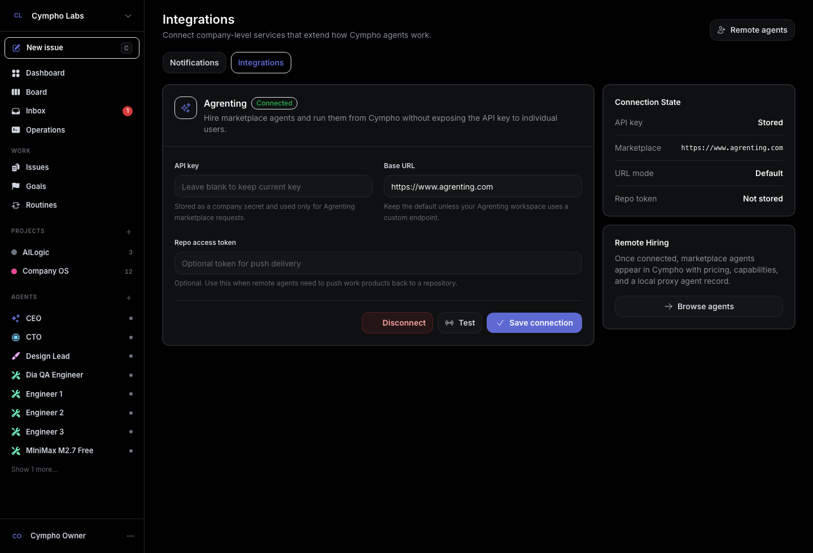
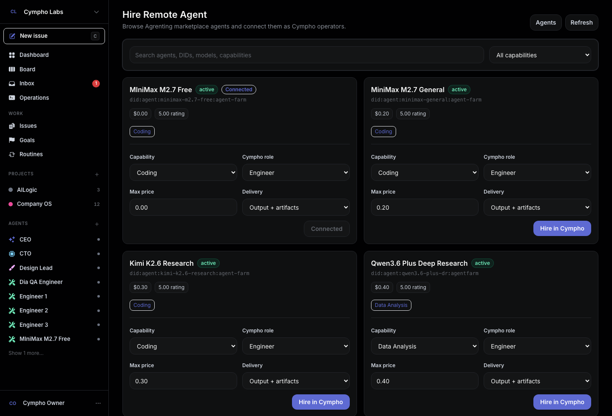
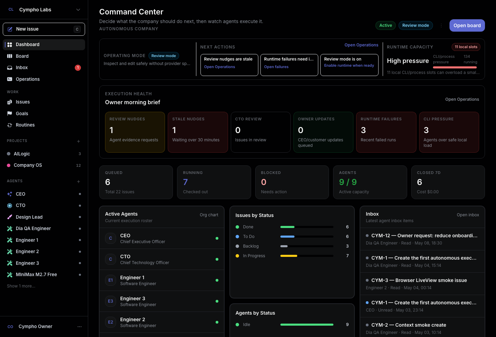
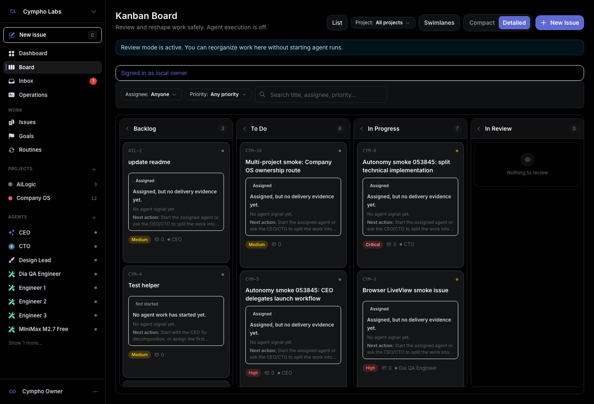
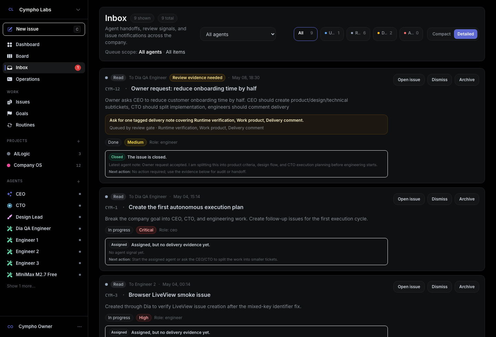

# Cympho

**An autonomous company OS for AI agents.**

Cympho turns owner requests into coordinated company work. A CEO agent routes priorities, Product and Design shape the brief, the CTO breaks large work into executable issues, and engineer agents produce inspectable changes with comments, runs, work products, PR evidence, and review trails.

<p align="center">
  
</p>

<p align="center">
  
</p>

<p align="center">
  
</p>

<p align="center">
  
</p>

<p align="center">
  
</p>

## What Is New

Cympho now has the pieces needed to feel like an operating system for agents, not just an issue tracker with a run button.

- **Operations console**: monitor runtime mode, agent capacity, adapter health, prompt readiness, blocked work, review nudges, and execution risk from one place.
- **Instruction Studio**: inspect agent instructions before they run, detect weak prompts, tune role playbooks, and preview contract coverage for CEO, CTO, Product, Design, and Engineering roles.
- **Issue digest and memory**: issue pages now synthesize comments, runs, work products, child issues, failures, and PR state into an owner-readable brief.
- **Review gates and nudges**: Cympho detects missing delivery notes, work products, verification, PR references, CTO review, and owner updates, then queues targeted follow-ups for the right agent.
- **PR quality contract**: agents are guided toward issue-aware branch names, clear PR titles, task-list descriptions, review evidence, and owner-facing status.
- **Adapter hardening**: Claude Code wrappers, Codex, Cursor, OpenClaw, HTTP, and Process adapters can be configured per agent with safer runtime env handling.
- **Agrenting remote agents**: connect an Agrenting API key, browse marketplace agents inside Cympho, and rent remote agents as local Cympho operators.
- **Multi-tenant auth hardening**: dashboard pages require login, LiveViews and APIs use company-scoped lookups, and test coverage guards against cross-company leaks.
- **Review mode by default**: run the UI safely without background agent execution or provider spend, then opt into autonomous execution when you are ready.

## Why Cympho

Most agent tools run one agent against one ticket and leave humans to infer what happened from terminal logs. Cympho gives agents a company structure, durable memory, role contracts, project context, workflow state, and a UI where owners can see progress without spelunking through raw output.

| Capability | Cympho |
| --- | --- |
| Company structure | CEO, CTO, Product, Design, QA, and Engineers with role-specific prompts and handoffs |
| Owner intake | New issues route through CEO-first triage with project, priority, and owner context |
| Work decomposition | CTO and specialist roles can split large requests into sub-issues with lineage |
| Evidence trail | Comments, runs, failures, work products, child issues, tool traces, PR links, and review notes |
| Prompt quality | Instruction Studio, deterministic prompt contracts, and role coverage scoring |
| Runtime operations | Capacity, adapter health, blocked work, review nudges, prompt radar, and execution mode |
| Safety posture | Review mode, scoped auth, governance gates, budgets, and explicit background-worker flags |
| Adapter choice | Claude Code, Codex, Cursor, OpenClaw, HTTP, and local process adapters per agent |

## How The Loop Works

1. The owner creates a business request.
2. The CEO triages the request and delegates to the right role.
3. Product and Design clarify scope, UX, and acceptance criteria when needed.
4. The CTO decomposes large work into smaller tickets and assigns engineers.
5. Engineers run through configured adapters and attach proof of work.
6. Cympho builds an issue digest from comments, runs, work products, PR state, and sub-issues.
7. Review gates decide whether the issue is ready for CTO review, CEO update, or owner-visible closure.
8. Agents receive targeted nudges when they missed evidence, review notes, PR quality, or owner updates.

The goal is not just to start an agent. The goal is to make the whole operating loop visible, governable, and repeatable.

## Product Surface

- **Command Center**: company health, operating mode, queue state, active agents, inbox, issue throughput, and recent activity.
- **Operations**: runtime capacity, adapter health, prompt readiness, contract gaps, blocked execution, stale runs, and recommended next actions.
- **Issues**: owner intake, assignment, status, priority, comments, digest, agent runs, sub-issues, work products, PR evidence, review gates, and nudges.
- **Board**: kanban flow across backlog, todo, in progress, review, done, blocked, and cancelled states, with safe review-mode controls.
- **Inbox**: compact and detailed agent updates grouped by status, assignee, issue context, and review nudge state.
- **Projects**: repository settings, environment variables, project issues, and workspace metadata in one editable page.
- **Agents**: role prompts, Instruction Studio, adapter configuration, remote Agrenting hiring, runtime model/command controls, env vars, health, budget, governance, and history.
- **Plugins and Skills**: extension points for tool capabilities and custom agent workflows.

## Agent Roles

Cympho ships with a default autonomous company roster:

- **CEO** owns company direction, owner updates, prioritization, and final business status.
- **CTO** decomposes technical work, reviews engineering delivery, and guards implementation quality.
- **Product Lead** turns ambiguous owner requests into product scope and acceptance criteria.
- **Design Lead** owns UX clarity, interface quality, and user-facing polish.
- **Engineers** implement work, attach evidence, comment with delivery notes, and open review-ready PRs.
- **QA or specialist agents** can be added for testing, browser review, operations, or project-specific workflows.

Each role gets a playbook, action examples, quality bar, anti-patterns, and a prompt contract that Cympho can inspect before the agent runs.

## Issue Digest And Review Gates

Issue pages are designed to answer the owner’s real question: **what happened, who did it, what evidence exists, and what decision is next?**

Cympho summarizes:

- latest owner request and current status
- role-by-role contribution ledger
- delivery notes and review notes
- runtime success or failure evidence
- work products and artifact links
- sub-issue closure state
- PR URL, branch/title/body quality, and code references
- missing evidence that blocks review or closure

When something is missing, Cympho can queue a targeted review nudge for the best agent instead of creating noise for everyone.

## Instruction Studio

Instruction Studio is a deterministic prompt-quality layer for agent configuration. It helps you catch weak instructions before they burn runtime:

- conflicting guidance such as skipping comments, tests, reviews, or governance
- missing owner-readable update requirements
- missing delivery, review, or PR contract fields
- adapter-specific readiness issues
- role scenarios that show how the agent is expected to respond
- additive prompt patches that improve instructions without replacing your custom voice

This is especially useful when running many agents, because small prompt gaps become expensive when repeated across a whole org.

## Runtime And Adapters

Cympho supports multiple execution backends:

- **Claude Code**: command-based runtime for `claude`, `cz`, `cm`, or another compatible CLI wrapper.
- **Codex**: OpenAI/Codex execution with per-agent model selection.
- **Cursor**: Cursor agent/CLI automation surface.
- **OpenClaw**: OpenClaw-compatible runtime configuration.
- **Process**: local command execution for tests and controlled automation.
- **HTTP**: remote adapter integration over an HTTP contract.
- **Agrenting**: rent marketplace agents and attach them to Cympho as remote operators.

Each agent can carry its own adapter, model/runtime configuration, concurrency limit, budget, instructions, and environment. Claude-compatible wrappers can source provider variables from `$HOME/.cld` in development, while production should use managed environment variables or the app secret store.

## Rent Remote Agents From Agrenting

Cympho can discover and rent agents from the [Agrenting](https://www.agrenting.com) marketplace. Rented agents are created in Cympho as local proxy agents, so they can be assigned to issues, shown in agent lists, and run through the normal Cympho orchestration loop.

### Why Rent Remote Agents

Two concrete operating wins, both important for autonomous companies:

- **Per-ticket cost drops by an order of magnitude.** A single local Claude/Codex CLI agent working a non-trivial ticket through to PR can burn **$15+ in provider tokens** per run — long context, many tool calls, retries on review failures. Equivalent specialist agents on Agrenting often quote **~$1 flat per task** because they amortize context, share warm caches, and bill on outcome rather than tokens. For a company that closes dozens of tickets a day, the autonomous loop becomes affordable instead of speculative.
- **Scale headcount without scaling your machine.** Every *local* agent costs you a Phoenix process slot, a heartbeat GenServer, an Ecto checkout, and a CLI subprocess (often hundreds of MB of RAM each — Claude Code, Codex, and Cursor are not light). Adding a tenth local engineer can OOM a small VM. *Remote* agents only consume one lightweight `Cympho.Agents.Agent` proxy row plus the HTTP adapter; the actual model + tools execute on Agrenting's infrastructure. You can hire fifty remote engineers without the laptop fan spinning up.

Cympho's budget system (per-agent monthly caps + governance approval gates) bounds remote spend the same way it bounds local spend — `mix cympho.compare` reports both under `cost_control`. Mix-and-match is the intended pattern: keep a few high-context local agents (CEO, CTO) for cross-cutting strategy and rent specialists from Agrenting for the long tail.

### 1. Get an Agrenting API key

Create or copy an Agrenting user API key from your Agrenting account. The key is only needed once per Cympho company.

### 2. Connect Agrenting in Cympho

1. Start Cympho and log in.
2. Open **Settings**.
3. Select **Integrations**.
4. Find the **Agrenting** card.
5. Paste your Agrenting API key into **API key**.
6. Leave **Base URL** as `https://www.agrenting.com` unless you use a custom Agrenting deployment.
7. Optionally add a **Repo access token** if rented agents need to push work products back to a repository.
8. Click **Save connection**.
9. Click **Test** to verify Cympho can reach Agrenting and discover marketplace agents.

Cympho stores these values as company secrets:

- `AGRENTING_API_KEY` for marketplace discovery and hiring.
- `AGRENTING_URL` only when you use a custom Agrenting base URL.
- `AGRENTING_REPO_ACCESS_TOKEN` when you provide an optional repository token.

### 3. Browse marketplace agents

1. Open **Agents**.
2. Click **Hire Remote Agent**.
3. Search or filter the Agrenting marketplace by name, model, DID, or capability.
4. Review each agent's status, price, rating, provider/model, and capabilities.

If Agrenting is not connected yet, this page shows a **Connect Agrenting** button that takes you back to **Settings -> Integrations**.

### 4. Rent an agent

1. Choose a marketplace agent.
2. Pick the capability Cympho should hire for.
3. Choose the local Cympho role, such as Engineer, Product Lead, Design Lead, CTO, or CEO.
4. Confirm the max price and delivery mode.
5. Click **Hire in Cympho**.

After the hire completes, Cympho creates a local agent record backed by Agrenting. The remote agent appears in the normal Cympho agent list and can be assigned to issues like any other agent.

### 5. Run rented agents safely

Renting from Agrenting may spend Agrenting marketplace balance depending on the agent and price. Cympho still boots in review mode by default, so background execution does not start unless you enable it deliberately:

```bash
CYMPHO_ORCHESTRATOR_ENABLED=1 mix phx.server
```

Keep the Agrenting API key in the integration settings or company secret store. Do not commit API keys or repository tokens to source control.

## Quick Start

Prerequisites are pinned in `.tool-versions`:

- Elixir `1.19.5-otp-28`
- Erlang `28.4.3`
- PostgreSQL with the local credentials expected by `config/dev.exs`

```bash
mix setup
mix phx.server
```

Open [http://localhost:4000](http://localhost:4000).

For local development, use the dev owner shortcut:

```text
http://localhost:4000/dev/login
```

Seeded dev credentials:

```text
Email: owner@cympho.local
Password: password1234
```

## Running Safely

Development boots in **review mode** unless you explicitly enable background workers. That lets you explore the product, create projects, configure agents, review issues, tune prompts, and test UI flows without accidentally spending provider credits.

Common runtime flags:

```bash
CYMPHO_ORCHESTRATOR_ENABLED=1 \
CYMPHO_START_HEALTH_CHECKER=1 \
CYMPHO_START_SCHEDULER=1 \
CYMPHO_SCHEDULE_ROUTINE_TRIGGERS=1 \
mix phx.server
```

Claude Code-compatible wrappers can be selected without renaming the real `claude` binary:

```bash
CYMPHO_CLAUDE_COMMAND=cz mix phx.server
```

The app can source provider environment from `$HOME/.cld` for local wrapper commands, and agent runtime settings can inject provider variables such as model names, base URLs, and API keys. Keep secrets in local environment files or the app secret store; do not commit them.

## Cympho Vs. Paperclip

Paperclip ([paperclipai/paperclip](https://github.com/paperclipai/paperclip)) is the most-starred open-source agent-orchestration product and the closest competitor to Cympho. Paperclip is a Node.js server with a React UI; Cympho is an Elixir/Phoenix BEAM application. The product surface looks similar — both ship org charts, heartbeats, budgets, governance, and ticketed work — but the foundations make different things natural. Cympho ships a `mix cympho.compare` task that introspects the running app and asserts the comparison below row by row; it exits non-zero on any regression so feature parity can gate CI.

### Where We Match

Cympho ships parity with Paperclip on the documented orchestration vocabulary:

- Bring-your-own-agent adapters, org chart with roles and reporting lines, goal/issue/decomposition, board governance + approvals, per-agent budgets, instance and company secrets, routines on cron and webhooks, workspaces with previews and exec sandboxes, plugin host services.
- Operating shell: ticketed work with comments, threaded conversations, work products, durable activity log, multi-company isolation, company export/import with secret scrubbing.

### How We Differ

The substantive deltas — each grounded in a Cympho module or process that `mix cympho.compare` checks at runtime:

| Capability | Paperclip | Cympho |
| --- | --- | --- |
| Real-time UI | React + fetch/poll | Phoenix LiveView + 7 dedicated Channels (`heartbeats`, `runs`, `activity`, `comments`, `issue`, `issues`, `company`) + ETS replay buffer (`Cympho.EventStore`); reconnecting clients catch up without losing state |
| Process model | Single Node.js event loop | OTP per-agent supervision under `Cympho.AgentHeartbeat.Supervisor`; one failing agent cannot take down the company |
| Tool-call traces | Audit-log entries | First-class `Cympho.ToolCallTraces` context with its own LiveView, filterable + exportable |
| Decision reversal | "Rollback" mentioned in copy | Explicit primitive: `Cympho.Decisions.reverse_decision/3` with audit log and company-scoped broadcast |
| AI-driven control plane | Not documented | Built-in MCP server (`Cympho.Mcp.Server`) exposes Cympho as tools so Claude and other models can drive it directly |
| Skill hot-reload | Redeploy required | `Cympho.Skills.HotReloader` hot-loads skill manifests at runtime via the BEAM |
| Multi-company safety | `company_id` scoping | `company_id` scoping plus `Cympho.PubSubGuard` runtime guard against cross-tenant event leakage |

Smaller wins that don't need their own row: Cympho ships a 7th adapter (`agrenting`) beyond Paperclip's documented six; `Cympho.ReviewNudges` proactively tracks stale evidence requests with a Quantum-driven scanner that re-emits and escalates instead of letting nudges die; per-socket token-bucket rate limiting and broadcast dedup run as supervised GenServers without exposing public ETS handles.

### The Autonomy Gap

The sharpest difference is the autonomous loop itself. Paperclip documents the *ingredients* — heartbeats, governance, decomposition. Cympho ships the *closed loop* that ties them together: new top-level issues auto-ignite to an eligible CEO instead of stranding in `:backlog`; CEO `create_issue` actions emit immediate wakes so engineers pick up children in seconds rather than waiting for a 30-second poll; parent agents are woken on each child entering `:in_review` via `Wakes.notify_child_in_review/1`, so a CTO supervising fan-out sees mid-flight progress without re-reading; CEO-owned root issues route through `:in_review` and a `final_review_required` wake instead of silently auto-completing, so the boss-level quality gate (`ensure_approval_quality`) fires on every shipped deliverable; and `Cympho.ReviewNudges.StaleScanner` re-emits wakes at T1 and escalates across the role-fallback chain at T2 so nudges cannot die silently. With humans only invoked for the goal and the final sign-off, an end-to-end run executes without manual nudges in the dashboard.

### Verify It Yourself

```bash
mix cympho.compare           # text table with per-row evidence
mix cympho.compare --json    # machine-readable; exits non-zero on any gap
```

The task introspects the live OTP tree, the registered adapter list, and exported context functions — every claim above maps to a row tagged `WIN` (Cympho exceeds) or `PAR` (parity).

## Architecture

Cympho is a Phoenix application with LiveView for the primary UI, Ecto/PostgreSQL for durable state, PubSub and Channels for real-time updates, and OTP supervisors for agent orchestration.

Core domains live under `lib/cympho/`:

- `Issues`, `Agents`, `Companies`, `Projects`, and `Users`
- `Orchestrator`, `AgentRunner`, and `Adapters` (with `Adapters.Registry`, `Adapters.HealthChecker`, and seven built-in adapters)
- `IssueDigest`, `IssueMemory`, `ReviewNudges`, and `PullRequestContract`
- `RuntimeOperations`, `RuntimeCapacity`, and `RuntimeProfiles`
- `Inbox`, `Comments`, `WorkProducts`, `ToolCallTraces`, and `Activities`
- `ExecutionPolicies`, `BoardApprovals`, `Decisions`, and governance audit logs
- `Workspaces`, `Routines`, `Skills` (canonical public context for the plugin/skill concept), `Plugins` (internal runtime: registry, supervisor, worker, host services, plugin state, webhooks), `Budgets`, and notifications

The web layer lives under `lib/cympho_web/` and uses Phoenix LiveView, controllers, channels, and shared components. Larger LiveViews — `issue_live/show` in particular — are progressively decomposed into focused function components under `lib/cympho_web/live/<feature>/components/`.

## Useful Commands

```bash
mix setup                         # Install deps, create DB, migrate, seed
mix ecto.reset                    # Drop, recreate, migrate, seed
mix test                          # Run the test suite
mix test test/path/to_test.exs    # Run one test file
mix format                        # Format Elixir code
mix assets.build                  # Build dev assets
mix assets.deploy                 # Build production assets
```

## Production Notes

Set the usual Phoenix release environment variables, plus a Cympho encryption key:

```bash
SECRET_KEY_BASE=...
DATABASE_URL=...
APP_HOST=...
LIVE_VIEW_SALT=...
CYMPHO_ENCRYPTION_KEY=32-byte-or-longer-secret
```

Background execution should be enabled deliberately in production, with adapter credentials, budgets, governance policies, and project repository settings configured before agents are allowed to run.

## Documentation

- `AGENTS.md` / `CLAUDE.md`: repository guidance for AI coding agents
- `DESIGN.md`: UI and design-system notes
- `PLUGIN_SDK.md`: plugin extension surface
