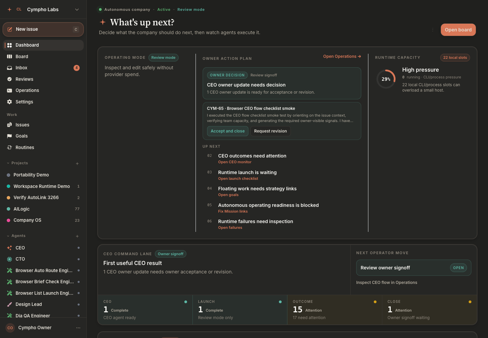
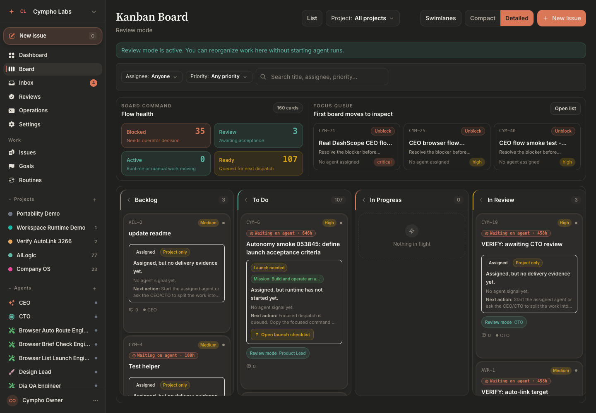
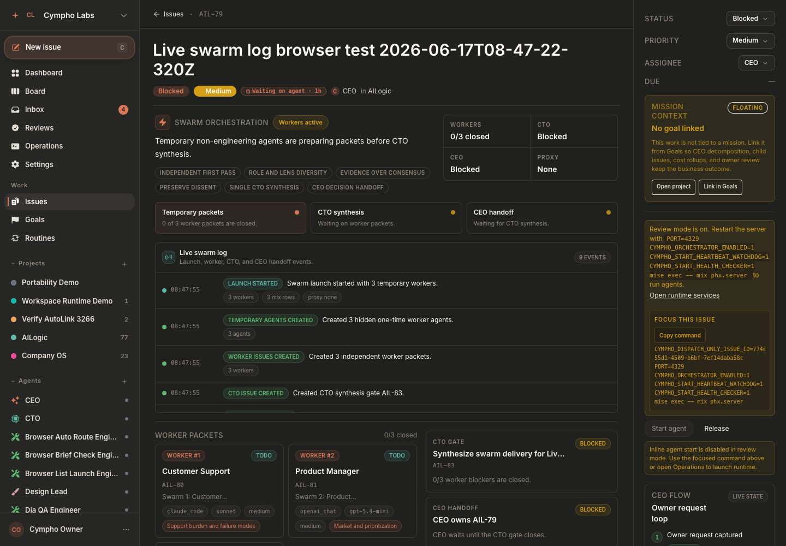
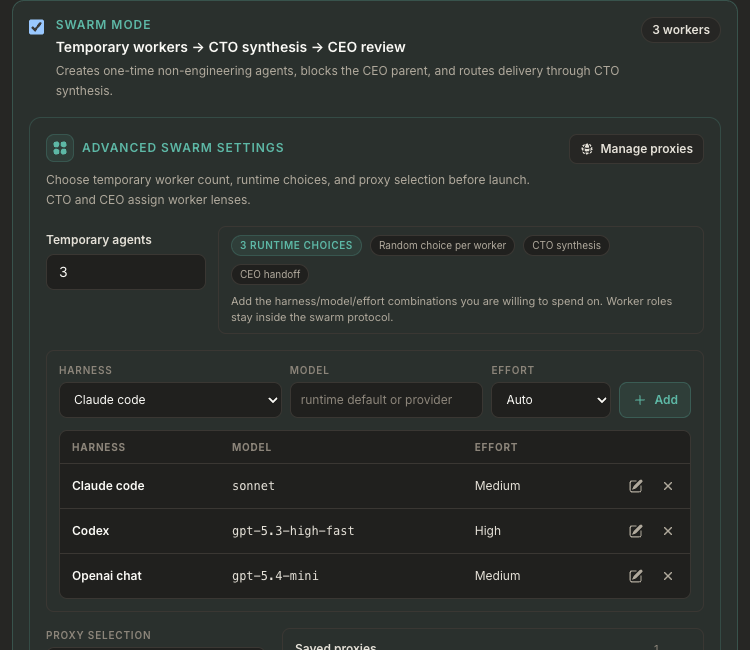
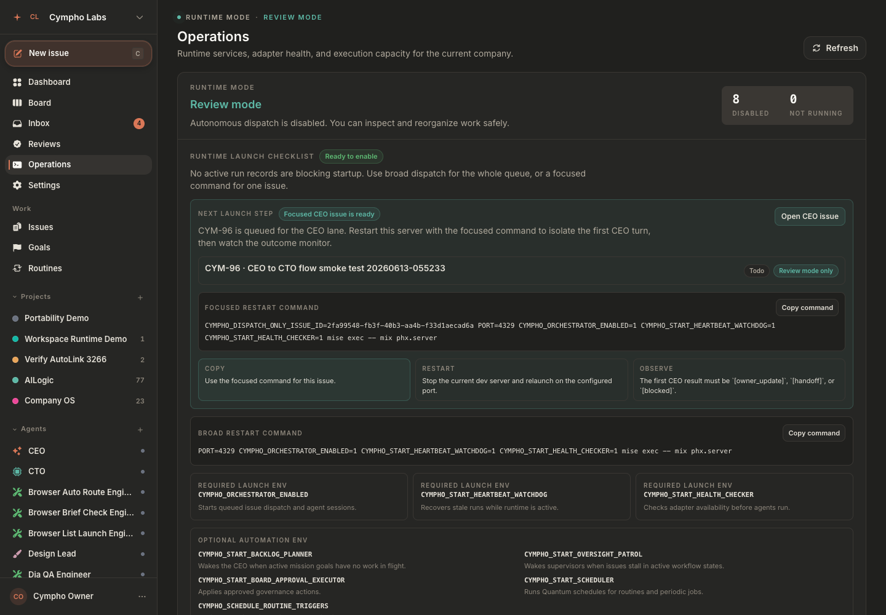
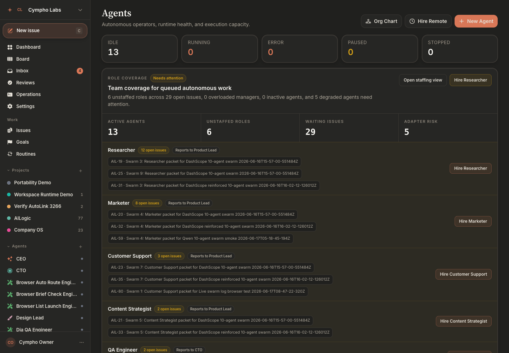

# Cympho

**An autonomous company OS for AI agents.**

Cympho turns owner requests into coordinated company work. A CEO agent routes priorities, Product and Design shape the brief, the CTO breaks large work into executable issues, and engineer agents produce inspectable changes with comments, runs, work products, PR evidence, and review trails.

When one agent is not enough, **swarm mode** can fan a single owner issue into temporary non-engineering worker packets, route synthesis through the CTO, block the CEO parent until the synthesis is ready, and stream the whole chain back into the issue log.

## Product Tour

### Command Center

<p align="center">
  
</p>

### Kanban Board

<p align="center">
  
</p>

### Swarm Issue Log

<p align="center">
  
</p>

### Swarm Composer

<p align="center">
  
</p>

### Operations

<p align="center">
  
</p>

### Agents

<p align="center">
  
</p>

## Installation (Local & VPS)

Cympho includes a robust, automated installation script (`install.sh`) that sets up the entire application on both **macOS (Local)** and **Ubuntu/Linux (VPS)**. 

To install Cympho on an empty VPS or your local machine, run the following command:

```bash
curl -sL https://raw.githubusercontent.com/zaalipro/cympho/main/install.sh | bash
```
*(Or simply execute `./install.sh` if you have already cloned the repository).*

### What the script does:
1. **Interactive Onboarding:** Prompts for your Admin details and Company setup.
2. **OS Auto-Detection & Dependencies:** Installs `asdf`, Node.js, PostgreSQL, and other necessary build tools via `apt` or `brew`.
3. **VPS Production Ready:** If installing on a VPS, it automatically creates a secure Postgres user, provisions a Let's Encrypt SSL certificate via Caddy, generates production secrets (`.env`), and sets up a `systemd` service so Cympho stays running reliably.

## What Is New

Cympho now has the pieces needed to feel like an operating system for agents, not just an issue tracker with a run button.

- **Swarm mode**: create one-time temporary worker agents from a parent issue, assign independent non-engineering lenses automatically, route synthesis through the CTO, then return the decision path to the CEO.
- **Live swarm logs**: launch, worker creation, worker completion, CTO synthesis, CEO handoff, blocker state, runtime mix, and proxy routing events are stored and streamed on the issue page.
- **Runtime mix chooser**: admins choose temporary agent count plus reusable harness/model/reasoning-effort rows; workers randomly draw from that allowed cost/capability mix.
- **Proxy profiles**: company admins can manage reusable HTTP, HTTPS, SOCKS4, and SOCKS5 profiles, then route swarms through no proxy, random saved proxies, selected profiles, or named managed slots. Raw proxy URLs are ignored by swarm launchers.
- **Operations console**: monitor runtime mode, agent capacity, adapter health, prompt readiness, blocked work, review nudges, and execution risk from one place.
- **Runtime mode controls**: top-level Pause, Stop, Resume, and Low Power controls let admins preserve queued wakes, cancel active sessions, or keep only high/critical work running after hours.
- **Issue-level Pause/Resume**: freeze one runaway task without pausing the whole agent or company; Cympho stops active runtime for that issue, suppresses future dispatch, and records issue-scoped audit events.
- **Instruction Studio**: inspect agent instructions before they run, detect weak prompts, tune role playbooks, and preview contract coverage for CEO, CTO, Product, Design, and Engineering roles.
- **Issue digest and memory**: issue pages now synthesize comments, runs, work products, child issues, failures, and PR state into an owner-readable brief.
- **Review gates and nudges**: Cympho detects missing delivery notes, work products, verification, PR references, CTO review, and owner updates, then queues targeted follow-ups for the right agent.
- **PR quality contract**: agents are guided toward issue-aware branch names, clear PR titles, task-list descriptions, review evidence, and owner-facing status.
- **Adapter hardening**: Claude Code wrappers, Codex, Cursor, OpenAI-compatible chat endpoints, OpenClaw, HTTP, Process, and Agrenting adapters can be configured per agent with safer runtime env handling.
- **CLI harness presets**: Process runtimes can be configured for Codex CLI, Claude-compatible CLIs, Cursor CLI, OpenClaw, Antigravity (`agy`), Kimi Code, Cline, Gemini, Aider, OpenCode, or custom commands.
- **Agrenting remote agents**: connect an Agrenting API key, browse marketplace agents inside Cympho, and rent remote agents as local Cympho operators.
- **Multi-tenant auth hardening**: dashboard pages require login, LiveViews and APIs use company-scoped lookups, and test coverage guards against cross-company leaks.
- **Review mode by default**: run the UI safely without background agent execution or provider spend, then opt into autonomous execution when you are ready.

## Why Cympho

Most agent tools run one agent against one ticket and leave humans to infer what happened from terminal logs. Cympho gives agents a company structure, durable memory, role contracts, project context, workflow state, and a UI where owners can see progress without spelunking through raw output.

## Cympho Vs. Paperclip At A Glance

Paperclip is the stronger public benchmark today: larger public footprint, better public docs/community surface, stronger mobile/product story, and a much larger prebuilt company catalog. Cympho is younger, rougher, and less battle-proven, but it is optimizing for supervised operations, owner-readable evidence, and CTO-mediated swarm work. This table is intentionally candid; the longer evidence-backed comparison appears later in this README.

Source basis: Paperclip's public [README](https://github.com/paperclipai/paperclip), source tree, docs, and [companies catalog](https://github.com/paperclipai/companies), pinned to Paperclip revision `c62fa8d6a03377370c3a08ac49320cbba1c44227` inspected on 2026-07-30. The Cympho side is based on this repository, the current screenshots above, `paperclip_gap.md`, and `mix cympho.compare`; this is not a private deployment benchmark.

| Buyer question | Paperclip | Cympho | Honest read |
| --- | --- | --- | --- |
| Which is safer to try first? | Better public docs, community proof, website polish, and quickstart path. | Working local app with screenshots and installer, but less public proof. | **Paperclip wins.** Cympho has to earn trust through shipped behavior. |
| Which has more ready-made teams? | `paperclipai/companies` advertises 16 prebuilt companies, 440+ agents, and 500+ skills. | Default company roster, role playbooks, executable blueprints, and Agrenting remote-agent hiring. | **Paperclip wins clearly.** Cympho is not yet a catalog competitor. |
| Which proves what a blueprint launches? | Stronger public catalog size and ecosystem story. | Each executable blueprint exposes a launch manifest: default agent count, roster, role mix, capability tags, seed-work titles, and created companies retain that manifest for audit. | **Cympho wins on launch verifiability.** Paperclip still wins raw ecosystem scale. |
| Core company OS | Strong goals, org chart, tickets, budgets, governance, heartbeats, workspaces, plugins, secrets, routines, and activity story. | Similar primitives: agents, goals, issues, budgets, governance, workspaces, plugins/skills, secrets, routines, activity, and company scope. | **Tie.** Both are serious agent-company control planes. |
| Runtime choice | Broad bring-your-own-agent posture across OpenClaw, Claude Code, Codex, Cursor, Bash, HTTP, and heartbeat-driven agents. | Claude Code, Codex, Cursor, OpenAI-compatible chat, OpenClaw, HTTP, Process, Agrenting, plus presets for `agy`, Kimi Code, Cline, Gemini, Aider, and OpenCode. | **Mixed.** Paperclip markets breadth better; Cympho exposes runtime/profile choices more directly in-app. |
| Runtime workspace/env contract | Public issues report PATH/env inheritance, `AGENT_HOME`, fallback workspace, and run-id env drift across adapters. | Runtime preflight injects one workspace contract: `cwd`, `workspace_path`, `CYMPHO_WORKSPACE`, `AGENT_HOME`, and run/issue/agent IDs for CLI adapters. | **Cympho wins on this guard.** Existing third-party gateway protocols can still limit live env injection. |
| Shared workspace safety | Public issues report shared/fallback workspace surprises and ask for isolated workspaces to be default or at least discoverable. | Local repo-delivery preflight warns when a worker would use a shared project workspace and links operators to attach an execution workspace or worktree before parallel edits. | **Cympho wins on early warning.** Automatic per-worker worktree provisioning is still a separate improvement. |
| Task and comment context | Public issues report agents waking without the issue/comment body or letting generic role instructions dominate the actual task. | Every prompt starts with a current-task block, and comment/mention wakes pin the triggering comment body above recent history when available. | **Cympho wins on this prompt contract.** Long-running adapter resume behavior still depends on each adapter honoring fresh prompt input. |
| Idle heartbeat cost | Public issues report timer heartbeats waking agents with no assigned work and archived companies still consuming limits. | Timer heartbeats check agent/company availability first, keep no-work agents idle, and only mark running after a `todo` issue is checked out. | **Cympho wins on this guard.** It still needs broader long-term-memory work for repeated context costs. |
| Duplicate recovery work | Public issues report one stuck run spawning duplicate recovery/evaluation work instead of one visible recovery chain. | Review-nudge stale recovery keeps one active issue/agent/nudge chain: superseded rows are consumed, re-emits refresh the active wake timestamp, and retries keep `re_emit_of`/`re_emit_count` metadata. | **Cympho wins on review recovery.** This covers built-in review nudges; custom external scanners still need their own idempotency contracts. |
| Intentional long-running work | Public issues report recovery loops around perpetual in-progress work without an opt-out. | Operators can mark an issue excluded from stale-work patrol via `monitor_state["patrol"]`, keeping it out of automatic supervisor wakes until the exclusion is cleared. | **Cympho wins on this control.** It is an explicit operator override, not a replacement for fixing genuinely stuck work. |
| Live operations | Documents wakeups, queues, locks, runs, budgets, orphan recovery, and persistent agent state. | BEAM/OTP supervision, LiveView/Channels, EventStore replay, Operations console, live swarm logs, and global Pause/Resume/Stop. | **Cympho narrowly wins** for operator ergonomics and supervised local runtime control. |
| Emergency stop | Publicly supports pause/terminate, but public issues show pain around killing stuck in-flight work. | Stops active orchestrators, releases checked-out issues, cancels run rows, marks agents paused, cancels registered adapter sessions, reports confirmed vs still-registered adapter stops, and writes company-scoped runtime audit events. | **Cympho narrowly wins for Cympho-managed sessions.** Remote/provider-side cancellation still depends on adapter contracts. |
| Per-task pause | Public issue #3105 requests a first-class task pause/resume so one issue can be parked without pausing the whole agent. | Issue-level Pause/Resume stores an orthogonal `issue_runtime` pause flag, stops active runtime for that issue, blocks checkout/dispatch/wakes while paused, and audits pause/resume. | **Cympho wins this narrow control.** It is a hard scoped freeze for Cympho-managed sessions, not a cross-provider guarantee outside adapter contracts. |
| After-hours runtime mode | Public issues request a middle ground between fully live and paused so idle/background loops do not burn full budget. | Low Power keeps the company active but limits automatic dispatcher selection to high and critical work; Resume clears the mode back to full power. | **Cympho wins this narrow control.** It is an operator throttle, not a replacement for provider-side rate limits or budgets. |
| Failure-loop protection | Public issue feedback asks for circuit breakers because budget hard-stops catch token waste too late. | Repeated adapter-resolution failures and repeated unresolved action-contract turns trip circuit breakers that pause the agent with repair metadata instead of cycling forever. | **Cympho wins on these narrow failure classes.** Broad semantic no-progress detection beyond the action contract is still future work. |
| Swarm work | No public first-class CTO-mediated temporary swarm workflow is documented. | Admin swarm mode creates temporary workers, child issues, CTO synthesis, CEO handoff blocking, runtime mix rows, proxy profile routing, and live logs. | **Cympho wins.** This is the clearest current differentiator. |
| Evidence and review | Tickets, conversations, persistent sessions, labels, inbox/activity, tool tracing, and audit log claims. | Issue digest, comments, runs, work products, child issues, PR evidence, review gates, tool traces, nudges, and owner-readable briefs. | **Cympho wins on owner-readable issue evidence.** Paperclip is still strong on tracing and audit. |
| Sidebar and inbox trust | Public issues and discussions report stale inbox/sidebar badge counts after read, resolve, or dismiss actions. | One company-scoped Owner Attention source combines human issues, reviews, approvals, pending questions/confirmations/task proposals, failed runs, and budget incidents. Inbox and interaction changes refresh mounted views, while desktop/mobile badges deduplicate persisted unread rows by issue. | **Cympho wins on this tested path.** Paperclip may improve here; this is not a whole-UI reliability benchmark. |
| Human action queue | Public issues ask for a clean board-user queue for work assigned to humans instead of noisy touched/read notification inboxes. | Inbox's `Needs my action` lane now includes human-assigned or blocked issues plus pending owner interactions and approval/runtime/spend decisions, with plain summaries instead of raw interaction payloads. | **Cympho wins on this focused queue.** Real-world workflow polish still needs continued usage. |
| Ecosystem and plugins | Stronger public skills manager, community story, and reusable company/skill ecosystem. | Skill manifests, hot reload, plugin supervisor, capability-gated host services, Instruction Studio, MCP server, and prompt contract checks. | **Paperclip wins ecosystem; Cympho wins local prompt/control tooling.** |
| Mobile and polish | README explicitly positions mobile management and has a more mature product story. | The shell uses dynamic viewport, safe-area, and bottom-nav-aware scroll primitives with focused tests and a repeatable [Ego Lite QA record](docs/MOBILE_QA.md) for portrait, keyboard-shrink, and landscape. | **Mixed.** Cympho now has repository-backed responsive mechanics; Paperclip still has the stronger public product story and physical-device proof. |
| Keyboard view control | Public issue #3757 asks Paperclip to move toward production-grade UI polish and keyboard-first design. | Cympho complex pages expose Compact/Detailed state, `V` toggles page density, `U` toggles Simple/Advanced globally, and the shortcuts modal documents both. | **Cympho wins this narrow control.** Paperclip still wins broader public polish until Cympho proves mobile and product finish. |
| Cost and governance | Monthly budgets, hard stops, token/cost tracking, approvals, and governance are central public claims. | Run-linked usage commits incidents before enforcement; hard stops block new dispatch and cancel active scoped runtime. Agent stops use the exact company/agent pair before pausing, preventing cross-company cleanup. | **Tie.** Cympho has concrete repository-backed enforcement; Paperclip explains the baseline more clearly. |
| What is not proven here? | This README does not independently benchmark Paperclip's private runtime reliability. | This README does not prove Cympho at Paperclip-scale traffic, catalog size, or mobile usage. | **No winner.** Treat this as a repo/source comparison, not a production bake-off. |
| Best choice today | Pick Paperclip when maturity, docs, community, mobile polish, and a large catalog matter most. | Pick Cympho when Phoenix/BEAM ops, live issue evidence, governed swarms, and runtime experimentation matter most. | **Depends on the buyer.** Paperclip is safer today; Cympho is more interesting where live ops and swarms matter. |

## How The Loop Works

1. The owner creates a business request.
2. The CEO triages the request and delegates to the right role.
3. Product and Design clarify scope, UX, and acceptance criteria when needed.
4. The CTO decomposes large work into smaller tickets and assigns engineers.
5. Engineers run through configured adapters and attach proof of work.
6. Cympho builds an issue digest from comments, runs, work products, PR state, and sub-issues.
7. Review gates decide whether the issue is ready for CTO review, CEO update, or owner-visible closure.
8. Agents receive targeted nudges when they missed evidence, review notes, PR quality, or owner updates.

The goal is not just to start an agent. The goal is to make the whole operating loop visible, governable, and repeatable.

## Product Surface

- **Command Center**: company health, operating mode, queue state, active agents, inbox, issue throughput, and recent activity.
- **Operations**: runtime capacity, adapter health, prompt readiness, contract gaps, blocked execution, stale runs, and recommended next actions.
- **Issues**: owner intake, assignment, status, priority, comments, digest, agent runs, sub-issues, work products, PR evidence, review gates, swarm orchestration, and nudges.
- **Swarm composer**: admin-only issue controls for temporary worker count plus harness/model/reasoning-effort rows; the protocol, CTO, and CEO assign worker roles instead of asking the owner to micromanage them.
- **Swarm issue panel**: live swarm log, worker packets, CTO synthesis gate, CEO handoff state, proxy mode, runtime mix, and blocker chain in the same issue view.
- **Board**: kanban flow across backlog, todo, in progress, review, done, blocked, and cancelled states, with safe review-mode controls.
- **Inbox**: compact and detailed agent updates grouped by status, assignee, issue context, and review nudge state.
- **Projects**: repository settings, environment variables, project issues, and workspace metadata in one editable page.
- **Agents**: role prompts, Instruction Studio, adapter configuration, remote Agrenting hiring, runtime model/command controls, env vars, health, budget, governance, and history.
- **Proxy settings**: reusable company proxy profiles with health checks; swarm launchers consume saved profile names and selected profile IDs, not pasted raw proxy URLs.
- **Plugins and Skills**: extension points for tool capabilities and custom agent workflows.

## Agent Roles

Cympho ships with a default autonomous company roster:

- **CEO** owns company direction, owner updates, prioritization, and final business status.
- **CTO** decomposes technical work, reviews engineering delivery, and guards implementation quality.
- **Product Lead** turns ambiguous owner requests into product scope and acceptance criteria.
- **Design Lead** owns UX clarity, interface quality, and user-facing polish.
- **Engineers** implement work, attach evidence, comment with delivery notes, and open review-ready PRs.
- **QA or specialist agents** can be added for testing, browser review, operations, or project-specific workflows.

Each role gets a playbook, action examples, quality bar, anti-patterns, and a prompt contract that Cympho can inspect before the agent runs.

## Issue Digest And Review Gates

Issue pages are designed to answer the owner’s real question: **what happened, who did it, what evidence exists, and what decision is next?**

Cympho summarizes:

- latest owner request and current status
- role-by-role contribution ledger
- delivery notes and review notes
- runtime success or failure evidence
- work products and artifact links
- sub-issue closure state
- PR URL, branch/title/body quality, and code references
- missing evidence that blocks review or closure

When something is missing, Cympho can queue a targeted review nudge for the best agent instead of creating noise for everyone.

## Swarm Mode And Proxies

Swarm mode is designed for work where one agent's answer would be too narrow or too expensive to trust. The owner still writes one issue. An admin can then toggle swarm mode, choose the number of temporary agents, and add the harness/model/reasoning-effort combinations they are willing to pay for. Cympho handles the operating protocol:

1. Create hidden one-time worker agents.
2. Create independent worker child issues with diverse non-engineering lenses.
3. Preserve dissent and evidence instead of forcing consensus.
4. Create a CTO synthesis issue that waits on the worker packets.
5. Block the CEO parent until the CTO synthesis is ready.
6. Return the owner-facing decision path to the CEO.

Each swarm emits durable events through `Cympho.Issues.SwarmEvents`: launch started, temporary agents created, worker issues created, CTO gate created, dependency links, worker completion, CTO synthesis, CEO handoff, and error states. The issue page subscribes to those events and renders a live log so owners can watch the swarm move without tailing terminal output.

Proxy support is intentionally profile-based. Company admins can save HTTP, HTTPS, SOCKS4, or SOCKS5 profiles in Settings, test them, and choose no proxy, random saved proxies, selected saved proxies, or named managed slots from the swarm composer. Raw proxy URLs are not accepted by the swarm launcher; credentials should live in company-managed profiles or secret storage, not in issue descriptions or README examples.

## Instruction Studio

Instruction Studio is a deterministic prompt-quality layer for agent configuration. It helps you catch weak instructions before they burn runtime:

- conflicting guidance such as skipping comments, tests, reviews, or governance
- missing owner-readable update requirements
- missing delivery, review, or PR contract fields
- adapter-specific readiness issues
- role scenarios that show how the agent is expected to respond
- additive prompt patches that improve instructions without replacing your custom voice

This is especially useful when running many agents, because small prompt gaps become expensive when repeated across a whole org.

## Runtime And Adapters

Cympho supports multiple execution backends:

- **Claude Code**: command-based runtime for `claude`, `cz`, `cm`, or another compatible CLI wrapper.
- **Codex**: OpenAI/Codex execution with per-agent model selection.
- **Cursor**: Cursor agent/CLI automation surface.
- **OpenAI Chat**: OpenAI-compatible `/chat/completions` endpoints, including DashScope/Qwen runtime profiles.
- **OpenClaw**: OpenClaw-compatible runtime configuration.
- **Process**: local command execution for tests and controlled automation, including presets for Codex CLI, Claude-compatible CLIs, Cursor CLI, OpenClaw, Antigravity (`agy`), Kimi Code, Cline, Gemini, Aider, and OpenCode.
- **HTTP**: remote adapter integration over an HTTP contract.
- **Agrenting**: rent marketplace agents and attach them to Cympho as remote operators.

Each agent can carry its own adapter, model/runtime configuration, concurrency limit, budget, instructions, and environment. Claude-compatible wrappers can source provider variables from `$HOME/.cld` in development, while production should use managed environment variables or the app secret store. Runtime profiles let admins switch between expensive local coding agents, cheaper OpenAI-compatible endpoints, and CLI harnesses without rewriting role instructions.

## Rent Remote Agents From Agrenting

Cympho can discover and rent agents from the [Agrenting](https://www.agrenting.com) marketplace. Rented agents are created in Cympho as local proxy agents, so they can be assigned to issues, shown in agent lists, and run through the normal Cympho orchestration loop.

### Why Rent Remote Agents

Two concrete operating wins, both important for autonomous companies:

- **Per-ticket cost drops by an order of magnitude.** A single local Claude/Codex CLI agent working a non-trivial ticket through to PR can burn **$15+ in provider tokens** per run — long context, many tool calls, retries on review failures. Equivalent specialist agents on Agrenting often quote **~$1 flat per task** because they amortize context, share warm caches, and bill on outcome rather than tokens. For a company that closes dozens of tickets a day, the autonomous loop becomes affordable instead of speculative.
- **Scale headcount without scaling your machine.** Every *local* agent costs you a Phoenix process slot, a heartbeat GenServer, an Ecto checkout, and a CLI subprocess (often hundreds of MB of RAM each — Claude Code, Codex, and Cursor are not light). Adding a tenth local engineer can OOM a small VM. *Remote* agents only consume one lightweight `Cympho.Agents.Agent` proxy row plus the HTTP adapter; the actual model + tools execute on Agrenting's infrastructure. You can hire fifty remote engineers without the laptop fan spinning up.

Cympho's budget system (per-agent monthly caps + governance approval gates) bounds remote spend the same way it bounds local spend — `mix cympho.compare` reports both under `cost_control`. Mix-and-match is the intended pattern: keep a few high-context local agents (CEO, CTO) for cross-cutting strategy and rent specialists from Agrenting for the long tail.

### 1. Get an Agrenting API key

Create or copy an Agrenting user API key from your Agrenting account. The key is only needed once per Cympho company.

### 2. Connect Agrenting in Cympho

1. Start Cympho and log in.
2. Open **Settings**.
3. Select **Integrations**.
4. Find the **Agrenting** card.
5. Paste your Agrenting API key into **API key**.
6. Leave **Base URL** as `https://www.agrenting.com` unless you use a custom Agrenting deployment.
7. Optionally add a **Repo access token** if rented agents need to push work products back to a repository.
8. Click **Save connection**.
9. Click **Test** to verify Cympho can reach Agrenting and discover marketplace agents.

Cympho stores these values as company secrets:

- `AGRENTING_API_KEY` for marketplace discovery and hiring.
- `AGRENTING_URL` only when you use a custom Agrenting base URL.
- `AGRENTING_REPO_ACCESS_TOKEN` when you provide an optional repository token.

### 3. Browse marketplace agents

1. Open **Agents**.
2. Click **Hire Remote Agent**.
3. Search or filter the Agrenting marketplace by name, model, DID, or capability.
4. Review each agent's status, price, rating, provider/model, and capabilities.

If Agrenting is not connected yet, this page shows a **Connect Agrenting** button that takes you back to **Settings -> Integrations**.

### 4. Rent an agent

1. Choose a marketplace agent.
2. Pick the capability Cympho should hire for.
3. Choose the local Cympho role, such as Engineer, Product Lead, Design Lead, CTO, or CEO.
4. Confirm the max price and delivery mode.
5. Click **Hire in Cympho**.

After the hire completes, Cympho creates a local agent record backed by Agrenting. The remote agent appears in the normal Cympho agent list and can be assigned to issues like any other agent.

### 5. Run rented agents safely

Renting from Agrenting may spend Agrenting marketplace balance depending on the agent and price. Cympho still boots in review mode by default, so background execution does not start unless you enable it deliberately:

```bash
CYMPHO_ORCHESTRATOR_ENABLED=1 mix phx.server
```

Keep the Agrenting API key in the integration settings or company secret store. Do not commit API keys or repository tokens to source control.

## Quick Start

Prerequisites are pinned in `.tool-versions`:

- Elixir `1.19.5-otp-28`
- Erlang `28.4.3`
- PostgreSQL with the local credentials expected by `config/dev.exs`

```bash
mix setup
mix phx.server
```

Open [http://localhost:4329](http://localhost:4329). Set `PORT=4000` if you
prefer the conventional Phoenix development port.

For local development, use the dev owner shortcut:

```text
http://localhost:4329/dev/login
```

Seeded dev credentials:

```text
Email: owner@cympho.local
Password: password1234
```

## Running Safely

Development boots in **review mode** unless you explicitly enable background workers. That lets you explore the product, create projects, configure agents, review issues, tune prompts, and test UI flows without accidentally spending provider credits.

Common runtime flags:

```bash
CYMPHO_ORCHESTRATOR_ENABLED=1 \
CYMPHO_START_HEALTH_CHECKER=1 \
CYMPHO_START_SCHEDULER=1 \
CYMPHO_SCHEDULE_ROUTINE_TRIGGERS=1 \
mix phx.server
```

Claude Code-compatible wrappers can be selected without renaming the real `claude` binary:

```bash
CYMPHO_CLAUDE_COMMAND=cz mix phx.server
```

The app can source provider environment from `$HOME/.cld` for local wrapper commands, and agent runtime settings can inject provider variables such as model names, base URLs, and API keys. Keep secrets in local environment files or the app secret store; do not commit them.

## Cympho Vs. Paperclip

Paperclip ([paperclipai/paperclip](https://github.com/paperclipai/paperclip), [paperclip.ing](https://paperclip.ing)) is the closest public comparison point: a Node.js server and React UI for coordinating teams of AI agents around goals, org charts, budgets, governance, tickets, heartbeats, workspaces, plugins, secrets, routines, activity, and company portability. Its companion [paperclipai/companies](https://github.com/paperclipai/companies) catalog also gives it a strong public library of prebuilt organizations, agents, and skills. Cympho is an Elixir/Phoenix BEAM application aimed at the same company-OS problem, with more emphasis on LiveView operations, supervised runtime processes, owner-readable issue evidence, and the newer swarm/proxy workflow.

This comparison is intentionally not a trophy wall. Paperclip is the more mature public product and has the stronger ecosystem story today. Cympho has sharper operational ideas in a few places, but it is younger and should be judged by what is actually implemented in this repository. Public Paperclip claims below are based on its README, source tree, docs, and `paperclipai/companies` catalog at revision `c62fa8d6a03377370c3a08ac49320cbba1c44227`, inspected on 2026-07-30. The table does not claim side-by-side runtime quality, private roadmap knowledge, complete physical-device coverage, or production-load benchmarking. Open gaps and their verification criteria live in [`paperclip_gap.md`](paperclip_gap.md).

| Dimension | Paperclip today | Cympho today | Honest winner |
| --- | --- | --- | --- |
| Public trust and maturity | Stronger public story: docs, website, Discord/community links, roadmap, quickstart, and polished positioning. | Active Phoenix app with screenshots, local/VPS installer, and repo-local comparison checks. | **Paperclip.** Easier to evaluate from the outside. |
| Setup and first-run onboarding | Public quickstart centers on `npx paperclipai onboard --yes`, interactive setup, docs, and a clearer external path for new users. | `install.sh` covers macOS/local and Ubuntu/VPS setup, with production-oriented Postgres, Caddy, secrets, and systemd support. | **Mixed.** Paperclip is friendlier for first impressions; Cympho is stronger for a VPS production bootstrap. |
| Interrupted or existing-company onboarding | Setup state and improvement workflows recover from interrupted onboarding and work with an existing company. | Allowlisted non-secret drafts restore after refresh; Improve drafts are company-pinned and carry a durable submission ID. One locked transaction rechecks membership, reuses the same goal/CEO issue on replay, and clears the matching draft without creating another company. | **Tie on this workflow.** Paperclip still presents the friendlier public quickstart; Cympho now has a narrow, tested draft/tenant/idempotency contract. |
| Prebuilt company ecosystem | `paperclipai/companies` advertises 16 companies, 440+ specialized agents, and 500+ skills. | Default company roster, role playbooks, executable blueprints, and Agrenting remote-agent hiring. | **Paperclip.** Cympho has useful defaults; Paperclip has the larger public catalog. |
| Blueprint launch verifiability | Stronger public catalog scale, but public metadata is mostly catalog/skill oriented. | Cympho blueprints are executable, smoke-tested, searchable by role/capability/seed work, and persist a launch manifest with roster, capability tags, and seed-work provenance on the created company. | **Cympho.** Better proof of what the launch actually created; Paperclip remains ahead on catalog breadth. |
| Core company OS model | Org chart, goals, issues, budgets, governance, heartbeats, workspaces, plugins, secrets, routines, activity, and portability. | Same core primitives: agents, goals, issues, budgets, governance, workspaces, plugins/skills, secrets, routines, activity, and portability. | **Tie.** Both are agent-company control planes, not single-agent wrappers. |
| Remote sandbox execution | Environment-driver plugins provision and operate remote sandboxes across multiple providers. | Workspace records, leases, services, probes, and previews currently operate as local control-plane primitives; no real remote provider driver executes acquire/run/release. | **Paperclip.** Provider-shaped records are not provider execution. |
| Runtime and model choice | Broad bring-your-own-agent posture across local agents, CLI agents, HTTP/web agents, and scheduled/event heartbeats. | Built-in adapters for Claude Code, Codex, Cursor, OpenAI Chat, OpenClaw, HTTP, Process, Agrenting, plus Process presets for `agy`, Kimi Code, Cline, Gemini, Aider, OpenCode, and custom commands. | **Mixed.** Paperclip is broader publicly; Cympho is more explicit in-app about runtime presets and provider/model profiles. |
| Runtime cwd/env contract | [#3614](https://github.com/paperclipai/paperclip/issues/3614), [#3430](https://github.com/paperclipai/paperclip/issues/3430), [#2443](https://github.com/paperclipai/paperclip/issues/2443), [#3894](https://github.com/paperclipai/paperclip/issues/3894), and [#1724](https://github.com/paperclipai/paperclip/issues/1724) show PATH, env, `AGENT_HOME`, fallback workspace, username path, and run-id injection pain. | Runtime preflight now injects `cwd`, `workspace_path`, `CYMPHO_RUN_ID`, `CYMPHO_ISSUE_ID`, `CYMPHO_AGENT_ID`, `CYMPHO_WORKSPACE`, and `AGENT_HOME`; prompts tell agents to use that workspace contract; Cursor consumes runtime env and `cwd`. | **Cympho, narrowly.** Stronger for Cympho-spawned CLI adapters; already-running external gateways may still require protocol-specific credential handoff. |
| Shared workspace isolation | [paperclipai/paperclip#3335](https://github.com/paperclipai/paperclip/issues/3335) asks for isolated workspaces to be default/discoverable because multiple agents can collide in the same repository workspace. | Cympho local repo-delivery preflight flags issues that would run from a shared project workspace, links the exact workspace, and tells operators to attach an execution workspace or worktree before parallel edits. | **Cympho on discoverability.** It warns before launch; automatic issue-scoped worktree creation is not claimed here. |
| Empty heartbeat cost | [#373](https://github.com/paperclipai/paperclip/issues/373), [#3401](https://github.com/paperclipai/paperclip/issues/3401), and [#39 via discussion #610](https://github.com/paperclipai/paperclip/discussions/610) describe idle heartbeats consuming tokens; [#1348](https://github.com/paperclipai/paperclip/issues/1348) reports archived companies still running heartbeats. | Cympho's direct timer heartbeat path checks agent runtime availability and company active state first, keeps no-work agents idle, and only marks an agent running after an assigned `todo` issue is checked out. | **Cympho on no-work timer guards.** Repeated-context optimization and durable memory remain separate areas. |
| Duplicate stale recovery work | [paperclipai/paperclip#4923](https://github.com/paperclipai/paperclip/issues/4923) reports duplicate evaluation issues for the same stuck run; [#3882](https://github.com/paperclipai/paperclip/issues/3882) reports recovery wake pileups for perpetual in-progress work. | Cympho's built-in review-nudge stale scanner advances one active recovery chain per issue/agent/nudge, consumes superseded rows, refreshes re-emitted wake timestamps, and keeps retry lineage in metadata. | **Cympho on this built-in loop.** External custom scanners still need explicit idempotency if they create their own recovery work. |
| Stale-work patrol opt-out | [paperclipai/paperclip#3882](https://github.com/paperclipai/paperclip/issues/3882) asks for an opt-in or exclusion mechanism so recovery does not keep waking perpetual in-progress work. | Cympho issues can store `monitor_state["patrol"]["excluded"]`, and `Issues.list_stuck_issues/2` keeps those issues out of patrol preview and supervisor wake sweeps until the flag is cleared. | **Cympho on operator control.** This is useful for intentional long-running work; true deadlocks still need recovery. |
| Mobile and public polish | README explicitly markets managing autonomous businesses from a phone. | The LiveView shell uses dynamic viewport, safe-area, and bottom-nav-aware scroll primitives, with focused tests and a repeatable [Ego Lite QA record](docs/MOBILE_QA.md) for portrait, keyboard-shrink, and landscape. | **Mixed.** Cympho now proves the defined browser matrix; Paperclip still has the stronger public product story and broader real-world proof. |
| Keyboard-first view polish | [paperclipai/paperclip#3757](https://github.com/paperclipai/paperclip/issues/3757) calls out production-grade UI polish, state communication, and keyboard-first design as product gaps. | Cympho's shared density switch now exposes active Compact/Detailed state for assistive tech and automation; `V` toggles density on complex pages, `U` toggles Simple/Advanced globally, and the shortcuts modal documents both. | **Cympho on this narrow interaction.** Paperclip remains ahead on broader public product polish and mobile story. |
| Live operations | Documents queues, wakeups, run logs, locks, budgets, orphan recovery, and persistent agent state. | OTP supervisors, per-agent heartbeat supervision, watchdogs, Channels, LiveView, EventStore replay, Operations console, and live swarm logs. | **Cympho, narrowly.** BEAM supervision and live ops are a real strength, while Paperclip documents its queue semantics well. |
| Pause, resume, and stop | Publicly documents agent pause/resume/terminate; public issues show demand for stronger in-flight kill behavior. | Global Pause/Resume/Stop controls pause the company, stop active orchestrators, release active issues, cancel run rows, mark agents paused, cancel registered adapter sessions, report requested/confirmed/still-registered session counts, and write runtime audit events with operator/count metadata. | **Cympho, narrowly.** The operator surface, audit trail, and session cancellation visibility are stronger now; provider-side cancellation still depends on each adapter contract. |
| Per-task pause/resume | Public issue #3105 says task pause is missing: users have to move work to backlog, unassign agents, create placeholder blockers, or pause the whole agent. | Issue pages now expose Pause/Resume for a single issue. Paused issues keep their workflow status but set `monitor_state["issue_runtime"]["paused"]`, cannot be checked out or selected by the dispatcher, reject wake dispatch, stop active Cympho-managed runtime, and write audit events. | **Cympho.** This closes a public Paperclip gap with a scoped operator control. |
| Failure-loop circuit breaker | [paperclipai/paperclip#390](https://github.com/paperclipai/paperclip/issues/390) asks for automatic loop detection because budgets catch waste only after spend has already happened. | The orchestrator now pauses an agent after 3 consecutive adapter-resolution failures or 3 consecutive unresolved action-contract turns, resets the relevant persisted failure counter, cancels queued wakes for no-progress loops, and leaves repair metadata on the agent. | **Cympho on adapter setup and action-contract loops.** This does not yet prove generalized LLM no-progress detection. |
| Ticket evidence and review | Tickets, threaded conversations, persistent sessions, labels, inbox/activity, audit trails, workspace/runtime context, and roadmap artifact/memory work. | Issues, comments, runs, work products, child issues, PR evidence, issue digest/memory, review gates, tool traces, nudges, and inbox/read state. | **Cympho.** Stronger owner-readable delivery evidence today. |
| Task/comment prompt delivery | Public reports describe task-triggered runs missing the issue brief, resumed comment wakes missing the comment body, custom instruction files being ignored, and role prompts overpowering the active task. | `AgentPrompt` begins with `## Current task - do this now`, explicitly subordinates role playbooks to the issue, injects the company operating brief, includes DB-managed agent instruction files, and pins the exact triggering comment body for comment/mention wakes when the comment can be loaded. | **Cympho, narrowly.** This proves prompt construction, not private Paperclip runtime behavior or every external adapter's resume implementation. |
| Inbox/sidebar count reliability | Public Paperclip issue/discussion signals include stale badge counts after read/resolved/dismissed inbox items. | `Cympho.OwnerAttention` and persisted unread state feed one capped desktop/mobile count. Company-scoped PubSub refreshes it for Inbox mutations and interaction create/resolve events, while issue IDs prevent the same blocked item being counted twice. | **Cympho on this narrow path.** This is a code-backed Cympho claim, not a broad claim that Paperclip's UI is unreliable everywhere. |
| Human action inbox | [paperclipai/paperclip#3256](https://github.com/paperclipai/paperclip/issues/3256) asks for a "Needs my action" board-user view filtered by `assigneeUserId`, and [#923](https://github.com/paperclipai/paperclip/issues/923) argues that human blockers need issue-backed tasks, not noisy inbox notifications. | Cympho's Inbox unifies open human issues, reviews, approvals, pending questions/confirmations/task proposals, failed runs, and spend incidents. Interaction cards link to the issue with a plain explanation and never echo their payload. | **Cympho on this focused operator queue.** This does not claim full board-workflow superiority; it makes owner blockers first-class, current, and filterable. |
| Tool-call tracing and audit | Public README claims full tool-call tracing and immutable audit logging. | ToolCallTraces, activities, governance audit logs, event replay, issue-level execution briefs, and a SHA-256 content+chain verifier that pinpoints stale or tampered trace rows. | **Cympho, narrowly, on verifiable trace integrity.** Paperclip remains strong on tracing and audit breadth. |
| Governance and rollback | Approval gates, execution policies, decision tracking, budget hard-stops, config revisioning, pause/terminate, and rollback language. | Board approvals, execution policies, governance audit logs, decision reversal primitives, pause/release controls, and owner risk briefs. | **Tie.** Cympho has explicit reversible decisions; Paperclip has broader public governance messaging. |
| Skills and plugins | Strong public skills manager, runtime/context injection, community/plugin story, and out-of-process plugin/capability specs. | Skill manifests, hot reload, plugin supervisor, capability-gated host services, Instruction Studio, role prompt contracts, and adapter readiness checks. | **Mixed.** Paperclip has stronger ecosystem gravity; Cympho has stronger local prompt-quality tooling. |
| Evaluation and feedback | Saved skill-test runs and feedback exports connect outcomes back to agent context. | Deterministic prompt fixtures and Instruction Studio provide exact additive patch previews, explicit apply, durable tuning revisions, restore/rollback, and a latest-run canary. Evaluation runs, immutable outcome provenance, reruns, comparisons, and owner feedback are not durable product records. | **Paperclip.** Cympho has useful local change guardrails, but they are not yet a product feedback loop. |
| Swarm orchestration | No first-class CTO-mediated temporary swarm workflow is documented in the public README. | Admin-toggle swarm mode creates temporary non-engineering workers, child issues, CTO synthesis, CEO handoff blocking, runtime-mix rows, proxy profile routing, and a live swarm log. | **Cympho.** This is Cympho's clearest differentiated workflow. |
| Proxy governance | No swarm-specific proxy profile workflow is documented in the public README. | Company-managed HTTP/HTTPS/SOCKS4/SOCKS5 proxy profiles with random, selected, and named routing modes; raw proxy URLs are rejected from swarm launch params. | **Cympho.** Better for managed proxy routing during large temporary swarms. |
| External AI control | Publicly documents an MCP Tool Gateway and Apps with governed tool access. | Built-in MCP server exposes company-scoped Cympho tools directly to external AI clients. | **Mixed.** Paperclip has the broader governed gateway story; Cympho has a direct control-plane MCP surface but still needs dynamic tool grants. |
| Cost controls | Monthly budgets, hard stops, token/cost tracking, and budget-aware governance are core public claims. | Run-linked usage is idempotent, creates incidents before enforcement, blocks future dispatch, and cancels active company/agent/issue/project/goal work. Agent hard stops stop live orchestrators and cancel runs only for the exact `(company_id, agent_id)` pair before pausing; the UI also distinguishes unpriced usage. | **Tie on repository behavior.** Cympho still documents the model less clearly, and external cleanup retains a small post-commit crash window. |
| Selective portability | Portable company packages support selective content and standard local or repository-backed sources. | V1 export/import now has a read-only mutation preview and secret restore manifest, but remains whole-company JSON without selective merge/skip/replace or local/GitHub/ref sources. | **Paperclip.** Cympho has safer previewing, not equivalent package breadth. |
| Best fit right now | Teams wanting the more established open-source agent-company platform with stronger docs, mobile/product polish, community, and prebuilt company catalog. | Teams wanting Phoenix/BEAM supervision, live operational surfaces, issue memory/review gates, explicit runtime profiles, Agrenting, proxy profiles, MCP, and CTO-mediated swarm orchestration. | Pick **Paperclip** for maturity and ecosystem. Pick **Cympho** for live ops, evidence, and swarm experimentation. |

### Paperclip Pain Points Cympho Is Targeting

This backlog comes from public Paperclip issue research, not guesswork. Paperclip is strong, but these are the rough edges Cympho should deliberately beat.

| Pain point | Public signal | Cympho response |
| --- | --- | --- |
| No reliable emergency stop for in-flight agent work | [paperclipai/paperclip#2224](https://github.com/paperclipai/paperclip/issues/2224) describes no kill switch for active runs, status desync after OS kills, and concurrent process confusion. [#1158](https://github.com/paperclipai/paperclip/issues/1158), [#3722](https://github.com/paperclipai/paperclip/issues/3722), [#4266](https://github.com/paperclipai/paperclip/issues/4266), [#3173](https://github.com/paperclipai/paperclip/issues/3173), and [#5561](https://github.com/paperclipai/paperclip/issues/5561) describe hanging or stuck running heartbeats that require manual intervention. | **Implemented for Cympho-managed sessions:** global shell Pause/Resume/Stop controls pause the company, stop active orchestrators, release in-progress issue ownership, cancel active run rows, mark agents paused, send cancellation to registered adapter workers, report requested/confirmed/still-registered adapter session counts, and record company-scoped audit events (`company_runtime_paused`, `company_runtime_stopped`, `company_runtime_resumed`) with operator and runtime-count metadata. |
| One task needs pause without stopping the whole agent | [paperclipai/paperclip#3105](https://github.com/paperclipai/paperclip/issues/3105) asks for first-class task pause/resume because backlog moves, unassigning, placeholder blockers, and pausing the whole agent all lose intent or stop unrelated work. | **Implemented issue-scoped freeze:** Cympho issue pages expose Pause/Resume, store `monitor_state["issue_runtime"]`, block dispatcher selection, block checkout, reject wake dispatch, stop active Cympho-managed sessions for that issue, and audit `issue_runtime_paused` / `issue_runtime_resumed`. |
| Runtime needs a budget-saving middle ground | [paperclipai/paperclip#2584](https://github.com/paperclipai/paperclip/issues/2584) asks for after-hours or low-power operation between active and paused, where only critical/high-priority work runs and timer loops slow down. | **Implemented dispatcher throttle:** Cympho Low Power keeps the company `active`, records `governance_config["runtime_mode"] = "low_power"`, exposes a top-level control, audits `company_runtime_low_power`, and filters automatic dispatch to high/critical issues until Resume clears the mode. |
| Functional UI needs product-grade keyboard polish | [paperclipai/paperclip#3757](https://github.com/paperclipai/paperclip/issues/3757) asks for production-grade UI polish, clearer state communication, and keyboard-first design. | **Implemented keyboard view modes:** Cympho density switches expose active Compact/Detailed state, `V` toggles density on complex pages, `U` toggles Simple/Advanced globally, and the shortcuts modal documents both controls. |
| Stale execution locks block the next run | [#1033](https://github.com/paperclipai/paperclip/issues/1033), [#2912](https://github.com/paperclipai/paperclip/issues/2912), [#6798](https://github.com/paperclipai/paperclip/issues/6798), and [#7458](https://github.com/paperclipai/paperclip/issues/7458) show cancelled/failed/dead runs leaving checkout or execution locks behind, and #1033 specifically warns that recovery should not unexpectedly unassign the task. | **Implemented:** every dispatched run binds its checkout before provider execution, and terminal cleanup clears it only when `checkout_run_id` exactly matches that run. An older terminal run therefore cannot clear a successor-owned lock, and an unbound same-agent checkout is preserved as potentially newer. Explicit runtime Stop and stale Operations recovery remain available for operator-directed cleanup while preserving intended assignment where appropriate. |
| Closed issues leave queued runtime work behind | [#3168](https://github.com/paperclipai/paperclip/issues/3168) reports queued/running runs surviving after an issue is `done` or `cancelled`; [#5021](https://github.com/paperclipai/paperclip/issues/5021) reports process-loss retry creating new work for an already-cancelled issue. | **Implemented:** when a Cympho issue first reaches `done` or `cancelled`, the domain layer cancels issue-scoped pending/running wakes and pending/queued/running run rows immediately, while preserving the terminal issue status and writing a runtime-cleanup activity event. |
| Blocked work can restart or strand dependents | [#6523](https://github.com/paperclipai/paperclip/issues/6523) reports `blocked` issues with empty blockers entering a recovery-wake loop; [#4001](https://github.com/paperclipai/paperclip/issues/4001) reports blocked issues being reselected as runnable fallback work; [#3636](https://github.com/paperclipai/paperclip/issues/3636) reports wakeups ignoring blocking relations. | **Implemented for automatic routing:** Cympho's dispatcher treats `blocked` issues as parked even if runtime config broadens active states, and relation-blocked `todo`/`in_review` work is filtered before checkout. Cancelling a blocker now reopens dependent issues just like completing it, so terminal blocker decisions do not strand work. Human-driven relaunch remains explicit through the issue page, which reopens the issue to `todo` first. |
| Concurrent wakes can bloat, hide, or corrupt a session | [#5421](https://github.com/paperclipai/paperclip/issues/5421) reports the same conversation resumed by concurrent runs; [#6144](https://github.com/paperclipai/paperclip/issues/6144) reports queued duplicate wakes growing one issue session into hundreds of events and large token burn; [#4471](https://github.com/paperclipai/paperclip/issues/4471) reports concurrency-cap bugs; [#4996](https://github.com/paperclipai/paperclip/issues/4996) reports a wake silently coalesced into an already-running session with no follow-up. | Cympho gates issue ownership through the dispatcher, per-issue orchestrator registry, and lock versions. The wake queue coalesces only pending duplicate wakes, caps pending queue depth per agent, preserves compact `coalesced_count`, `coalesced_comment_ids`, and `coalesced_review_ids` metadata, and suppresses recent consumed duplicates by event fingerprint while still allowing explicit manual dispatches. New wakes after a wake is consumed remain pending instead of being folded into the already-running session. |
| Provider quota failures can look successful | [#2234](https://github.com/paperclipai/paperclip/issues/2234) reports a run marked succeeded even though the adapter hit quota/rate-limit errors; [#2743](https://github.com/paperclipai/paperclip/issues/2743) asks for fallback models/adapters when limits are hit. | Cympho classifies high-signal quota/rate-limit output from local CLIs and error-shaped JSON as failed adapter runs instead of successful turns, then retries bounded normal-agent fallback runtime profiles when available. Each fallback attempt gets its own run row and audit comment; exhaustion still blocks visibly. |
| Repeated failures burn spend before budgets stop them | [#390](https://github.com/paperclipai/paperclip/issues/390) describes teams burning tokens on no-progress cycles and asks for a circuit breaker that pauses agents before budget hard-stops are the only guard. | **Implemented for adapter-resolution and action-contract loops:** Cympho persists separate failure counts on the agent row, trips at 3 consecutive failures, pauses the agent with operator repair metadata, resets the relevant counter, and avoids returning that agent to idle until a human fixes and resumes it. For no-progress action-contract loops, it also cancels queued wakes so stale prompts do not restart the same behavior. General semantic loop detection beyond the action contract remains a separate target. |
| Token usage should not masquerade as free spend | [#212](https://github.com/paperclipai/paperclip/issues/212) reports Codex-connected agents showing millions of tokens while cost dashboards still display `$0.00`, making budget controls look clean when pricing is actually missing. | **Implemented in Costs and Dashboard:** Cympho tracks token-bearing zero-cost usage as unpriced, shows a dedicated unpriced-usage warning on Costs, marks Dashboard spend with `+ unpriced`, queues a next action to open Costs, and keeps `$0.00` reserved for priced-zero spend rather than missing pricing. |
| Runtime timeouts can be unsafe or confusing | [#4535](https://github.com/paperclipai/paperclip/issues/4535) reports productive agents killed by a hard 600-second timeout; [#3173](https://github.com/paperclipai/paperclip/issues/3173) and [#1749](https://github.com/paperclipai/paperclip/issues/1749) report `timeoutSec: 0` leaving runs stuck forever; [#3305](https://github.com/paperclipai/paperclip/issues/3305) reports seconds-vs-milliseconds timeout confusion across harnesses. | **Implemented shared timeout policy:** Cympho's Process, Codex, Cursor, and OpenAI-compatible chat adapters accept backward-compatible millisecond `timeout`, explicit `timeout_ms`, and human-facing `timeout_sec`; reject zero/infinite values, reject disagreeing units, and cap unsafe maximums so local harnesses do not silently hang or kill productive work because an operator guessed the wrong unit. |
| Agents miss attached context | [#2536](https://github.com/paperclipai/paperclip/issues/2536) reports files attached to an issue not appearing in heartbeat context; [#3061](https://github.com/paperclipai/paperclip/issues/3061) asks for text attachment content injection; [#1600](https://github.com/paperclipai/paperclip/issues/1600) notes authenticated image URLs are not enough for AI visibility. | **Implemented for small text and common image files:** Cympho issue prompts list attachments, inline small text/Markdown/CSV/JSON/code attachments from storage, and inline capped PNG/JPEG/WebP/GIF attachments as base64 `data:` URIs so authenticated deployments do not hide visual context behind private URLs. Larger or unsupported binaries stay metadata-only and must be inspected separately. |
| Instructions can be silently dropped or hard to edit | [#3833](https://github.com/paperclipai/paperclip/issues/3833) reports AGENTS.md not injected for a local adapter; [#3552](https://github.com/paperclipai/paperclip/issues/3552) and [#2068](https://github.com/paperclipai/paperclip/issues/2068) report instructions UI save/display failures. | **Implemented runtime receipt baseline:** Cympho's Instruction Studio, instruction files, and prompt contracts remain editable, and prompt telemetry now records an instruction-delivery receipt on each prompt-based run: role, role playbook present, role completion contract present, action contract present, runtime/issue context present, custom instruction status, hashes, and no prompt text. The issue runtime ledger surfaces contract/custom-instruction chips so operators can prove the adapter received the intended contract. |
| Heartbeat context can be too expensive or too broad | [#906](https://github.com/paperclipai/paperclip/issues/906) asks for role-tiered heartbeat skills to avoid loading a large universal protocol on every run; [#3794](https://github.com/paperclipai/paperclip/issues/3794) asks for context budget telemetry; [#5806](https://github.com/paperclipai/paperclip/issues/5806) reports oversized heartbeat-context payloads causing role drift. | **Implemented baseline telemetry:** Cympho keeps role-specific prompts and now stores prompt/payload context size on run metadata for Claude Code, Codex, Cursor, OpenAI Chat, Process, HTTP, and OpenClaw adapters: chars, bytes, estimated tokens, section count, short hash, source, and risk label. The issue runtime ledger surfaces those estimates so operators can spot oversized context without storing prompt text. Exact provider-token accounting remains provider-specific. |
| Empty timer heartbeats burn money | [#373](https://github.com/paperclipai/paperclip/issues/373) describes idle agents consuming large token volume overnight, [#3401](https://github.com/paperclipai/paperclip/issues/3401) argues no LLM should wake just to discover no work exists, and [#1348](https://github.com/paperclipai/paperclip/issues/1348) reports archived companies still consuming Claude limits. | **Implemented no-work timer guard:** Cympho's direct heartbeat path checks agent status, governance status, and company active state before considering work; with no assigned `todo` issue, it keeps the agent idle and creates no run. Dispatcher-driven work remains push/queue oriented. |
| Failed runs are too hard to find and retry | [#2732](https://github.com/paperclipai/paperclip/issues/2732) reports failed runs buried per agent with no central visibility; [#928](https://github.com/paperclipai/paperclip/issues/928) and [#276](https://github.com/paperclipai/paperclip/issues/276) ask for safe auto-retry when no work started. | **Implemented for no-output/malformed-output adapter failures:** Cympho creates an audit comment, starts one fresh same-runtime run, gives the retry a runtime-specific prompt preamble, and then blocks visibly if the retry also produces no usable work. Operations, run status surfaces, review nudges, and runtime recovery actions keep the failure findable. |
| Inbox/sidebar counts can drift from real state | [#3145](https://github.com/paperclipai/paperclip/issues/3145) reports stale inbox badge counts after read/resolved items, and [discussion #610](https://github.com/paperclipai/paperclip/discussions/610) lists dismissed inbox items not updating the sidebar badge count. | **Implemented for Cympho sidebar badges:** unread counts are computed server-side by company, LiveViews subscribe to company badge updates, and inbox create/read/dismiss/archive/restore/bulk-read paths publish the new count so the sidebar does not depend on a capped client-side list formula. |
| Human blockers disappear into noisy inbox history | [#3256](https://github.com/paperclipai/paperclip/issues/3256) asks for a dedicated `assigneeUserId=me` board inbox, and [#923](https://github.com/paperclipai/paperclip/issues/923) says humans need clear, issue-backed tasks for things only they can unblock. | **Implemented in Inbox:** the `Needs my action` lane lists non-terminal issues assigned directly to the current user, with its own filter tab, count, and action-queue card, so human blockers do not depend on unread notification state. |
| Non-CEO delegation needs real permission grants | [#1323](https://github.com/paperclipai/paperclip/issues/1323) and [#375](https://github.com/paperclipai/paperclip/issues/375) ask for granular `tasks:assign`-style grants so PM/COO-style agents can assign decomposed work without a CEO bottleneck. | **Implemented in AgentActions:** CEO/CTO orchestration remains unrestricted, but non-governance `create_issue` now requires explicit `task.assign`/`task.create` authority from the agent permission map, the existing `can_assign_tasks` admin toggle, or scoped principal permission grants. Grants can be scoped to company, project, goal, or issue, colon-style `tasks:assign` is accepted, and denied agents get an actionable rejection comment. |
| Polling consumers can replay old events | [#5893](https://github.com/paperclipai/paperclip/issues/5893) reports `GET /api/companies/{companyId}/activity?since=...` returning full history every call, causing a Discord bridge to repost old comments repeatedly. | **Implemented for company activity timeline:** Cympho accepts an ISO8601 `since` cursor, filters both returned activity rows and `pagination.total` by `inserted_at > since`, clamps `limit`/`offset`, and returns `400` for invalid cursors instead of silently replaying full history. Real-time consumers should still prefer PubSub/Channel streams when available. |
| Operators have to poll because nothing pushes out | [#1790](https://github.com/paperclipai/paperclip/issues/1790) requests outbound webhooks for agent and issue events, [#3257](https://github.com/paperclipai/paperclip/issues/3257) requests email/webhook notifications for board intervention, and [#2897](https://github.com/paperclipai/paperclip/issues/2897) describes uncertainty from having to check the UI. | **Implemented for Cympho notifications:** webhook settings persist the URL into dispatcher preferences, the webhook channel accepts persisted string-key config, payloads include a structured `event_type`, deliveries can be filtered by event, HMAC signatures are sent as `X-Cympho-Signature`, and failed notification deliveries go through retry/dead-letter handling. |
| Copy buttons should never silently do nothing | [#3529](https://github.com/paperclipai/paperclip/issues/3529) reports copy-to-clipboard actions silently failing on self-hosted HTTP/non-secure contexts, leaving operators unsure whether command, key, path, or packet buttons are wired. | **Implemented globally:** Cympho copy buttons try the browser Clipboard API, fall back to selection/`execCommand` for local HTTP deployments, show explicit failure feedback, and restore original icon/button markup after copy feedback so operational buttons do not degrade after one click. Browsers that block all clipboard paths still show an error label instead of failing silently. |
| The active task or triggering comment can disappear inside a wake | [#848](https://github.com/paperclipai/paperclip/issues/848) reports task-triggered runs where the issue description is not injected clearly enough; [#683](https://github.com/paperclipai/paperclip/issues/683), [#1583](https://github.com/paperclipai/paperclip/issues/1583), [#2881](https://github.com/paperclipai/paperclip/issues/2881), and [#799](https://github.com/paperclipai/paperclip/issues/799) describe wakes/resumes where agents receive IDs or session state but not the actionable issue/comment body. [#2054](https://github.com/paperclipai/paperclip/issues/2054) and [#635](https://github.com/paperclipai/paperclip/issues/635) show stale or wrong resumed sessions polluting the active task. | **Implemented prompt/session contract:** Cympho prompts start with a `## Current task - do this now` block, state that role playbooks cannot override the issue, and add `## Triggering comment - answer this` for comment/mention wakes with the exact comment body loaded by issue-scoped ID. Claude CLI resume is only allowed from the issue-scoped workspace, and comment wakes force a fresh turn even when `resume: true` is configured so stale sessions do not swallow the new comment. |
| Mentioned agents can wake without seeing the message | [#2249](https://github.com/paperclipai/paperclip/issues/2249) reports an `@mentioned` agent waking but only checking its own assigned issues, so it never reads or replies to the comment. [mvanhorn/paperclip-plugin-telegram#9](https://github.com/mvanhorn/paperclip-plugin-telegram/issues/9) shows the same shape for routed session messages that are not visible in the heartbeat workflow. | **Implemented for issue comments:** Cympho resolves `@agent-name`, `@url-key`, `@role`, and id-style mentions inside the issue's company, wakes the mentioned agent even when another agent owns the issue, stores the `comment_id` on the wake, and adds a prompt preamble telling the agent to read and answer the referenced comment. |
| Self-generated wakes and stale payloads can create loops | [#3817](https://github.com/paperclipai/paperclip/issues/3817) reports agent comments misattributed as user comments and retriggering work; [#3980](https://github.com/paperclipai/paperclip/issues/3980) reports agent PATCH comments reopening done issues; [#3433](https://github.com/paperclipai/paperclip/issues/3433) reports comments on blocked/done/cancelled issues waking agents while an operator is trying to pause work; [#4482](https://github.com/paperclipai/paperclip/issues/4482) reports self-sustaining continuation wakes; [#4176](https://github.com/paperclipai/paperclip/issues/4176) reports wake payloads frozen before newer comments land. | Cympho comments carry explicit `author_type`, MCP/action-produced comments are forced to agent attribution, assigned-agent self-comments do not wake that same agent, comment and mention wakes stay quiet on blocked/done/cancelled issues, only exact assignee/agent mentions receive mention wake reasons on active work, prompts load recent comments and the triggering comment body at execution time, coalesced wake metadata shows when more than one comment/review is represented by one pending wake, and recent consumed duplicate wake payloads are suppressed before they can reopen the same loop. |
| UI/runtime observability does not scale cleanly | [#958](https://github.com/paperclipai/paperclip/issues/958) reports UI freezes from unpaginated heartbeat runs; [#1259](https://github.com/paperclipai/paperclip/issues/1259) ties polling bursts and runaway processes to desktop instability; [#687](https://github.com/paperclipai/paperclip/issues/687) reports repeated sidebar polling for missing companies. | Cympho caps issue run history at the latest 50 by default, counts total runs server-side, and renders latest-N-of-total ledger feedback while using LiveView, Channels, EventStore replay, and scoped company assigns instead of broad client polling. |
| Duplicate recovery/evaluation work can pile up for one stuck item | [#4923](https://github.com/paperclipai/paperclip/issues/4923) reports one silent active run generating duplicate evaluation issues; [#3882](https://github.com/paperclipai/paperclip/issues/3882) reports unbounded recovery wakes for persistent in-progress work. | **Implemented for review nudges:** Cympho's stale scanner treats review recovery as one active issue/agent/nudge chain, consumes superseded rows, refreshes re-emitted wake timestamps, and keeps retry lineage with `re_emit_of` and `re_emit_count`. This does not replace idempotency requirements for arbitrary plugin-defined scanners. |
| Perpetual in-progress work needs an explicit opt-out | [#3882](https://github.com/paperclipai/paperclip/issues/3882) calls for opt-in labels or configuration to keep recovery from repeatedly waking intentionally long-running issues. | **Implemented as issue monitor state:** `monitor_state["patrol"]["excluded"]` keeps intentional long-running issues out of stale-work patrol preview and wake sweeps, and can be cleared without changing status, assignee, or runtime pause state. |
| Runtime env and workspace guidance can be brittle | [#3614](https://github.com/paperclipai/paperclip/issues/3614) reports CLI commands missing from subprocess PATH; [#3430](https://github.com/paperclipai/paperclip/issues/3430) reports parent env not inherited by a process adapter; [#2443](https://github.com/paperclipai/paperclip/issues/2443) reports external instructions using a fallback workspace and wrong `AGENT_HOME`; [#3894](https://github.com/paperclipai/paperclip/issues/3894) reports run-specific env available in prompt text but not to native tools; [#2886](https://github.com/paperclipai/paperclip/issues/2886) reports agents searching broad filesystem paths instead of their working directory. | **Implemented for Cympho-spawned CLI adapters:** runtime preflight merges profile, agent, and secret env with authoritative runtime identity vars, sets both `cwd` and `workspace_path`, forces `AGENT_HOME`/`CYMPHO_WORKSPACE` to the same directory, and prompt runtime blocks tell agents not to search broad fallback paths. Cursor now consumes configured runtime env and falls back to `cwd` when `workspace_path` is absent. |
| Shared workspaces can cause parallel-agent collisions | [#3335](https://github.com/paperclipai/paperclip/issues/3335) asks for isolated workspaces to be default or more discoverable because multiple agents working in one repo checkout can step on each other. [#3459](https://github.com/paperclipai/paperclip/issues/3459), [#1387](https://github.com/paperclipai/paperclip/issues/1387), and [#1164](https://github.com/paperclipai/paperclip/issues/1164) report issue/project context or workspace-policy gaps that fall back to shared/default locations. | **Implemented as a preflight guard:** Cympho warns local repo-delivery issues when no execution workspace is attached and the worker would use a shared project workspace, links the workspace, and asks operators to attach an execution workspace or worktree before parallel file edits. |
| International process output can become unreadable | [#3940](https://github.com/paperclipai/paperclip/issues/3940) reports Chinese/CJK text becoming mojibake when child-process bytes are treated as UTF-8, and [#1026](https://github.com/paperclipai/paperclip/issues/1026) reports non-ASCII text breaking on locale-specific database encoding. | **Implemented for Cympho Process runtimes:** subprocess output is accumulated as raw bytes, valid UTF-8 multilingual delivery text is preserved, and malformed bytes are replaced before provider-failure detection, JSON parsing, error tuples, comments, or LiveView display consume the text. This does not reconstruct original text from a legacy codepage like GBK; it prevents invalid bytes from corrupting or crashing the Cympho delivery path. |
| Workspace paths can surprise external runtimes | [#1425](https://github.com/paperclipai/paperclip/issues/1425), [#1841](https://github.com/paperclipai/paperclip/issues/1841), and [#3422](https://github.com/paperclipai/paperclip/issues/3422) show friction around workspace path ownership, fallback paths, and integration with existing agent workspaces. | Cympho now keeps its own runtime workspace contract explicit and visible, with workspace/environment/lease/preview configuration still available. Existing external frameworks with their own long-lived workspace trees may still need adapter-specific mapping or symlink conventions; do not treat this as solved for every third-party gateway. |

### Verify Cympho Claims

```bash
mix cympho.compare           # text table with per-row evidence
mix cympho.compare --json    # machine-readable report, including known gaps
mix cympho.compare --strict  # exit non-zero when any reported gap is open
```

The task introspects Cympho's live OTP tree, registered adapter list, and exported context functions. It now reports known gaps instead of selecting only already-covered claims. Treat it as a Cympho regression/audit aid, not as an independent benchmark of Paperclip. Its Paperclip descriptions are pinned to `c62fa8d6a03377370c3a08ac49320cbba1c44227` (inspected 2026-07-30) and should be deliberately refreshed when that baseline changes.

## Architecture

Cympho is a Phoenix application with LiveView for the primary UI, Ecto/PostgreSQL for durable state, PubSub and Channels for real-time updates, and OTP supervisors for agent orchestration.

Core domains live under `lib/cympho/`:

- `Issues`, `Agents`, `Companies`, `Projects`, and `Users`
- `Orchestrator`, `AgentRunner`, and `Adapters` (with `Adapters.Registry`, `Adapters.HealthChecker`, built-in adapters, and Process runtime presets)
- `IssueDigest`, `IssueMemory`, `ReviewNudges`, and `PullRequestContract`
- `RuntimeOperations`, `RuntimeCapacity`, and `RuntimeProfiles`
- `Inbox`, `Comments`, `WorkProducts`, `ToolCallTraces`, and `Activities`
- `ExecutionPolicies`, `BoardApprovals`, `Decisions`, and governance audit logs
- `Workspaces`, `Routines`, `Skills` (canonical public context for the plugin/skill concept), `Plugins` (internal runtime: registry, supervisor, worker, host services, plugin state, webhooks), `Budgets`, and notifications

The web layer lives under `lib/cympho_web/` and uses Phoenix LiveView, controllers, channels, and shared components. Larger LiveViews — `issue_live/show` in particular — are progressively decomposed into focused function components under `lib/cympho_web/live/<feature>/components/`.

## Useful Commands

```bash
mix setup                         # Install deps, create DB, migrate, seed
mix ecto.reset                    # Drop, recreate, migrate, seed
mix test                          # Run the test suite
mix test test/path/to_test.exs    # Run one test file
mix format                        # Format Elixir code
mix assets.build                  # Build dev assets
mix assets.deploy                 # Build production assets
```

## Production Notes

Set the usual Phoenix release environment variables, plus a Cympho encryption key:

```bash
SECRET_KEY_BASE=...
DATABASE_URL=...
APP_HOST=...
LIVE_VIEW_SALT=...
CYMPHO_ENCRYPTION_KEY=32-byte-or-longer-secret
```

Background execution should be enabled deliberately in production, with adapter credentials, budgets, governance policies, and project repository settings configured before agents are allowed to run.

## Documentation

- [`AGENTS.md`](AGENTS.md) / [`CLAUDE.md`](CLAUDE.md): repository guidance for AI coding agents
- [`docs/QUICKSTART.md`](docs/QUICKSTART.md): safe local bootstrap and first controlled autonomy smoke
- [`docs/OPERATIONS.md`](docs/OPERATIONS.md): production configuration, runtime controls, backup, and incident response
- [`docs/OBSERVABILITY.md`](docs/OBSERVABILITY.md): opt-in OTLP tracing, correlation fields, and redaction contract
- [`SECURITY.md`](SECURITY.md): vulnerability reporting and deployment baseline
- [`CONTRIBUTING.md`](CONTRIBUTING.md): contribution and verification workflow
- [`ROADMAP.md`](ROADMAP.md): current direction and evidence-backed priorities
